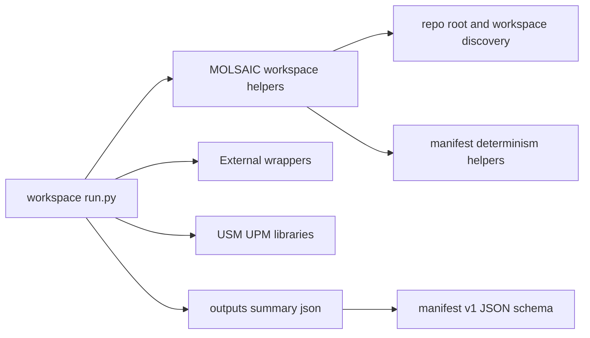

# MOLSAIC orchestration in this repo: fit, responsibilities, and usage

This repository mixes:
- **Code-first workspaces** under [`workspaces/`](workspaces:1): standalone [`run.py`](workspaces/alumina/alumina_AS2_hydration_v1/run.py:1)-style runners with local configs.
- **Reusable libraries** in [`src/`](src:1), including domain libraries like `usm`/`upm` and the external tool wrappers in [`src/external/`](src/external:1).
- **MOLSAIC**, the orchestration “glue” package in [`src/molsaic/`](src/molsaic:1), intended to standardize *workspace discovery* and *reproducible manifest writing patterns* without owning the workflow logic itself.

This document explains what MOLSAIC currently provides, what it explicitly does **not** provide, and how current workspaces do (or do not) use it.

Related docs:
- Code-first workflow conventions and workspace contract: [`docs/WORKFLOWS.md`](docs/WORKFLOWS.md:1)
- Primary manifest JSON schema (summary.json contract): [`docs/manifest.v1.schema.json`](docs/manifest.v1.schema.json:1)

---

## 1) MOLSAIC role and boundaries

### MOLSAIC **does**
MOLSAIC is intentionally small (see [`src/molsaic/__init__.py`](src/molsaic/__init__.py:1)). Its implemented responsibilities are:

1) **Repo root discovery (robust to workspace nesting)**
- Walk upward until a `pyproject.toml` is found:
  - [`find_repo_root()`](src/molsaic/workspaces.py:21)

This avoids hardcoding assumptions like “repo root is 3 directories up from this workspace”.

2) **Workspace discovery and resolution under `workspaces/`**
MOLSAIC defines “workspace” structurally as:

> Any directory beneath `workspaces/**` that contains either `run.py` or `config.json`,
> excluding hidden directories and `_template`.

This logic is implemented by:
- Workspace root resolution:
  - [`workspaces_root()`](src/molsaic/workspaces.py:39)
- Workspace directory enumeration:
  - [`_iter_workspace_dirs()`](src/molsaic/workspaces.py:44)
- Basename-to-path indexing with collision detection:
  - [`_workspace_index_cached()`](src/molsaic/workspaces.py:68)
  - [`WorkspaceCollisionError`](src/molsaic/workspaces.py:17)

Lookup helper:
- Find workspace dir by basename:
  - [`find_workspace_dir()`](src/molsaic/workspaces.py:98)

3) **Standard workspace file conventions (paths)**
Given a workspace basename, MOLSAIC can compute conventional paths:
- [`WorkspaceFiles`](src/molsaic/workspaces.py:119)
- [`workspace_files()`](src/molsaic/workspaces.py:137)

The convention encodes:
- `config.json`
- `run.py`
- `outputs/`
- `outputs/summary.json`

4) **CLI-friendly workspace selection**
MOLSAIC provides a single “choose one of name/dir” resolver:
- [`resolve_workspace_dir()`](src/molsaic/workspaces.py:148)

This establishes an expected CLI contract:
- use `--workspace-dir` for explicit paths
- use `--workspace-name` for discovery by basename
- reject providing both

5) **Deterministic manifest utilities**
MOLSAIC provides small building blocks for reproducible artifact manifests:

- **Deterministic JSON serialization and writing**
  - [`json_dumps_stable()`](src/molsaic/manifest_utils.py:22) (sorted keys, fixed indentation, newline)
  - [`write_json_stable()`](src/molsaic/manifest_utils.py:27)

- **Stable relative path discipline**
  - [`relpath_posix()`](src/molsaic/manifest_utils.py:35) ensures a path is within `base_dir` and returns a POSIX-style relative path

- **Content hashing**
  - [`sha256_file()`](src/molsaic/manifest_utils.py:12)
  - [`hash_paths()`](src/molsaic/manifest_utils.py:55) returns a stable-keyed mapping of relative path + sha256

- **Best-effort runtime version capture**
  - [`get_runtime_versions()`](src/molsaic/manifest_utils.py:88)
  - [`get_module_version()`](src/molsaic/manifest_utils.py:76)

These utilities are designed to support determinism goals (avoid timestamps, absolute paths, and platform-specific formatting in the manifest where possible).

---

### MOLSAIC **does not**
MOLSAIC does **not** currently provide a “full workflow engine” for the repository. In particular:

- It does **not** define pipeline step semantics (hydration, conversion, tool chaining, etc.). Those remain in each workspace’s [`run.py`](workspaces/alumina/alumina_AS2_hydration_v1/run.py:1) and in reusable libraries.
- It does **not** execute external tools. That responsibility is owned by thin wrappers like:
  - [`msi2lmp.run()`](src/external/msi2lmp.py:68)
  - [`msi2namd.run()`](src/external/msi2namd.py:96)
  - [`packmol.run()`](src/external/packmol.py:46)
- It does **not** own the scientific/data model logic (USM/UPM). Those are separate packages under `src/` and `src/upm/src/`.

In other words:
- **MOLSAIC standardizes discovery + deterministic manifest helpers**
- **Workspaces own orchestration**
- **Wrappers own process execution**
- **USM/UPM own domain models and transforms**

---

## 2) Primary public interfaces (API surface)

### Workspace discovery/loading utilities
- Repo root discovery:
  - [`find_repo_root()`](src/molsaic/workspaces.py:21)
- Workspaces root path:
  - [`workspaces_root()`](src/molsaic/workspaces.py:39)
- Resolve workspace directory by basename:
  - [`find_workspace_dir()`](src/molsaic/workspaces.py:98)
- Compute conventional files/dirs in a workspace:
  - [`workspace_files()`](src/molsaic/workspaces.py:137)
  - [`WorkspaceFiles`](src/molsaic/workspaces.py:119)
- Resolve workspace selection from either `workspace_name` or `workspace_dir`:
  - [`resolve_workspace_dir()`](src/molsaic/workspaces.py:148)

Notes:
- `find_workspace_dir` enforces *basename uniqueness* and raises:
  - [`WorkspaceCollisionError`](src/molsaic/workspaces.py:17)
- If workspaces are added/removed during tests, the index cache can be cleared:
  - [`_invalidate_workspace_index_cache()`](src/molsaic/workspaces.py:93)

### Manifest utilities (determinism + metadata)
- Deterministic JSON:
  - [`json_dumps_stable()`](src/molsaic/manifest_utils.py:22)
  - [`write_json_stable()`](src/molsaic/manifest_utils.py:27)
- Stable relative paths:
  - [`relpath_posix()`](src/molsaic/manifest_utils.py:35)
- Content hashing:
  - [`sha256_file()`](src/molsaic/manifest_utils.py:12)
  - [`hash_paths()`](src/molsaic/manifest_utils.py:55)
  - [`HashedPath`](src/molsaic/manifest_utils.py:49)
- Runtime version capture:
  - [`get_runtime_versions()`](src/molsaic/manifest_utils.py:88)
  - [`get_module_version()`](src/molsaic/manifest_utils.py:76)
  - [`get_python_version()`](src/molsaic/manifest_utils.py:71)

---

## 3) What a “workspace” means in MOLSAIC terms

MOLSAIC defines a workspace as a directory under `workspaces/**` meeting the contract in [`_iter_workspace_dirs()`](src/molsaic/workspaces.py:44):

- **Included**: directory contains:
  - `run.py`, or
  - `config.json`
- **Excluded**:
  - hidden directories (`.foo`)
  - directories named `_template`

This aligns with the “code-first” pattern described in [`docs/WORKFLOWS.md`](docs/WORKFLOWS.md:1).

### Important implication: basename uniqueness
MOLSAIC’s lookup is by **basename** (directory name), not by full relative path. It builds an index `basename -> Path` and raises if the same basename appears twice under `workspaces/**`:
- [`_workspace_index_cached()`](src/molsaic/workspaces.py:68)
- [`WorkspaceCollisionError`](src/molsaic/workspaces.py:17)

This is a deliberate constraint to keep `--workspace-name foo_v1` deterministic.

---

## 4) What a “manifest” means here (and how schema fits)

### Primary manifest contract: `outputs/summary.json` (manifest v1)
The primary durable manifest contract in this repository is the **workspace summary** shape described by:
- [`docs/manifest.v1.schema.json`](docs/manifest.v1.schema.json:1)

Key required top-level fields include:
- `started_at`, `finished_at` (ISO timestamps)
- `inputs` (workspace inputs/parameters; schema includes constraints like residue name length)
- `outputs` (string paths)
- `counts`
- `cell` (requires at least `c`)

This schema corresponds to what code-first workspaces write as `outputs/summary.json` (see workflow doc description of summary.json as a contract in [`docs/WORKFLOWS.md`](docs/WORKFLOWS.md:129)).

### Legacy/variant: deterministic `run_manifest.json` labeled `molsaic.run_manifest.v0.1.1`
A separate “manifest-ish” artifact exists in the golden pipeline workspace:
- It writes `outputs/run_manifest.json` with:
  - `schema: "molsaic.run_manifest.v0.1.1"` and a deterministic design (relative paths + hashes, no timestamps)
  - [`manifest_obj`](workspaces/02_usm_upm_msi2lmp_pipeline/run.py:259)

That legacy label is validated by:
- [`test_golden_usm_upm_msi2lmp_pipeline.py`](tests/integration/test_golden_usm_upm_msi2lmp_pipeline.py:40)

This artifact is *not* currently governed by [`docs/manifest.v1.schema.json`](docs/manifest.v1.schema.json:1); it is best described as a “deterministic run manifest” used by a particular workspace/test harness.

---

## 5) How workspaces are expected to use MOLSAIC (and how they currently do)

### Intended integration points for workspaces
Given current implementation, workspaces can use MOLSAIC in a lightweight way:

- Discover the repo root (for consistent relative path handling and optional `sys.path` bootstrapping):
  - [`find_repo_root()`](src/molsaic/workspaces.py:21)
- Optionally resolve workspace directory / conventional file locations (useful for centralized CLIs or tools that run workspaces):
  - [`resolve_workspace_dir()`](src/molsaic/workspaces.py:148)
  - [`workspace_files()`](src/molsaic/workspaces.py:137)
- Emit reproducible manifests:
  - Use [`write_json_stable()`](src/molsaic/manifest_utils.py:27)
  - Enforce relative paths with [`relpath_posix()`](src/molsaic/manifest_utils.py:35)
  - Hash inputs/outputs with [`sha256_file()`](src/molsaic/manifest_utils.py:12) or [`hash_paths()`](src/molsaic/manifest_utils.py:55)
  - Capture versions via [`get_runtime_versions()`](src/molsaic/manifest_utils.py:88)

### Concrete example A: workspace that uses MOLSAIC utilities (golden pipeline)
The golden pipeline workspace uses MOLSAIC as glue for:
- repo root discovery:
  - [`from molsaic.workspaces import find_repo_root`](workspaces/02_usm_upm_msi2lmp_pipeline/run.py:52)
- deterministic manifest helpers:
  - [`get_runtime_versions()`](workspaces/02_usm_upm_msi2lmp_pipeline/run.py:53)
  - [`write_json_stable()`](workspaces/02_usm_upm_msi2lmp_pipeline/run.py:53)
  - [`relpath_posix()`](workspaces/02_usm_upm_msi2lmp_pipeline/run.py:53)
  - [`sha256_file()`](workspaces/02_usm_upm_msi2lmp_pipeline/run.py:53)

It emits a deterministic `run_manifest.json` with `schema: molsaic.run_manifest.v0.1.1`:
- [`manifest_obj`](workspaces/02_usm_upm_msi2lmp_pipeline/run.py:259)

And the integration test asserts those fields and determinism expectations:
- [`test_golden_usm_upm_msi2lmp_pipeline.py`](tests/integration/test_golden_usm_upm_msi2lmp_pipeline.py:66)

### Concrete example B: code-first workspace that largely bypasses MOLSAIC orchestration (alumina hydration)
The alumina hydration runner is “code-first orchestration”:
- It imports MOLSAIC only for repo root discovery:
  - [`from molsaic.workspaces import find_repo_root`](workspaces/alumina/alumina_AS2_hydration_v1/run.py:55)

But it executes the workflow directly via wrappers and reusable libs, e.g.:
- external tools:
  - [`msi2namd.run()`](workspaces/alumina/alumina_AS2_hydration_v1/run.py:247)
  - [`packmol.run()`](workspaces/alumina/alumina_AS2_hydration_v1/run.py:281)
  - [`msi2lmp.run()`](workspaces/alumina/alumina_AS2_hydration_v1/run.py:319)
- composition:
  - [`pm2mdfcar.build()`](workspaces/alumina/alumina_AS2_hydration_v1/run.py:300)

It writes `outputs/summary.json` itself (shape intended to comply with [`docs/manifest.v1.schema.json`](docs/manifest.v1.schema.json:1)).

This is the common pattern today: workspaces are the orchestration layer; MOLSAIC is a helper library rather than the driver.

---

## 6) Relationship to external wrappers + USM/UPM

### External wrappers
Wrappers in [`src/external/`](src/external:1) encapsulate:
- process invocation
- working directory rules
- PATH augmentation
- output existence/non-empty validation
- timeouts and “missing tool” outcomes

MOLSAIC does not call these wrappers directly; workspaces do (see [`docs/WORKFLOWS.md`](docs/WORKFLOWS.md:1) for wrapper behavior summaries and references).

### USM/UPM
USM and UPM provide:
- data models, IO, selection/edit/transform ops (USM)
- forcefield requirement derivation and minimal subset resolution (UPM)

MOLSAIC currently only interacts with these packages indirectly via:
- `__version__` discovery used by [`get_runtime_versions()`](src/molsaic/manifest_utils.py:88)

---

## 7) Mental model (how everything fits)

- **Workspaces** coordinate the workflow and own the step semantics.
- **Wrappers** execute external tools deterministically and validate outputs.
- **USM/UPM** handle domain data/logic.
- **MOLSAIC** provides “small but important” shared utilities: discovery + deterministic manifest building blocks.
- **Manifest schema** provides a shared contract for `outputs/summary.json` (primary) and helps keep workflow outputs machine-consumable.

---

## 8) Practical guidance (if you’re authoring a new workspace)

- Follow the workspace layout contract described in [`docs/WORKFLOWS.md`](docs/WORKFLOWS.md:1).
- Use [`find_repo_root()`](src/molsaic/workspaces.py:21) rather than fixed-depth assumptions.
- When writing a summary/manifest artifact:
  - Prefer [`write_json_stable()`](src/molsaic/manifest_utils.py:27)
  - Use [`relpath_posix()`](src/molsaic/manifest_utils.py:35) to keep paths relative to the workspace outputs directory when determinism matters
  - Hash key inputs/outputs using [`sha256_file()`](src/molsaic/manifest_utils.py:12) or [`hash_paths()`](src/molsaic/manifest_utils.py:55)
- Keep `outputs/summary.json` compatible with [`docs/manifest.v1.schema.json`](docs/manifest.v1.schema.json:1) where possible so downstream automation can depend on the contract.
