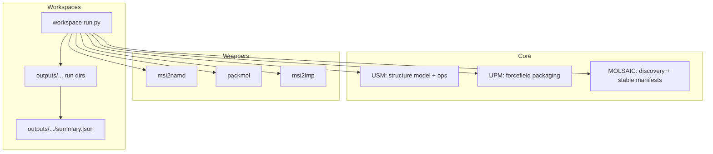

# How everything fits together (USM + MOLSAIC + wrappers + workspaces) — and what we did for MXenes

This repo is organized into three layers that intentionally separate:
- **data models / deterministic transforms** (core libraries),
- **deterministic execution of external binaries** (wrappers),
- **real scientific workflows** (workspaces) that stitch the pieces together and emit reproducible run directories + manifests.

This document ties together:
- USM: [`docs/USM_FIT_AND_USAGE.md`](docs/USM_FIT_AND_USAGE.md:1)
- MOLSAIC: [`docs/MOLSAIC_FIT_AND_USAGE.md`](docs/MOLSAIC_FIT_AND_USAGE.md:1)
- the MXenes fluorinated scaffold: [`workspaces/mxenes/fluorinated/mxn_f_sub_v3/WORKFLOW_NOTES.md`](workspaces/mxenes/fluorinated/mxn_f_sub_v3/WORKFLOW_NOTES.md:1)
- the working pH hydrated bilayer workflow: [`workspaces/mxenes/pH_systems/pH_all_hydrated_bilayer_v1/README.md`](workspaces/mxenes/pH_systems/pH_all_hydrated_bilayer_v1/README.md:1) and [`workspaces/mxenes/pH_systems/pH_all_hydrated_bilayer_v1/run.py`](workspaces/mxenes/pH_systems/pH_all_hydrated_bilayer_v1/run.py:1)

---

## 1) Repository architecture (the “three layers”)

### Layer 1 — Core libraries (USM / UPM / MOLSAIC)

- **USM** (“Unified Structure Model”) is the in-memory structure model and deterministic edit/compose ops.
  - See: [`docs/USM_FIT_AND_USAGE.md`](docs/USM_FIT_AND_USAGE.md:1)
  - Key join/compose primitive: [`compose_on_keys()`](src/usm/ops/compose.py:13)

- **UPM** is the forcefield packaging / requirement derivation layer (used heavily in the “golden” pipeline).
  - UPM lives under: [`src/upm/src/upm/__init__.py`](src/upm/src/upm/__init__.py:1)

- **MOLSAIC** is small “glue” that standardizes workspace discovery and deterministic manifest helpers without owning workflow semantics.
  - Workspace selection contract: [`resolve_workspace_dir()`](src/molsaic/workspaces.py:148)
  - Stable JSON writing helper: [`write_json_stable()`](src/molsaic/manifest_utils.py:27)

### Layer 2 — External tool wrappers (deterministic subprocess boundary)

Wrappers under [`src/external/`](src/external:1) encapsulate:
- executable resolution (including search paths),
- deterministic process execution policy,
- output existence/non-empty validation,
- stable **result envelope** writing.

Key wrappers used across MXene workflows:
- [`msi2namd.run()`](src/external/msi2namd.py:96): CAR/MDF → PDB/PSF for NAMD-style intermediate representations
- [`packmol.run()`](src/external/packmol.py:46): deterministic packing of multiple PDB components into a combined PDB
- [`msi2lmp.run()`](src/external/msi2lmp.py:68): CAR/MDF → LAMMPS `.data`

Underlying wrapper result shape is captured in adapter types like [`ExternalToolResult`](src/external/adapter.py:50).

### Layer 3 — Workspaces (real workflows; reproducible run dirs + manifests)

Workspaces live under [`workspaces/`](workspaces:1) and are “code-first runners”:
- each workspace defines its orchestration logic in a local runner like [`run.py`](workspaces/mxenes/pH_systems/pH_all_hydrated_bilayer_v1/run.py:1),
- typically parameterized by a local config like [`config.json`](workspaces/mxenes/pH_systems/pH_all_hydrated_bilayer_v1/config.json:1),
- produces structured outputs under `outputs/...`,
- writes a machine-readable `summary.json` manifest intended to align with [`docs/manifest.v1.schema.json`](docs/manifest.v1.schema.json:1) (and described by the workspace contract in [`docs/WORKFLOWS.md`](docs/WORKFLOWS.md:1)).

### Text diagram (how the pieces connect)



---

## 2) USM in this repo: what it is and how workspaces use it

USM is the repo’s **deterministic in-memory structure model** and provides:
- a stable atoms/bonds schema,
- deterministic identifier allocation,
- high-fidelity CAR/MDF I/O boundaries,
- deterministic edit/compose operations.

The USM doc covers:
- model + invariants: [`USM`](src/usm/core/model.py:95)
- CAR/MDF I/O: [`load_car()`](src/usm/io/car.py:128), [`load_mdf()`](src/usm/io/mdf.py:243)
- a key repo join pattern: [`compose_on_keys()`](src/usm/ops/compose.py:13)

A practical mental model (from [`docs/USM_FIT_AND_USAGE.md`](docs/USM_FIT_AND_USAGE.md:1)) is that this repo has **two usage styles**:

1) **USM-first pipelines**
- Load CAR/MDF into USM, edit/compose deterministically, then export and/or call wrappers.
- Example workspace (documented in the USM doc): [`workspaces/02_usm_upm_msi2lmp_pipeline/run.py`](workspaces/02_usm_upm_msi2lmp_pipeline/run.py:1)

2) **External-tool-first pipelines**
- Rely on wrappers + other utilities (not USM) for most steps, doing “boundary fixes” only where required.
- Example: the pH hydrated bilayer workspace [`workspaces/mxenes/pH_systems/pH_all_hydrated_bilayer_v1/run.py`](workspaces/mxenes/pH_systems/pH_all_hydrated_bilayer_v1/run.py:1)

Even when USM is not directly imported, **USM-style identity constraints** still show up at boundaries:
- many workflows rely on the identity tuple `(mol_label, mol_index, name)` (USM’s default compose keys in [`compose_on_keys()`](src/usm/ops/compose.py:13)),
- the pH hydration workspace implements an explicit “identifier de-dup” preflight to restore uniqueness before calling [`msi2lmp.run()`](src/external/msi2lmp.py:68) (see [`_preflight_fix_nonbonded_terminations_mdf()`](workspaces/mxenes/pH_systems/pH_all_hydrated_bilayer_v1/run.py:99)).

---

## 3) MOLSAIC in this repo: what it standardizes (and what it does not)

MOLSAIC is intentionally small and focuses on:
- **repo/workspace discovery**
- **deterministic manifest utilities**

Key entry points:
- repo root discovery helper (used by centralized tools/CLIs): [`find_repo_root()`](src/molsaic/workspaces.py:21)
- CLI-friendly workspace selection: [`resolve_workspace_dir()`](src/molsaic/workspaces.py:148)
- stable JSON emit: [`write_json_stable()`](src/molsaic/manifest_utils.py:27)

MOLSAIC **does not** define pipeline semantics. The orchestration logic remains in each workspace runner (per the contract described in [`docs/WORKFLOWS.md`](docs/WORKFLOWS.md:1)).

---

## 4) Wrappers: deterministic external tools + result envelopes

Wrappers in [`src/external/`](src/external:1) are thin, deterministic boundaries around non-Python binaries.
Workspaces call wrappers directly and then validate outputs before moving to the next step.

For MXene workflows, the typical sequence is:

1. CAR/MDF → PDB/PSF via [`msi2namd.run()`](src/external/msi2namd.py:96)
2. packing via [`packmol.run()`](src/external/packmol.py:46)
3. PDB + templates → CAR/MDF via [`pm2mdfcar.build()`](src/pm2mdfcar/__init__.py:392)
4. CAR/MDF → LAMMPS `.data` via [`msi2lmp.run()`](src/external/msi2lmp.py:68)

Each wrapper writes tool outputs to stable locations in the run directory (e.g., `stdout.txt`, `stderr.txt`, and a wrapper result JSON). The “envelope” concept is represented by types like [`ExternalToolResult`](src/external/adapter.py:50).

---

## 5) Workspace pattern: how workflows are implemented here

The repository’s workspace contract is described in:
- [`docs/WORKFLOWS.md`](docs/WORKFLOWS.md:1)

Workspaces generally implement:
- a `main()` that resolves config + args and enumerates a parameter matrix,
- a per-run `run_one()` that:
  - stages inputs (or expects them staged),
  - runs wrapper steps sequentially,
  - validates produced artifacts,
  - writes `outputs/.../summary.json` (schema: [`docs/manifest.v1.schema.json`](docs/manifest.v1.schema.json:1)).

The pH hydrated bilayer workspace follows this shape directly in [`main()`](workspaces/mxenes/pH_systems/pH_all_hydrated_bilayer_v1/run.py:805) and [`run_one()`](workspaces/mxenes/pH_systems/pH_all_hydrated_bilayer_v1/run.py:490).

---

## 6) MXenes workspaces: what exists today

Within [`workspaces/mxenes/`](workspaces/mxenes:1) you can see several “families”:

- **pH systems**: a generator workspace that produces pH-specific slab templates, plus downstream hydration workspaces that consume those templates.
  - Hydration workspace deep dive: [`workspaces/mxenes/pH_systems/pH_all_hydrated_bilayer_v1/README.md`](workspaces/mxenes/pH_systems/pH_all_hydrated_bilayer_v1/README.md:1)

- **fluorinated bilayer reference workspaces**: serve as lineage references and templates for pH workflows.
  - Example lineage function referenced by the scaffold notes: [`run_pipeline()`](workspaces/mxenes/fluorinated/mxene_bilayer_water_f50_v1/run.py:127)

- **analysis workspaces**: inventory/analysis outputs (counts, z-bins, etc.).

---

## 7) `mxn_f_sub_v3` reality check: what we did (and did not do)

`mxn_f_sub_v3` is currently an **empty scaffold directory** in this repo snapshot.

- Location: [`workspaces/mxenes/fluorinated/mxn_f_sub_v3/`](workspaces/mxenes/fluorinated/mxn_f_sub_v3:1)
- Documentation artifact created from repo evidence: [`WORKFLOW_NOTES.md`](workspaces/mxenes/fluorinated/mxn_f_sub_v3/WORKFLOW_NOTES.md:1)

### What was done
- We created a durable “what this would look like if implemented” note based on:
  - the workspace contract in [`docs/WORKFLOWS.md`](docs/WORKFLOWS.md:1),
  - wrapper conventions,
  - fluorinated lineage runners (e.g., [`run_pipeline()`](workspaces/mxenes/fluorinated/mxene_bilayer_water_f50_v1/run.py:127)).

### What was not done (explicitly)
- No runnable workspace was added:
  - no committed [`run.py`](workspaces/mxenes/fluorinated/mxn_f_sub_v3/run.py:1)
  - no committed `inputs/`, `outputs/`, or `summary.json` artifacts
- No execution history exists for `mxn_f_sub_v3` in this snapshot:
  - there are no logs/manifests under [`workspaces/mxenes/fluorinated/mxn_f_sub_v3/`](workspaces/mxenes/fluorinated/mxn_f_sub_v3:1)

---

## 8) pH hydrated bilayer workflow: how to run and what it produces

### What it does (pipeline steps)

The workspace builds hydrated **bilayers** for a full pH matrix:
- pH ∈ 3–10
- variant ∈ `{omx-hoy, o_star-h_star}`
- water_count ∈ `{0, 50, 100, 155, 206}`

The orchestration is implemented in [`run_one()`](workspaces/mxenes/pH_systems/pH_all_hydrated_bilayer_v1/run.py:490) as:

1) Convert pH slab template CAR/MDF → `MXN.pdb`/`MXN.psf` via [`msi2namd.run()`](src/external/msi2namd.py:96)  
2) Convert water template CAR/MDF → `WAT.pdb`/`WAT.psf` via [`msi2namd.run()`](src/external/msi2namd.py:96)  
3) Pack **two slabs + two water regions** → `mxene_bilayer_water.pdb` via [`packmol.run()`](src/external/packmol.py:46)  
4) Compose packed PDB + templates → `converted/mxene_bilayer_water.{car,mdf}` via [`pm2mdfcar.build()`](src/pm2mdfcar/__init__.py:392)  
5) Convert CAR/MDF → `simulation/mxene_bilayer_water.data` via [`msi2lmp.run()`](src/external/msi2lmp.py:68)  
6) Write `summary.json` + copy `.data` into `outputs/final_structures/` (see the summary writer block near [`out_summary`](workspaces/mxenes/pH_systems/pH_all_hydrated_bilayer_v1/run.py:783))

### Output layout (what to expect)

Per-run directory:
- `outputs/pH{pH}/{variant}/count_{water_count}/`
  - `MXN.pdb`, `MXN.psf`
  - `WAT.pdb`, `WAT.psf`
  - `mxene_bilayer_water.pdb`
  - `converted/mxene_bilayer_water.car`
  - `converted/mxene_bilayer_water.mdf`
  - `simulation/mxene_bilayer_water.data`
  - `summary.json`

Aggregated convenience copy:
- `outputs/final_structures/MXN_pH{pH}__{variant}__water_{water_count}.data`

These conventions are documented in [`workspaces/mxenes/pH_systems/pH_all_hydrated_bilayer_v1/README.md`](workspaces/mxenes/pH_systems/pH_all_hydrated_bilayer_v1/README.md:30) and implemented in [`run_one()`](workspaces/mxenes/pH_systems/pH_all_hydrated_bilayer_v1/run.py:506).

### How to rerun (exact commands)

From the workspace directory, run with [`run.py`](workspaces/mxenes/pH_systems/pH_all_hydrated_bilayer_v1/run.py:1) and a config like [`config.json`](workspaces/mxenes/pH_systems/pH_all_hydrated_bilayer_v1/config.json:1):

```bash
python run.py --config ./config.json
```

To (re)stage inputs from the pH builder outputs:

```bash
python run.py --config ./config.json --stage-inputs
```

To run a single case (example):

```bash
python run.py --ph 5 --variant o_star-h_star --water-count 100
```

To validate produced artifacts:

```bash
python validate.py
```

(These commands are listed in [`workspaces/mxenes/pH_systems/pH_all_hydrated_bilayer_v1/README.md`](workspaces/mxenes/pH_systems/pH_all_hydrated_bilayer_v1/README.md:57).)

### What to check when something fails

The workflow is designed so “why it failed” is visible in the run directory:
- wrapper tool logs under `outputs/.../simulation/stdout.txt` and `outputs/.../simulation/stderr.txt` (see troubleshooting in [`README.md`](workspaces/mxenes/pH_systems/pH_all_hydrated_bilayer_v1/README.md:123))
- `outputs/.../summary.json` includes `warnings[]` and per-step timing keys written in [`summary`](workspaces/mxenes/pH_systems/pH_all_hydrated_bilayer_v1/run.py:721)

---

## 9) What we changed to make pH hydration run end-to-end (session change log)

This session’s concrete changes were limited to these files:

### Workflow runner changes
- [`workspaces/mxenes/pH_systems/pH_all_hydrated_bilayer_v1/run.py`](workspaces/mxenes/pH_systems/pH_all_hydrated_bilayer_v1/run.py:1)

Key fixes / guardrails added in the runner:

1) Forcefield selection guardrail (“missing angle term”)
- Problem: `msi2lmp` can fail with `Unable to find angle data for hoy omx hoy` when an incomplete `.frc` is used.
- Fix: forcefield resolution now verifies the chosen `.frc` contains that required angle term and falls back to a known-good copy (see [`_resolve_frc_file()`](workspaces/mxenes/pH_systems/pH_all_hydrated_bilayer_v1/run.py:304)).

2) Bilayer identifier de-dup preflight (connectivity ambiguity)
- Problem: bilayer composition can produce duplicate `{mol_label}_{mol_index}:{name}` identifiers across layers, leading to connectivity ambiguity and downstream `msi2lmp` failures.
- Fix: preflight rewrites the repeated layer’s `mol_index` (and updates same-line connection tokens + CAR residue indices) to restore uniqueness before calling [`msi2lmp.run()`](src/external/msi2lmp.py:68). See [`_preflight_fix_nonbonded_terminations_mdf()`](workspaces/mxenes/pH_systems/pH_all_hydrated_bilayer_v1/run.py:99).

### pm2mdfcar boundary fix
- [`src/pm2mdfcar/__init__.py`](src/pm2mdfcar/__init__.py:1)

Problem/fix summarized in the workspace README:
- Problem: ions like `Na+` could yield CAR/MDF “label normalization” mismatches (`+`/`-` handling differences), which then breaks downstream steps.
- Fix: allow `+`/`-` in legacy label normalization so CAR and MDF remain consistent for ions (referenced in the workspace troubleshooting section near [`pm2mdfcar._to_old_full_label()`](src/pm2mdfcar/__init__.py:1209)).

### Documentation changes (durable narrative and inventory)
- USM fit/use: [`docs/USM_FIT_AND_USAGE.md`](docs/USM_FIT_AND_USAGE.md:1)
- MOLSAIC fit/use: [`docs/MOLSAIC_FIT_AND_USAGE.md`](docs/MOLSAIC_FIT_AND_USAGE.md:1)
- `mxn_f_sub_v3` inventory notes: [`workspaces/mxenes/fluorinated/mxn_f_sub_v3/WORKFLOW_NOTES.md`](workspaces/mxenes/fluorinated/mxn_f_sub_v3/WORKFLOW_NOTES.md:1)

---

## 10) Cross-links / “where to look next”

- Start with the workspace contract: [`docs/WORKFLOWS.md`](docs/WORKFLOWS.md:1)
- Read the USM fit/use and dive into I/O + ops:
  - [`docs/USM_FIT_AND_USAGE.md`](docs/USM_FIT_AND_USAGE.md:1)
  - the core model: [`USM`](src/usm/core/model.py:95)
  - composition/join primitive: [`compose_on_keys()`](src/usm/ops/compose.py:13)
- Read MOLSAIC fit/use and explore manifest helpers:
  - [`docs/MOLSAIC_FIT_AND_USAGE.md`](docs/MOLSAIC_FIT_AND_USAGE.md:1)
  - stable JSON writer: [`write_json_stable()`](src/molsaic/manifest_utils.py:27)
- Explore wrapper implementations:
  - MXene hydration uses [`msi2namd.run()`](src/external/msi2namd.py:96), [`packmol.run()`](src/external/packmol.py:46), [`msi2lmp.run()`](src/external/msi2lmp.py:68)
- For the pH hydrated bilayer workflow itself:
  - [`README.md`](workspaces/mxenes/pH_systems/pH_all_hydrated_bilayer_v1/README.md:1)
  - pipeline implementation: [`run_one()`](workspaces/mxenes/pH_systems/pH_all_hydrated_bilayer_v1/run.py:490)