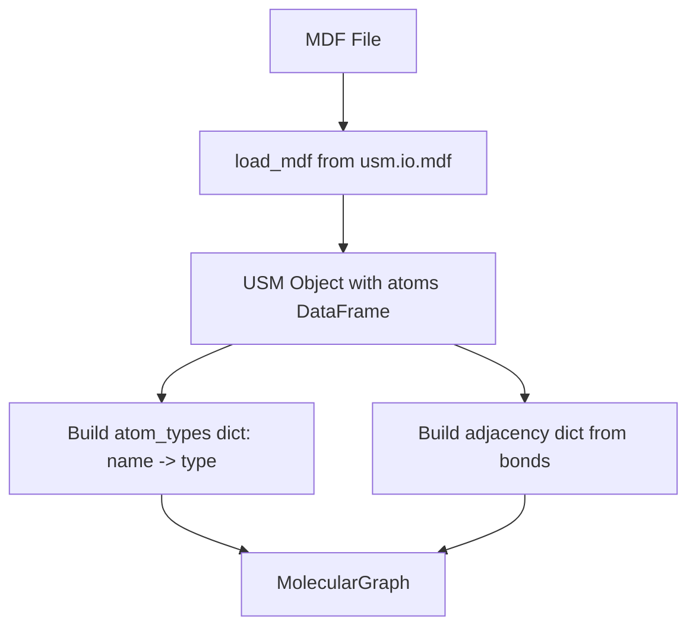

# Subtask 1: MDF Topology Parser & Bonded Type Extractor - Implementation Plan

**Date**: 2025-12-21
**Status**: DESIGN COMPLETE - READY FOR IMPLEMENTATION
**Phase**: Phase 11 (msi2lmp.exe -ignore-free Operation)

## 1) Executive Summary

This plan details the implementation of a utility to parse MSI MDF files and extract all bonded topology types needed for forcefield parameter assignment. The extracted types enable generation of bonded parameters that allow msi2lmp.exe to operate **without** the `-ignore` flag.

## 2) Context Analysis

### 2.1 CALF20.mdf Structure

From [`CALF20.mdf`](workspaces/NIST/nist_calf20_msi2lmp_unbonded_v1/inputs/CALF20.mdf:1):

```
Atom      Type      Connections
Zn1       Zn_MOF    N1 O1 N2 O2 N3  (5 neighbors)
N1        N_MOF     Zn1 C1 N2       (3 neighbors)
N2        N_MOF     Zn1 N1 C2       (3 neighbors)
N3        N_MOF     C1 C2 Zn1       (3 neighbors)
O1        O_MOF     Zn1 C3          (2 neighbors)
O2        O_MOF     Zn1 C3          (2 neighbors)
C1        C_MOF     N1 N3 H1A       (3 neighbors)
H1A       H_MOF     C1              (1 neighbor)
C2        C_MOF     N2 N3 H2A       (3 neighbors)
H2A       H_MOF     C2              (1 neighbor)
C3        C_MOF     O1 O2           (2 neighbors)
```

### 2.2 Existing MDF Parser

The existing parser at [`src/usm/io/mdf.py`](src/usm/io/mdf.py:1):

- [`load_mdf()`](src/usm/io/mdf.py:243) parses MDF into USM object
- [`_parse_atom_line()`](src/usm/io/mdf.py:105) extracts atom_type and connections_raw
- [`_build_bonds_from_connections()`](src/usm/io/mdf.py:148) creates bonds DataFrame
- Uses pandas DataFrame for atom and bond storage

### 2.3 Integration Target

The utility will be placed in [`src/upm/src/upm/build/topology_extractor.py`](src/upm/src/upm/build/topology_extractor.py:1) alongside the existing:

- [`_placeholder_bond_params()`](src/upm/src/upm/build/frc_from_scratch.py:56)
- [`_placeholder_angle_params()`](src/upm/src/upm/build/frc_from_scratch.py:75)

## 3) Data Structure Design

### 3.1 BondedTypeSet Dataclass

```python
from dataclasses import dataclass, field
from typing import FrozenSet

@dataclass(frozen=True)
class BondedTypeSet:
    """Immutable set of canonical bonded interaction types extracted from topology.
    
    All tuples are canonicalized for deterministic ordering:
    - bonds: (A, B) where A <= B alphabetically
    - angles: (A, B, C) where A <= C, B is center
    - torsions: (A, B, C, D) where A <= D, if equal then B <= C
    - out_of_plane: (center, p1, p2, p3) where p1 <= p2 <= p3
    """
    
    bonds: FrozenSet[tuple[str, str]] = field(default_factory=frozenset)
    angles: FrozenSet[tuple[str, str, str]] = field(default_factory=frozenset)
    torsions: FrozenSet[tuple[str, str, str, str]] = field(default_factory=frozenset)
    out_of_plane: FrozenSet[tuple[str, str, str, str]] = field(default_factory=frozenset)
```

### 3.2 MolecularGraph Internal Structure

```python
@dataclass
class MolecularGraph:
    """Internal graph representation for topology traversal."""
    
    # Map: atom_name -> atom_type
    atom_types: dict[str, str]
    
    # Map: atom_name -> set of neighbor atom_names
    adjacency: dict[str, set[str]]
```

## 4) Canonicalization Rules

### 4.1 Bonds (Pairs)

Sort alphabetically: `(min(A, B), max(A, B))`

```python
def canonicalize_bond(t1: str, t2: str) -> tuple[str, str]:
    return (t1, t2) if t1 <= t2 else (t2, t1)
```

### 4.2 Angles (Triplets)

Keep center in middle, sort ends: `(min(A, C), B, max(A, C))`

```python
def canonicalize_angle(t1: str, center: str, t2: str) -> tuple[str, str, str]:
    if t1 <= t2:
        return (t1, center, t2)
    return (t2, center, t1)
```

### 4.3 Torsions (Quadruplets)

Compare first with last; if equal, compare second with third:

```python
def canonicalize_torsion(t1: str, t2: str, t3: str, t4: str) -> tuple[str, str, str, str]:
    forward = (t1, t2, t3, t4)
    reverse = (t4, t3, t2, t1)
    return forward if forward <= reverse else reverse
```

### 4.4 Out-of-Plane (Center + 3 Peripherals)

Center fixed, sort peripherals:

```python
def canonicalize_oop(center: str, p1: str, p2: str, p3: str) -> tuple[str, str, str, str]:
    peripherals = tuple(sorted([p1, p2, p3]))
    return (center, peripherals[0], peripherals[1], peripherals[2])
```

## 5) Algorithm Design

### 5.1 Molecular Graph Construction



### 5.2 Bond Type Extraction

For each edge `(a1, a2)` in the graph:
1. Get atom types: `t1 = atom_types[a1]`, `t2 = atom_types[a2]`
2. Canonicalize: `bond = canonicalize_bond(t1, t2)`
3. Add to bond set

### 5.3 Angle Type Extraction

For each atom `center` with 2+ neighbors:
1. Get all neighbor pairs `(n1, n2)` where `n1 != n2`
2. For each pair: `angle = canonicalize_angle(type[n1], type[center], type[n2])`
3. Add to angle set

### 5.4 Torsion Type Extraction

For each bond `(a, b)`:
1. For each neighbor `a_neighbor` of `a` (excluding `b`):
2. For each neighbor `b_neighbor` of `b` (excluding `a`):
3. `torsion = canonicalize_torsion(type[a_neighbor], type[a], type[b], type[b_neighbor])`
4. Add to torsion set

### 5.5 Out-of-Plane Type Extraction

For each atom `center` with exactly 3 neighbors:
1. Get neighbor types: `[type[n1], type[n2], type[n3]]`
2. `oop = canonicalize_oop(type[center], type[n1], type[n2], type[n3])`
3. Add to OOP set

## 6) Expected CALF20 Results

### 6.1 Bond Types (6 Expected)

| Canonical Pair | Bond Instances |
|----------------|----------------|
| `(C_MOF, H_MOF)` | C1-H1A, C2-H2A |
| `(C_MOF, N_MOF)` | C1-N1, C1-N3, C2-N2, C2-N3 |
| `(C_MOF, O_MOF)` | C3-O1, C3-O2 |
| `(N_MOF, N_MOF)` | N1-N2 |
| `(N_MOF, Zn_MOF)` | Zn1-N1, Zn1-N2, Zn1-N3 |
| `(O_MOF, Zn_MOF)` | Zn1-O1, Zn1-O2 |

### 6.2 Angle Types (~11 Expected)

Centers with 2+ neighbors: Zn1(5), N1(3), N2(3), N3(3), O1(2), O2(2), C1(3), C2(3), C3(2)

| Center | Canonical Angle Type |
|--------|---------------------|
| Zn1 | `(N_MOF, Zn_MOF, N_MOF)` |
| Zn1 | `(N_MOF, Zn_MOF, O_MOF)` |
| Zn1 | `(O_MOF, Zn_MOF, O_MOF)` |
| N1 | `(C_MOF, N_MOF, Zn_MOF)` |
| N1 | `(N_MOF, N_MOF, Zn_MOF)` |
| N1 | `(C_MOF, N_MOF, N_MOF)` |
| N3 | `(C_MOF, N_MOF, C_MOF)` |
| N3 | `(C_MOF, N_MOF, Zn_MOF)` |
| O1 | `(C_MOF, O_MOF, Zn_MOF)` |
| C1 | `(H_MOF, C_MOF, N_MOF)` |
| C1 | `(N_MOF, C_MOF, N_MOF)` |
| C3 | `(O_MOF, C_MOF, O_MOF)` |

### 6.3 Torsion Types (~16 Expected)

Based on bond pairs and their neighbors - detailed enumeration in test cases.

### 6.4 OOP Types (~3 Expected)

Centers with exactly 3 neighbors: N1, N2, N3, C1, C2

| Center | Canonical OOP Type |
|--------|-------------------|
| C1 | `(C_MOF, H_MOF, N_MOF, N_MOF)` |
| C2 | `(C_MOF, H_MOF, N_MOF, N_MOF)` |
| N1 | `(N_MOF, C_MOF, N_MOF, Zn_MOF)` |
| N2 | `(N_MOF, C_MOF, N_MOF, Zn_MOF)` |
| N3 | `(N_MOF, C_MOF, C_MOF, Zn_MOF)` |

## 7) Implementation Files

### 7.1 Main Module

**File**: `src/upm/src/upm/build/topology_extractor.py`

```python
# Key functions to implement:
def extract_bonded_types_from_mdf(mdf_path: str | Path) -> BondedTypeSet
def extract_bonded_types_from_usm(usm: USM) -> BondedTypeSet
def _build_molecular_graph(usm: USM) -> MolecularGraph
def _extract_bonds(graph: MolecularGraph) -> FrozenSet[tuple[str, str]]
def _extract_angles(graph: MolecularGraph) -> FrozenSet[tuple[str, str, str]]
def _extract_torsions(graph: MolecularGraph) -> FrozenSet[tuple[str, str, str, str]]
def _extract_out_of_plane(graph: MolecularGraph) -> FrozenSet[tuple[str, str, str, str]]
```

### 7.2 Test Module

**File**: `src/upm/tests/test_topology_extractor.py`

```python
# Key test cases:
def test_calf20_bond_count()          # Verify 6 bond types
def test_calf20_angle_count()         # Verify ~11 angle types
def test_calf20_torsion_count()       # Verify ~16 torsion types
def test_calf20_oop_count()           # Verify ~3 OOP types
def test_bond_canonicalization()      # (Zn_MOF, N_MOF) == (N_MOF, Zn_MOF)
def test_angle_canonicalization()     # Center stays in middle
def test_torsion_canonicalization()   # Forward/reverse equivalence
def test_oop_canonicalization()       # Peripheral sorting
def test_specific_bond_types_present()# e.g., (N_MOF, Zn_MOF) in bonds
def test_deterministic_output()       # Same input -> same output
```

## 8) Dependencies

### 8.1 Required Imports

```python
from pathlib import Path
from dataclasses import dataclass, field
from typing import FrozenSet
from itertools import combinations

from usm.io.mdf import load_mdf
from usm.core.model import USM
```

### 8.2 No New External Dependencies

All functionality uses existing USM library and Python stdlib.

## 9) Completion Criteria

| Criterion | Verification |
|-----------|--------------|
| `BondedTypeSet` dataclass implemented | Code compiles and type-checks |
| `extract_bonded_types_from_mdf()` works | Returns correct counts for CALF20 |
| Bond canonicalization correct | `(A, B) == (B, A)` after canonicalization |
| Angle canonicalization correct | Center stays in middle position |
| Torsion canonicalization correct | Forward equals reverse |
| OOP canonicalization correct | Peripherals sorted alphabetically |
| CALF20 has 6 bond types | Test assertion passes |
| CALF20 has ~11 angle types | Test assertion passes |
| Unit tests pass | `pytest src/upm/tests/test_topology_extractor.py` |
| Deterministic output | Same MDF -> same `BondedTypeSet` |

## 10) Next Steps

1. **Switch to Code mode** to implement the solution
2. Create `src/upm/src/upm/build/topology_extractor.py`
3. Create `src/upm/tests/test_topology_extractor.py`
4. Run tests to verify CALF20 extraction
5. Document actual bonded type counts in completion summary

---

**Ready for Implementation**: This plan is complete and provides all details needed to implement the MDF topology parser and bonded type extractor.
