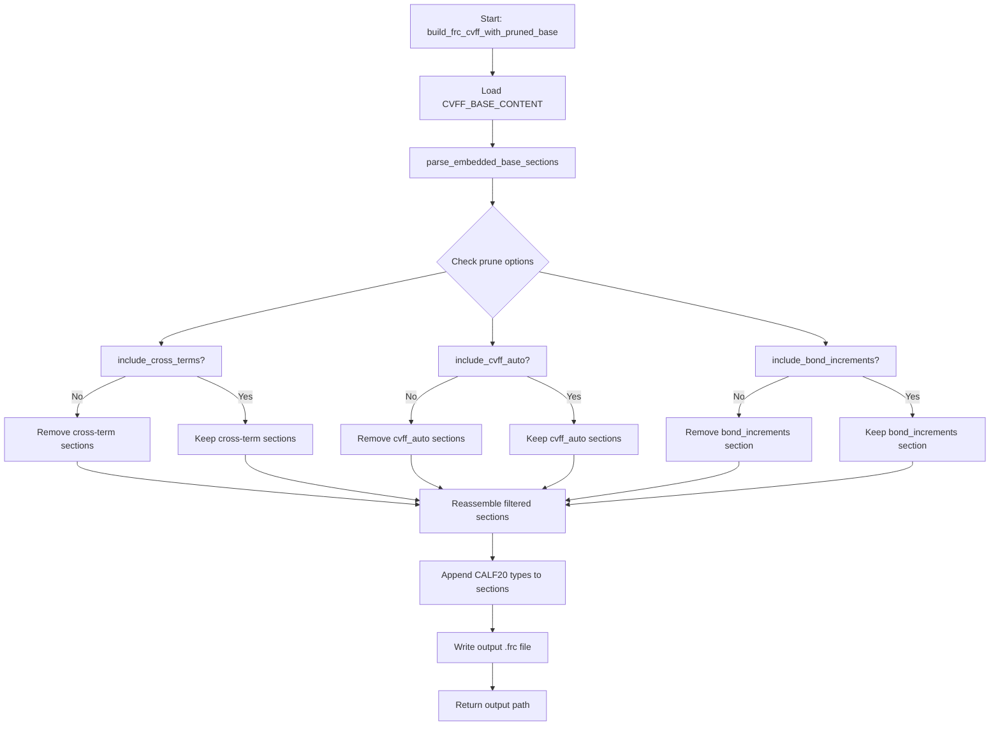

# Subtask 1: Phase 1 - Pruned Base Builder + Section-Level Experiments (M01-M05)

## 1. Overview

This plan implements the pruning infrastructure and executes Phase 1 section-level experiments to determine which entire sections can be removed from the CVFF base while maintaining msi2lmp.exe compatibility.

### Current State
- E20 (full embedded base): 5571 lines → **PASS** (exit 0, CALF20.data produced)
- E21 (headers-only skeleton): **FAIL** (exit 7, validation error)
- Target: reduce to <2800 lines while maintaining working output

### Key Insight
Structure is necessary to prevent stalls, but content within sections may be prunable. E21's failure proves some base entries ARE required.

---

## 2. Section Analysis from Embedded Base

Based on analysis of [`cvff_embedded_base.py`](src/upm/src/upm/build/cvff_embedded_base.py):

### Preamble + #define blocks (lines 1-125)
- Lines 1-20: BIOSYM header + version history
- Lines 46-62: `#define cvff_nocross_nomorse` macro block
- Lines 63-83: `#define cvff` macro block  
- Lines 86-100: `#define cvff_nocross` macro block
- Lines 104-124: `#define cvff_nomorse` macro block

**REQUIRED**: Always include - parser initialization

### Core Sections
| Section | Start Line | Label | Entry Count |
|---------|------------|-------|-------------|
| #atom_types | 127 | cvff | ~233 |
| #equivalence | 362 | cvff | ~229 |
| #auto_equivalence | 592 | cvff_auto | ~187 |
| #hbond_definition | 780 | cvff | ~5 |
| #morse_bond | 787 | cvff | ~151 |
| #quadratic_bond | 939 | cvff | ~239 |
| #quadratic_angle | 1179 | cvff | ~576 |
| #torsion_1 | 2160 | cvff | ~154 |
| #out_of_plane | 2392 | cvff | ~58 |
| #nonbond(12-6) | 4548 | cvff | ~139 |

### Cross-Term Sections (toggled by `include_cross_terms`)
| Section | Start Line | Label | Entry Count |
|---------|------------|-------|-------------|
| #bond-bond | 1756 | cvff | ~201 |
| #bond-angle | 1958 | cvff | ~201 |
| #angle-angle-torsion_1 | 2315 | cvff | ~76 |
| #out_of_plane-out_of_plane | 2451 | cvff | ~38 |
| #angle-angle | 2490 | cvff | ~198 |

**Total cross-term lines: ~528**

### cvff_auto Sections (toggled by `include_cvff_auto`)
| Section | Start Line | Label | Entry Count |
|---------|------------|-------|-------------|
| #morse_bond | 2689 | cvff_auto | ~640 |
| #quadratic_bond | 3330 | cvff_auto | ~640 |
| #quadratic_angle | 3971 | cvff_auto | ~336 |
| #torsion_1 | 4308 | cvff_auto | ~223 |
| #out_of_plane | 4532 | cvff_auto | ~15 |

**Total cvff_auto lines: ~1857**

### bond_increments Section (toggled by `include_bond_increments`)
| Section | Start Line | Label | Entry Count |
|---------|------------|-------|-------------|
| #bond_increments | 4688 | cvff | ~902 |

**Total bond_increments lines: ~903**

### Reference Sections (lines 5394-5590)
These are documentation only and can be removed.

---

## 3. Implementation Architecture

### 3.1 CvffPruneOptions Dataclass

```python
@dataclass
class CvffPruneOptions:
    """Options for pruning CVFF base content."""
    
    # Section toggles (False = remove entire section group)
    include_cross_terms: bool = True
    include_cvff_auto: bool = True
    include_bond_increments: bool = True
    include_references: bool = False  # Reference docs at end of file
```

### 3.2 Section Grouping Constants

```python
# Sections to remove when include_cross_terms=False
CVFF_CROSS_TERM_SECTIONS: frozenset[str] = frozenset({
    "bond-bond",
    "bond-angle", 
    "angle-angle-torsion_1",
    "out_of_plane-out_of_plane",
    "angle-angle",
})

# Sections to remove when include_cvff_auto=False
CVFF_AUTO_SECTIONS: frozenset[str] = frozenset({
    "morse_bond cvff_auto",
    "quadratic_bond cvff_auto",
    "quadratic_angle cvff_auto",
    "torsion_1 cvff_auto",
    "out_of_plane cvff_auto",
})

# Sections to remove when include_bond_increments=False  
CVFF_BOND_INCREMENT_SECTIONS: frozenset[str] = frozenset({
    "bond_increments",
})

# Reference sections (always removed by default)
CVFF_REFERENCE_SECTIONS: frozenset[str] = frozenset({
    "reference",
})
```

### 3.3 parse_embedded_base_sections()

```python
def parse_embedded_base_sections(content: str) -> dict[str, tuple[int, int, list[str]]]:
    """Parse embedded base into section name -> (start_line, end_line, lines) mapping.
    
    Section boundaries:
    - Lines starting with # (except #version, #define, ##)
    - Preamble is lines before first data section
    
    Returns:
        dict mapping section identifier to (start_idx, end_idx, lines)
        where start_idx/end_idx are line numbers in the original content
    """
```

Key behaviors:
- Preamble (lines 1-126) treated as special "preamble" section
- Section key derived from header: e.g., "#atom_types\tcvff" → "atom_types cvff"
- Track line indices for accurate removal

### 3.4 build_frc_cvff_with_pruned_base()

```python
def build_frc_cvff_with_pruned_base(
    termset: dict[str, Any],
    parameterset: dict[str, Any],
    out_path: str | Path,
    prune: CvffPruneOptions | None = None,
) -> str:
    """Build CVFF .frc with configurable base pruning for minimization experiments.
    
    Args:
        termset: TermSet with atom_types list
        parameterset: ParameterSet with atom_types map
        out_path: Output path for .frc file
        prune: Pruning options (None = include all base sections)
    
    Returns:
        Path to written .frc file
        
    Algorithm:
        1. Parse embedded base into sections
        2. Filter sections based on prune options
        3. Reassemble remaining sections
        4. Append CALF20 custom types to relevant sections
        5. Write output file
    """
```

---

## 4. M01-M05 Preset Definitions

```python
CVFF_MINIMIZATION_PRESETS: dict[str, CvffPruneOptions] = {
    # M01: Remove bond_increments only (~903 lines saved)
    "M01": CvffPruneOptions(
        include_bond_increments=False,
    ),
    
    # M02: Remove all cvff_auto sections (~1857 lines saved)
    "M02": CvffPruneOptions(
        include_cvff_auto=False,
    ),
    
    # M03: Remove cross-terms only (~528 lines saved)
    "M03": CvffPruneOptions(
        include_cross_terms=False,
    ),
    
    # M04: Remove cross-terms + cvff_auto (~2385 lines saved)
    "M04": CvffPruneOptions(
        include_cross_terms=False,
        include_cvff_auto=False,
    ),
    
    # M05: M04 + remove bond_increments (~3288 lines saved)
    # Target: 5571 - 3288 = ~2283 lines (well under 2800 target!)
    "M05": CvffPruneOptions(
        include_cross_terms=False,
        include_cvff_auto=False,
        include_bond_increments=False,
    ),
}
```

### Expected Line Counts

| Preset | Removed Sections | Lines Removed | Expected Total |
|--------|-----------------|---------------|----------------|
| E20 (baseline) | None | 0 | 5571 |
| M01 | bond_increments | ~903 | ~4668 |
| M02 | cvff_auto | ~1857 | ~3714 |
| M03 | cross-terms | ~528 | ~5043 |
| M04 | cross-terms + cvff_auto | ~2385 | ~3186 |
| M05 | all three | ~3288 | ~2283 |

---

## 5. Workspace Routing Updates

In [`run.py`](workspaces/NIST/nist_calf20_msi2lmp_unbonded_v1/run.py), add routing for M-series:

```python
# Import the new builder and presets
from upm.build.frc_from_scratch import (
    build_frc_cvff_with_pruned_base,
    CVFF_MINIMIZATION_PRESETS,
    # ... existing imports
)

# In the preset routing section:
if preset and preset.startswith("M") and preset in CVFF_MINIMIZATION_PRESETS:
    # M-series: pruned base experiments
    prune_opts = CVFF_MINIMIZATION_PRESETS[preset]
    build_frc_cvff_with_pruned_base(
        termset=json.loads(termset_path.read_text(encoding="utf-8")),
        parameterset=json.loads(parameterset_path.read_text(encoding="utf-8")),
        out_path=ff_path,
        prune=prune_opts,
    )
```

---

## 6. Experiment Execution Protocol

For each M01-M05 experiment:

### Step 1: Clean outputs
```bash
cd workspaces/NIST/nist_calf20_msi2lmp_unbonded_v1
rm -rf outputs
```

### Step 2: Create experiment config
```json
{
  "outputs_dir": "outputs",
  "inputs": {
    "car": "inputs/CALF20.car",
    "mdf": "inputs/CALF20.mdf",
    "parameterset": "inputs/parameterset.json"
  },
  "params": {
    "timeout_s": 30,
    "frc_experiment_preset": "M01"
  },
  "executables": {
    "msi2lmp": "/home/sf2/LabWork/software/msi2lmp.exe"
  }
}
```

### Step 3: Run workspace
```bash
python run.py --config config.json
```

### Step 4: Verify msi2lmp output
```bash
cd outputs/msi2lmp_run

# Check exit code from result.json
cat result.json | jq '.exit_code'

# Check if CALF20.data exists and has content
ls -la CALF20.data
wc -l CALF20.data

# Count lines in generated .frc
wc -l ../frc_files/cvff_M01.frc
```

### Step 5: Record results
Append to experiment results table in thrust log.

---

## 7. Results Recording Format

After each experiment, record:

```markdown
### M01: Remove bond_increments only

| Metric | Value |
|--------|-------|
| .frc lines | TBD |
| Exit code | TBD |
| CALF20.data exists | TBD |
| CALF20.data size | TBD |
| Error message | TBD |

Command:
```bash
# Exact command used
```
```

---

## 8. Acceptance Criteria

1. **CvffPruneOptions** dataclass implemented with 3 boolean toggles
2. **parse_embedded_base_sections()** correctly identifies all 22 sections
3. **build_frc_cvff_with_pruned_base()** produces valid .frc with CALF20 types appended
4. **M01-M05 presets** registered in CVFF_MINIMIZATION_PRESETS
5. **Workspace routing** correctly detects and routes M-series presets
6. **All 5 experiments** executed with results recorded
7. **Thrust log** updated with Phase 1 findings table
8. **At least one preset** achieves <2800 lines with PASS result

---

## 9. Implementation Order

1. Add `CvffPruneOptions` dataclass and section constants
2. Implement `parse_embedded_base_sections()` function
3. Implement `build_frc_cvff_with_pruned_base()` function
4. Add `CVFF_MINIMIZATION_PRESETS` registry
5. Update workspace `run.py` with M-series routing
6. Execute M01-M05 experiments sequentially
7. Record results and update thrust log

---

## 10. Mermaid Diagram: Pruned Builder Flow



---

## 11. Risk Mitigation

### Risk: Section parsing incorrectly identifies boundaries
**Mitigation**: Unit test parse_embedded_base_sections() against known line counts from thrust log section map.

### Risk: Removing required section causes msi2lmp failure  
**Mitigation**: Execute experiments in order of least-to-most aggressive pruning (M03 → M01 → M02 → M04 → M05). Stop if any fails and analyze.

### Risk: CALF20 types appended to wrong location after pruning
**Mitigation**: After pruning, re-identify section end positions before appending. Use same section-end detection logic as E20 builder.

---

## 12. Files to Modify

1. [`src/upm/src/upm/build/frc_from_scratch.py`](src/upm/src/upm/build/frc_from_scratch.py)
   - Add CvffPruneOptions dataclass
   - Add section grouping constants
   - Add parse_embedded_base_sections() function
   - Add build_frc_cvff_with_pruned_base() function
   - Add CVFF_MINIMIZATION_PRESETS registry
   - Update __all__ exports

2. [`workspaces/NIST/nist_calf20_msi2lmp_unbonded_v1/run.py`](workspaces/NIST/nist_calf20_msi2lmp_unbonded_v1/run.py)
   - Add import for new builder and presets
   - Add M-series routing in preset detection logic

3. [`docs/DevGuides/thrust_log_cvff_base_minimization.md`](docs/DevGuides/thrust_log_cvff_base_minimization.md)
   - Append Phase 1 results section after experiments

---

*Ready to switch to Code mode for implementation.*
