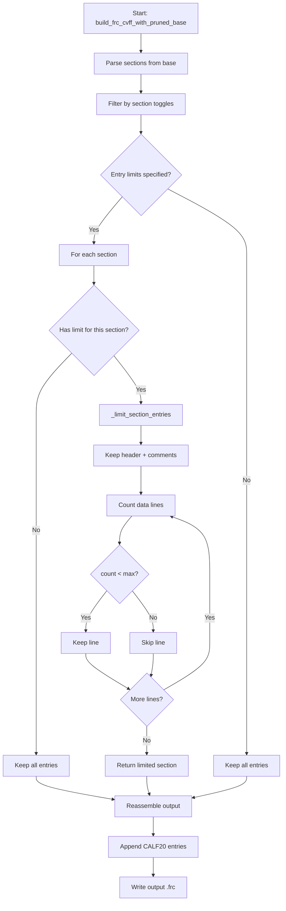
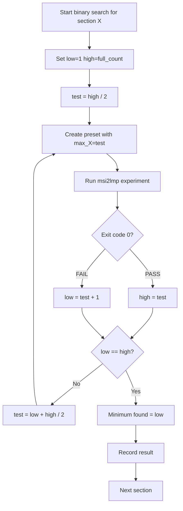

# Subtask 2: Phase 2 - Entry-Level Pruning Experiments (M10-M19)

## 1. Overview

Phase 1 established that **M04 is the optimal section-level configuration** at 4663 lines (cvff_auto + cross_terms removed, bond_increments retained). The target is <2800 lines, requiring ~1863 additional lines removed through entry-level pruning.

### 1.1 Phase 1 Results Summary

| Preset | Configuration | FRC Lines | Status |
|--------|---------------|-----------|--------|
| E20 (baseline) | Full embedded base | 5571 | **PASS** |
| M01 | Remove bond_increments | 4692 | **FAIL** (SIGSEGV) |
| M02 | Remove cvff_auto | 5382 | **PASS** |
| M03 | Remove cross_terms | 4679 | **PASS** |
| M04 | Remove cross_terms + cvff_auto | 4663 | **PASS** |
| M05 | Remove all three | 3957 | **FAIL** (SIGSEGV) |

### 1.2 Key Findings

- **bond_increments is REQUIRED** - M01/M05 crashed with SIGSEGV without it
- **cvff_auto and cross_terms can be safely removed** - Not needed for `-class I`
- **Starting point for Phase 2**: M04 at 4663 lines

### 1.3 Section Entry Counts in M04 Base

After removing cvff_auto and cross_terms, M04 retains these sections:

| Section | Line Range | Entry Count | Lines |
|---------|------------|-------------|-------|
| preamble + #define | 1-126 | - | ~126 |
| #atom_types cvff | 127-361 | ~233 | ~235 |
| #equivalence cvff | 362-591 | ~229 | ~230 |
| #hbond_definition cvff | 780-786 | ~5 | ~7 |
| #morse_bond cvff | 787-938 | ~151 | ~152 |
| #quadratic_bond cvff | 939-1178 | ~239 | ~240 |
| #quadratic_angle cvff | 1179-1755 | ~576 | ~577 |
| #torsion_1 cvff | 2141-2295 | ~154 | ~155 |
| #out_of_plane cvff | 2373-2431 | ~58 | ~59 |
| #nonbond(12-6) cvff | 4529-4668 | ~139 | ~140 |
| #bond_increments cvff | 4669-5571 | ~902 | ~903 |
| CALF20 appended | - | ~10 | ~24 |

**Total**: ~4663 lines

---

## 2. Entry-Limit Design

### 2.1 Extended CvffPruneOptions

Add entry-limit fields to [`CvffPruneOptions`](../src/upm/src/upm/build/frc_from_scratch.py:1569):

```python
@dataclass(frozen=True)
class CvffPruneOptions:
    """Options for pruning CVFF base content during minimization experiments.
    
    Section toggles control whether entire section groups are included.
    Entry limits control how many base entries to keep within each section.
    
    Entry limit semantics:
    - 0 = keep ALL entries (no limit)
    - N > 0 = keep first N entries only
    """
    
    # Section toggles (False = remove entire section group)
    include_cross_terms: bool = True
    include_cvff_auto: bool = True
    include_bond_increments: bool = True
    include_references: bool = False
    
    # Entry limits (0 = keep all, N > 0 = keep first N entries)
    max_atom_types: int = 0
    max_equivalence: int = 0
    max_morse_bond: int = 0
    max_quadratic_bond: int = 0
    max_quadratic_angle: int = 0
    max_torsion: int = 0
    max_out_of_plane: int = 0
    max_nonbond: int = 0
    max_bond_increments: int = 0
```

### 2.2 Entry Limiting Algorithm

In [`build_frc_cvff_with_pruned_base()`](../src/upm/src/upm/build/frc_from_scratch.py:1696), add entry limiting after section filtering:

```python
def _limit_section_entries(
    section_lines: list[str],
    max_entries: int,
) -> list[str]:
    """Limit entries in a section to max_entries.
    
    Args:
        section_lines: Lines including section header
        max_entries: Maximum entries to keep (0 = keep all)
        
    Returns:
        Lines with header + up to max_entries data lines
        
    Algorithm:
        1. First line is always the header (starts with #)
        2. Skip comment lines (start with !) after header
        3. Count data lines until max_entries reached
        4. Return header + comments + limited data lines
    """
    if max_entries <= 0:
        return section_lines
    
    result = []
    entry_count = 0
    in_header_comments = True
    
    for line in section_lines:
        stripped = line.strip()
        
        # Always keep header line
        if stripped.startswith("#"):
            result.append(line)
            continue
            
        # Keep annotation lines (>, @)
        if stripped.startswith(">") or stripped.startswith("@"):
            result.append(line)
            continue
            
        # Keep comment lines in header area
        if stripped.startswith("!"):
            if in_header_comments:
                result.append(line)
            continue
            
        # Empty lines in header area
        if not stripped:
            if in_header_comments:
                result.append(line)
            continue
            
        # Data line
        in_header_comments = False
        if entry_count < max_entries:
            result.append(line)
            entry_count += 1
    
    return result
```

### 2.3 Section Key to Limit Field Mapping

```python
SECTION_LIMIT_MAP: dict[str, str] = {
    "atom_types cvff": "max_atom_types",
    "equivalence cvff": "max_equivalence",
    "morse_bond cvff": "max_morse_bond",
    "quadratic_bond cvff": "max_quadratic_bond",
    "quadratic_angle cvff": "max_quadratic_angle",
    "torsion_1 cvff": "max_torsion",
    "out_of_plane cvff": "max_out_of_plane",
    "nonbond(12-6) cvff": "max_nonbond",
    "bond_increments cvff": "max_bond_increments",
}
```

---

## 3. Binary Search Strategy

### 3.1 Priority Order

Test sections in order of expected line savings (largest first):

| Priority | Section | Full Entries | Initial Test | Max Savings |
|----------|---------|--------------|--------------|-------------|
| 1 | bond_increments | 902 | 451 | ~450 lines |
| 2 | quadratic_angle | 576 | 288 | ~288 lines |
| 3 | quadratic_bond | 239 | 120 | ~119 lines |
| 4 | atom_types | 233 | 116 | ~116 lines |
| 5 | equivalence | 229 | 114 | ~114 lines |
| 6 | torsion_1 | 154 | 77 | ~77 lines |
| 7 | morse_bond | 151 | 76 | ~75 lines |
| 8 | nonbond | 139 | 70 | ~69 lines |
| 9 | out_of_plane | 58 | 29 | ~29 lines |

**Total potential savings**: ~1337 lines at 50% reduction

### 3.2 Binary Search Algorithm

For each section:
1. Start: `low = 1`, `high = full_count`, `test = high // 2`
2. Test with `max_section = test`
3. If PASS: `high = test`, `test = (low + high) // 2`
4. If FAIL: `low = test + 1`, `test = (low + high) // 2`
5. Continue until `low == high`
6. Minimum = `low`

### 3.3 Fast-Track Strategy

To reduce experiment count:
1. Test 50% first (M10 series)
2. If 50% passes, test 25% (M11 series)
3. If 50% fails, test 75%
4. Converge on minimum

---

## 4. M10-M19 Preset Naming Convention

### 4.1 Individual Section Tests

| Preset | Description | Configuration |
|--------|-------------|---------------|
| M10 | bond_increments 50% | M04 + max_bond_increments=451 |
| M10a | bond_increments 25% | M04 + max_bond_increments=225 |
| M10b | bond_increments 75% | M04 + max_bond_increments=676 |
| M11 | atom_types 50% | M04 + max_atom_types=116 |
| M11a | atom_types 25% | M04 + max_atom_types=58 |
| M12 | equivalence 50% | M04 + max_equivalence=114 |
| M13 | nonbond 50% | M04 + max_nonbond=70 |
| M14 | bonded 50% | M04 + max_morse_bond=76 + max_quadratic_bond=120 + max_quadratic_angle=288 + max_torsion=77 + max_out_of_plane=29 |

### 4.2 Combined Configurations

| Preset | Description | Configuration |
|--------|-------------|---------------|
| M15 | Combined minimums | M04 + all entry limits from M10-M14 |
| M16 | Aggressive prune | M04 + 25% limits on all sections |
| M17 | Conservative prune | M04 + 75% limits on all sections |
| M18 | Optimal candidate | M04 + binary search minimums |
| M19 | Final validation | M18 with A/B/A verification |

### 4.3 Dynamic Preset Generation

For binary search iterations, generate presets dynamically:

```python
def create_m_series_preset(
    base: str = "M04",
    limits: dict[str, int] | None = None,
) -> CvffPruneOptions:
    """Create M-series preset with entry limits.
    
    Args:
        base: Base preset (M04 recommended)
        limits: Dict mapping section name to max entries
        
    Returns:
        CvffPruneOptions with specified limits
    """
    # Start from M04 base
    opts = {
        "include_cross_terms": False,
        "include_cvff_auto": False,
        "include_bond_increments": True,
        "include_references": False,
    }
    
    # Apply entry limits
    if limits:
        for section, max_entries in limits.items():
            field = SECTION_LIMIT_MAP.get(section)
            if field:
                opts[field] = max_entries
    
    return CvffPruneOptions(**opts)
```

---

## 5. Experiment Execution Plan

### 5.1 Phase 2A: Individual Section Tests

Execute in priority order:

```bash
# M10: bond_increments at 50%
cd workspaces/NIST/nist_calf20_msi2lmp_unbonded_v1
rm -rf outputs && python run.py --config config_M10.json

# Check results
cat outputs/msi2lmp_run/result.json | jq '.exit_code'
wc -l outputs/frc_files/cvff_M10.frc
ls -la outputs/msi2lmp_run/CALF20.data
```

Repeat for M10-M14.

### 5.2 Phase 2B: Binary Search Refinement

Based on Phase 2A results:
- If M10 PASSES: Test M10a (25%)
- If M10 FAILS: Test M10b (75%)
- Continue until minimum found

### 5.3 Phase 2C: Combined Configuration

1. Collect minimum entries per section from Phase 2B
2. Create M15 with all minimums applied
3. Test M15 - if PASS, this is the optimal configuration
4. If FAIL, back off to conservative limits

### 5.4 Expected Results Table

| Section | Full | 50% Test | Min Found | Lines Saved |
|---------|------|----------|-----------|-------------|
| bond_increments | 902 | 451 | TBD | TBD |
| quadratic_angle | 576 | 288 | TBD | TBD |
| quadratic_bond | 239 | 120 | TBD | TBD |
| atom_types | 233 | 116 | TBD | TBD |
| equivalence | 229 | 114 | TBD | TBD |
| torsion_1 | 154 | 77 | TBD | TBD |
| morse_bond | 151 | 76 | TBD | TBD |
| nonbond | 139 | 70 | TBD | TBD |
| out_of_plane | 58 | 29 | TBD | TBD |
| **Total** | 2681 | - | TBD | TBD |

---

## 6. Implementation Steps

### Step 1: Extend CvffPruneOptions (frc_from_scratch.py)

Add 9 entry-limit fields to the dataclass.

### Step 2: Add _limit_section_entries() Helper

Implement the entry limiting algorithm.

### Step 3: Add SECTION_LIMIT_MAP Constant

Map section keys to limit fields.

### Step 4: Update build_frc_cvff_with_pruned_base()

Apply entry limits during section reassembly.

### Step 5: Add M10-M14 Static Presets

Register initial experiment configurations.

### Step 6: Add create_m_series_preset() Factory

Enable dynamic preset creation for binary search.

### Step 7: Update Workspace run.py

Handle M10-M19 preset routing.

### Step 8: Execute Experiments

Run binary search on each section.

### Step 9: Record Results

Save to phase2_results.json.

### Step 10: Update Thrust Log

Append Phase 2 findings.

---

## 7. Mermaid Diagram: Entry Limiting Flow



---

## 8. Mermaid Diagram: Binary Search Flow



---

## 9. Acceptance Criteria

1. **CvffPruneOptions extended** with 9 entry-limit fields
2. **_limit_section_entries()** correctly trims entries while preserving headers
3. **SECTION_LIMIT_MAP** maps all 9 sections
4. **build_frc_cvff_with_pruned_base()** applies limits during reassembly
5. **M10-M14 presets** registered with 50% initial limits
6. **Binary search** executed on all sections
7. **Minimum entries** identified per section
8. **M15+ combined configuration** tested and validated
9. **Final line count** calculated and compared to <2800 target
10. **phase2_results.json** records all experiment data
11. **Thrust log** updated with Phase 2 findings

---

## 10. Risk Mitigation

### Risk: Entry limiting breaks section structure
**Mitigation**: Preserve all header lines, comments, and annotations. Only count data lines.

### Risk: Minimum entries vary by system
**Mitigation**: CALF-20 specific minimum. Document that other systems may need different limits.

### Risk: Combined limits fail when individual limits pass
**Mitigation**: Test M15 early. If fails, back off using conservative M17 configuration.

### Risk: Target <2800 not achievable
**Mitigation**: Document best achieved result. May need Phase 3 content optimization.

---

## 11. Files to Modify

1. [`src/upm/src/upm/build/frc_from_scratch.py`](../src/upm/src/upm/build/frc_from_scratch.py)
   - Extend CvffPruneOptions with entry-limit fields
   - Add _limit_section_entries() helper
   - Add SECTION_LIMIT_MAP constant
   - Update build_frc_cvff_with_pruned_base()
   - Add M10-M14 presets to CVFF_MINIMIZATION_PRESETS
   - Add create_m_series_preset() factory

2. [`workspaces/NIST/nist_calf20_msi2lmp_unbonded_v1/run.py`](../workspaces/NIST/nist_calf20_msi2lmp_unbonded_v1/run.py)
   - Update preset routing for M10-M19

3. [`docs/DevGuides/thrust_log_cvff_base_minimization.md`](../docs/DevGuides/thrust_log_cvff_base_minimization.md)
   - Append Phase 2 results section

4. [`workspaces/NIST/nist_calf20_msi2lmp_unbonded_v1/outputs/phase2_results.json`](../workspaces/NIST/nist_calf20_msi2lmp_unbonded_v1/outputs/phase2_results.json) (new)
   - Record all M10-M19 experiment results

---

## 12. Config Files for Experiments

### config_M10.json
```json
{
  "outputs_dir": "outputs",
  "inputs": {
    "car": "inputs/CALF20.car",
    "mdf": "inputs/CALF20.mdf",
    "parameterset": "inputs/parameterset.json"
  },
  "params": {
    "timeout_s": 30,
    "frc_experiment_preset": "M10"
  },
  "executables": {
    "msi2lmp": "/home/sf2/LabWork/software/msi2lmp.exe"
  }
}
```

---

*Ready to switch to Code mode for implementation.*
