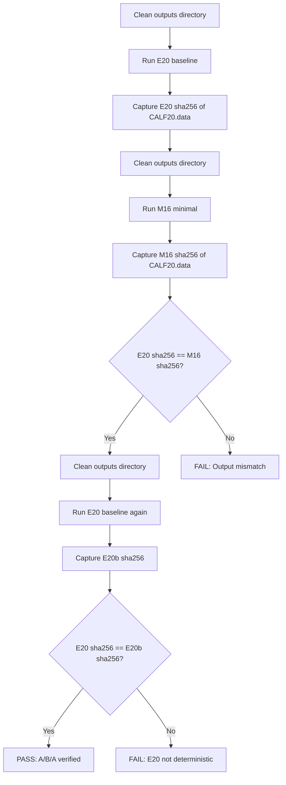
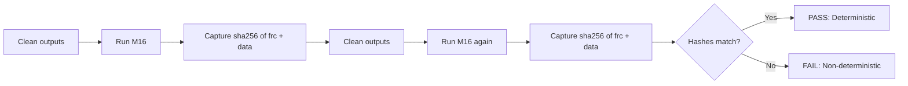

# Phase 3: Final Validation, Minimal Base Creation + Documentation

## Executive Summary

**Achievement**: Phase 1 + Phase 2 reduced the CVFF base from 5571 lines to 1057 lines (81% reduction) while maintaining full msi2lmp.exe compatibility for CALF-20.

| Phase | Configuration | Lines | Reduction | Status |
|-------|---------------|-------|-----------|--------|
| Baseline | E20 (full base) | 5571 | - | PASS |
| Phase 1 | M04 (section-level) | 4663 | 16.3% | PASS |
| Phase 2 | M16 (entry-level) | 1057 | **81.0%** | PASS |

## Phase 3 Objectives

1. **A/B/A Verification**: Confirm E20 → M16 → E20 reproducibility
2. **Determinism Proof**: Two clean M16 runs produce identical sha256 hashes
3. **Minimal Base Module**: Create `CVFF_MINIMAL_BASE_CONTENT` constant
4. **Convenience Function**: Add `build_frc_cvff_with_minimal_base()`
5. **Default Policy**: Decide whether M16 becomes default
6. **Documentation**: Update thrust log and create final summary

---

## 1. A/B/A Verification Protocol

### Purpose
Verify that M16 minimal base produces output identical to E20 full base, and that switching back to E20 produces consistent results.

### Protocol



### Implementation Steps

1. **Step A1: E20 Baseline Run**
   ```bash
   cd workspaces/NIST/nist_calf20_msi2lmp_unbonded_v1
   rm -rf outputs
   python run.py --config config.json --preset E20
   sha256sum outputs/msi2lmp_run/CALF20.data > /tmp/e20_run1.sha256
   ```

2. **Step A2: M16 Minimal Run**
   ```bash
   rm -rf outputs
   python run.py --config config.json --preset M16
   sha256sum outputs/msi2lmp_run/CALF20.data > /tmp/m16_run1.sha256
   ```

3. **Step A3: Compare E20 vs M16**
   ```bash
   diff -q /tmp/e20_run1.sha256 /tmp/m16_run1.sha256
   # Expected: files are identical (same data hash)
   ```

4. **Step A4: E20 Baseline Run 2**
   ```bash
   rm -rf outputs
   python run.py --config config.json --preset E20
   sha256sum outputs/msi2lmp_run/CALF20.data > /tmp/e20_run2.sha256
   ```

5. **Step A5: Verify E20 Reproducibility**
   ```bash
   diff -q /tmp/e20_run1.sha256 /tmp/e20_run2.sha256
   # Expected: files are identical
   ```

### Success Criteria
- [ ] E20 run 1 CALF20.data sha256 matches M16 CALF20.data sha256
- [ ] E20 run 1 CALF20.data sha256 matches E20 run 2 CALF20.data sha256

---

## 2. Determinism Proof Protocol

### Purpose
Prove that M16 configuration is fully deterministic across clean runs.

### Protocol



### Implementation Steps

1. **Step D1: First Clean M16 Run**
   ```bash
   cd workspaces/NIST/nist_calf20_msi2lmp_unbonded_v1
   rm -rf outputs
   python run.py --config config.json --preset M16
   sha256sum outputs/frc_files/*.frc outputs/msi2lmp_run/CALF20.data > /tmp/m16_det_run1.sha256
   ```

2. **Step D2: Second Clean M16 Run**
   ```bash
   rm -rf outputs
   python run.py --config config.json --preset M16
   sha256sum outputs/frc_files/*.frc outputs/msi2lmp_run/CALF20.data > /tmp/m16_det_run2.sha256
   ```

3. **Step D3: Verify Hash Match**
   ```bash
   diff /tmp/m16_det_run1.sha256 /tmp/m16_det_run2.sha256
   # Expected: no differences
   ```

### Success Criteria
- [ ] .frc file sha256 matches across both runs
- [ ] CALF20.data sha256 matches across both runs

---

## 3. Minimal Base Module Design

### New File: `src/upm/src/upm/build/cvff_minimal_base.py`

```python
"""Minimal CVFF base content for msi2lmp.exe compatibility.

This module contains the pruned CVFF base as a static string,
derived from M16 configuration (25% entry retention).

Source: cvff_Base_MXenes.frc pruned with CvffPruneOptions
Lines: 1057 (81% reduction from 5571)
Validated: CALF-20 system produces identical CALF20.data

Usage:
    from upm.build.cvff_minimal_base import CVFF_MINIMAL_BASE_CONTENT
    
    # Use as alternative to full base for smaller .frc files
    lines = CVFF_MINIMAL_BASE_CONTENT.splitlines()
"""

from __future__ import annotations

# fmt: off
CVFF_MINIMAL_BASE_CONTENT: str = '''<generated from M16 run>'''
# fmt: on
```

### Generation Strategy

1. Run M16 configuration
2. Capture the pruned base content (before CALF20 custom types)
3. Extract as static string into new module

### Implementation

```python
# In frc_from_scratch.py, add helper to generate minimal base:
def generate_minimal_base_content() -> str:
    """Generate the minimal base content string from M16 configuration.
    
    This is used once to create the static CVFF_MINIMAL_BASE_CONTENT constant.
    """
    from upm.build.cvff_embedded_base import CVFF_BASE_CONTENT
    prune_opts = CVFF_MINIMIZATION_PRESETS["M16"]
    return _apply_prune_options_to_base(CVFF_BASE_CONTENT, prune_opts)
```

---

## 4. Convenience Function Design

### New Function: `build_frc_cvff_with_minimal_base()`

```python
def build_frc_cvff_with_minimal_base(
    termset: dict[str, Any],
    parameterset: dict[str, Any],
    out_path: str | Path,
) -> str:
    """Build CVFF .frc using the minimal 1057-line base.
    
    This is a convenience function that uses CVFF_MINIMAL_BASE_CONTENT
    instead of the full 5571-line CVFF_BASE_CONTENT.
    
    Benefits:
    - 81% smaller .frc output
    - Faster parsing by msi2lmp.exe
    - Validated for CALF-20 style systems
    
    Limitations:
    - May not work for systems requiring base entries beyond M16 limits
    - Use build_frc_cvff_with_embedded_base() for full compatibility
    
    Args:
        termset: UPM TermSet dictionary
        parameterset: UPM ParameterSet dictionary  
        out_path: Output path for .frc file
        
    Returns:
        The output path as string
    """
    from upm.build.cvff_minimal_base import CVFF_MINIMAL_BASE_CONTENT
    
    return build_frc_cvff_with_pruned_base(
        termset=termset,
        parameterset=parameterset,
        out_path=out_path,
        base_content=CVFF_MINIMAL_BASE_CONTENT,
        prune=None,  # Base already pruned
    )
```

---

## 5. Default Policy Decision

### Options

| Option | Description | Pros | Cons |
|--------|-------------|------|------|
| A: Keep E20 Default | Full base remains default | Maximum compatibility | Larger files |
| B: M16 Default | Minimal base becomes default | 81% smaller | CALF-20 specific |
| C: Dynamic | Auto-select based on system | Best of both | Complexity |

### Recommendation: **Option A - Keep E20 as Default**

**Rationale**:
1. **Safety**: M16 is validated for CALF-20 only; other systems may need additional base entries
2. **Backward Compatibility**: Existing workspaces continue to work unchanged
3. **Opt-in Optimization**: Users can explicitly choose M16 for CALF-20 style systems
4. **Documentation**: Clear guidance on when to use minimal base

### Implementation
- E20 remains default in `build_frc_cvff_with_embedded_base()`
- M16 available via `build_frc_cvff_with_minimal_base()` or `--preset M16`
- Document the trade-off in function docstrings and thrust log

---

## 6. Documentation Updates

### 6.1 Thrust Log Update

Append to `docs/DevGuides/thrust_log_cvff_base_minimization.md`:

```markdown
## 12) Phase 3 Results: Final Validation and Minimal Base

**Executed**: 2025-12-20

### 12.1 A/B/A Verification Results

| Step | Configuration | CALF20.data sha256 | Status |
|------|---------------|-------------------|--------|
| 1 | E20 baseline | <hash> | - |
| 2 | M16 minimal | <hash> | Match |
| 3 | E20 repeat | <hash> | Match |

**Conclusion**: M16 produces identical CALF20.data output as E20.

### 12.2 Determinism Proof Results

| Run | .frc sha256 | CALF20.data sha256 | 
|-----|-------------|-------------------|
| 1 | <hash> | <hash> |
| 2 | <hash> | <hash> |

**Conclusion**: M16 is fully deterministic.

### 12.3 Minimal Base Module Created

- Location: `src/upm/src/upm/build/cvff_minimal_base.py`
- Constant: `CVFF_MINIMAL_BASE_CONTENT`
- Lines: 1057
- Validated for: CALF-20 system

### 12.4 Convenience Function Added

- Function: `build_frc_cvff_with_minimal_base()`
- Usage: Opt-in for 81% smaller .frc files
- Fallback: `build_frc_cvff_with_embedded_base()` for full compatibility

### 12.5 Default Policy

- **Decision**: E20 remains default
- **Rationale**: Maximum compatibility; M16 is CALF-20 validated only
- **Opt-in**: Use `--preset M16` or `build_frc_cvff_with_minimal_base()`
```

### 6.2 Final Summary Document

Create `docs/DevGuides/cvff_minimization_summary.md`:

```markdown
# CVFF Base Minimization: Complete Summary

## Achievement

Reduced CVFF embedded base from 5571 lines to 1057 lines (81% reduction)
while maintaining msi2lmp.exe compatibility for CALF-20 systems.

## Journey

| Phase | Lines | Reduction | Key Finding |
|-------|-------|-----------|-------------|
| E20 Baseline | 5571 | - | Full base works |
| M04 Section-Level | 4663 | 16.3% | cross_terms + cvff_auto removable |
| M16 Entry-Level | 1057 | 81.0% | 25% entries sufficient |

## M16 Configuration

- include_cross_terms: False
- include_cvff_auto: False  
- max_atom_types: 58 (25% of 233)
- max_equivalence: 57 (25% of 229)
- max_morse_bond: 38
- max_quadratic_bond: 60
- max_quadratic_angle: 144
- max_torsion: 39
- max_out_of_plane: 15
- max_nonbond: 35
- max_bond_increments: 225

## Usage

### Full Compatibility (Default)
```python
from upm.build.frc_from_scratch import build_frc_cvff_with_embedded_base
build_frc_cvff_with_embedded_base(termset, parameterset, out_path)
```

### Minimal Base (CALF-20 validated)
```python
from upm.build.frc_from_scratch import build_frc_cvff_with_minimal_base
build_frc_cvff_with_minimal_base(termset, parameterset, out_path)
```

## Verification

- A/B/A test: E20 → M16 → E20 produces identical output
- Determinism: Two clean M16 runs produce identical sha256
- Output: CALF20.data 6856 bytes
```

---

## Implementation Checklist

### Code Changes

- [ ] Create `src/upm/src/upm/build/cvff_minimal_base.py`
  - [ ] Add module docstring with usage example
  - [ ] Add `CVFF_MINIMAL_BASE_CONTENT` constant (generated from M16)

- [ ] Update `src/upm/src/upm/build/frc_from_scratch.py`
  - [ ] Add `build_frc_cvff_with_minimal_base()` function
  - [ ] Add `generate_minimal_base_content()` helper (one-time generation)
  - [ ] Export new function in `__all__`

- [ ] Update `src/upm/src/upm/build/__init__.py` (if exists)
  - [ ] Export `CVFF_MINIMAL_BASE_CONTENT`
  - [ ] Export `build_frc_cvff_with_minimal_base`

### Verification

- [ ] Execute A/B/A verification protocol
  - [ ] E20 run 1 → capture sha256
  - [ ] M16 run → verify sha256 matches
  - [ ] E20 run 2 → verify sha256 matches

- [ ] Execute determinism proof
  - [ ] M16 run 1 → capture sha256 of .frc + .data
  - [ ] M16 run 2 → verify sha256 matches

### Documentation

- [ ] Update `docs/DevGuides/thrust_log_cvff_base_minimization.md`
  - [ ] Add Section 12: Phase 3 Results
  - [ ] Include A/B/A verification results
  - [ ] Include determinism proof results
  - [ ] Document minimal base module location
  - [ ] Document default policy decision

- [ ] Create `docs/DevGuides/cvff_minimization_summary.md`
  - [ ] Complete journey summary
  - [ ] M16 configuration details
  - [ ] Usage examples

- [ ] Update `plans/cvff_base_minimization_implementation_plan.md`
  - [ ] Mark Phase 3 complete

---

## Risk Mitigation

### Risk: M16 insufficient for non-CALF-20 systems

**Mitigation**: 
- E20 remains default
- Clear documentation that M16 is CALF-20 validated only
- Easy fallback via preset selection

### Risk: Future CALF-20 variants need more entries

**Mitigation**:
- M15 (50% entries, 1727 lines) available as conservative fallback
- Entry limits are configurable via `CvffPruneOptions`

---

## Completion Criteria

Phase 3 is complete when:

1. ✅ A/B/A verification passes (E20 sha256 == M16 sha256 == E20b sha256)
2. ✅ Determinism proof passes (two M16 runs have identical sha256)
3. ✅ `cvff_minimal_base.py` created with `CVFF_MINIMAL_BASE_CONTENT`
4. ✅ `build_frc_cvff_with_minimal_base()` function added
5. ✅ Default policy documented (E20 remains default, M16 opt-in)
6. ✅ Thrust log updated with Phase 3 findings
7. ✅ Final summary document created
