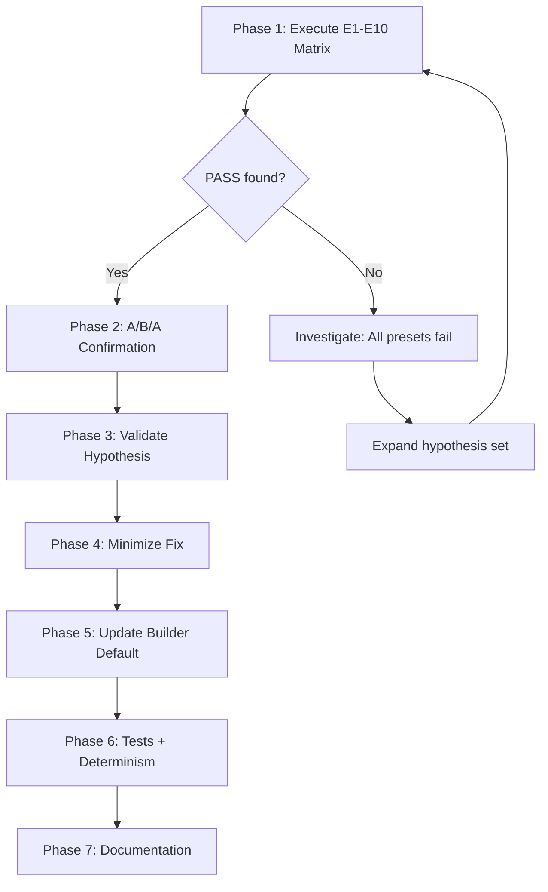

# Subtask 4: Diagnose and Remediate msi2lmp.exe Stall with From-Scratch CVFF .frc

## 1. Current State Summary

### What's Been Completed
- **Subtask 1:** Implemented [`CvffFrcEmitOptions`](src/upm/src/upm/build/frc_from_scratch.py:611) dataclass with 11 builder toggles
- **Subtask 1:** Created [`CVFF_FRC_EXPERIMENT_PRESETS`](src/upm/src/upm/build/frc_from_scratch.py:708) map (E0–E10)
- **Subtask 1:** Wired workspace to support `params.frc_experiment_preset` selection
- **Subtask 2:** Only E0 (baseline) has been run — it **STALLED** after 600s

### Current Stall Evidence
From [`result.json`](workspaces/NIST/nist_calf20_msi2lmp_unbonded_v1/outputs/msi2lmp_run/result.json:1):
- `status`: `"timeout"` after 600s
- `stdout`: empty (tool never printed "Reading forcefield file")
- `stderr`: `WARNING inconsistent # of connects on atom 10 type C_MOF`
- `CALF20.data`: **does not exist**

### Critical Gap
**Subtask 2 was NOT completed** — experiments E1–E10 have not been executed against the real `msi2lmp.exe`. We must run these experiments to identify which preset flips the stall to PASS.

## 2. Hypotheses Under Test

From the thrust log, six hypotheses were identified:

| ID | Hypothesis | Tested by Preset |
|----|------------|------------------|
| H1 | Macro/bond-model mismatch (both quadratic+morse under cvff) | E4, E5 |
| H2 | Section ordering dependency (equivalence before atom_types) | E6 |
| H3 | Ver/ref version loop (mixed 1.0/2.0) | E7 |
| H4 | Header tokenization sensitivity (tabs/spaces/trailing) | E3, E10 |
| H5 | Wildcard + equivalence exponential backtracking | E8, E9 |
| H6 | Front-matter compatibility (preamble format) | E1 |

## 3. Experiment Presets Reference

| Preset | Configuration | Tests |
|--------|---------------|-------|
| E0 | Baseline (emit=None → legacy path) | Baseline STALL |
| E1 | `preamble_style="asset_like"` | H6 |
| E2 | `emit_macro_table=False` | H1/H4 |
| E3 | `macro_table_format="asset_tabs"` | H4 |
| E4 | `bond_model="morse_only"` | H1 |
| E5 | `cvff_define="cvff_nocross_nomorse", bond_model="quadratic_only"` | H1 |
| E6 | `section_order="asset_like"` | H2 |
| E7 | `ver_ref_policy="normalize_2_0_18"` | H3 |
| E8 | `emit_auto_equivalence=False` | H5 |
| E9 | `emit_wildcard_torsion=False, emit_wildcard_oop=False` | H5 |
| E10 | `header_label_separator="space", header_trailing_space=True` | H4 |

## 4. Execution Plan

### Phase 1: Execute A/B Experiment Matrix (Priority Gap)

**Goal:** Run E1–E10 against real `msi2lmp.exe` and record outcomes.

**Execution template** (from diagnostics guide, per preset):

```bash
# 1. Generate .frc for preset Exx (clean outputs first)
rm -rf workspaces/NIST/nist_calf20_msi2lmp_unbonded_v1/outputs
python workspaces/NIST/nist_calf20_msi2lmp_unbonded_v1/run.py \
  --config workspaces/NIST/nist_calf20_msi2lmp_unbonded_v1/config_exp.json

# config_exp.json contains: { "params": { "frc_experiment_preset": "E1" } }

# 2. Manual hang-proof run (from outputs/msi2lmp_run)
cd workspaces/NIST/nist_calf20_msi2lmp_unbonded_v1/outputs/msi2lmp_run
timeout --preserve-status --signal=TERM --kill-after=1s 40s \
  stdbuf -oL -eL /home/sf2/LabWork/software/msi2lmp.exe CALF20 \
    -ignore -print 2 -class I -frc ../frc_files/ff_exp_E1.frc \
  </dev/null \
  >manual_E1.stdout.txt \
  2>manual_E1.stderr.txt
echo "E1 exit_code=$?"

# 3. Check outcome
ls -la CALF20.data
```

**Outcome classification:**
- **PASS:** `exit_code=0` + `CALF20.data` exists and is non-empty
- **STALL:** `exit_code=143` + stdout ends at/before "Reading forcefield file"
- **FAST-FAIL:** nonzero exit with error message before parameter resolution

**Artifacts to capture per preset:**
- `manual_Exx.stdout.txt`
- `manual_Exx.stderr.txt`
- Exit code
- CALF20.data size (0 or non-empty)

### Phase 2: Identify Winning Preset

**Stop condition:** First preset that flips STALL → PASS

**A/B/A confirmation protocol:**
1. Run E0 (baseline) — expect STALL
2. Run winning preset (e.g., E4) — expect PASS
3. Run E0 again — expect STALL
4. Run winning preset again — expect PASS

This proves the fix is deterministic and specific to the preset change.

### Phase 3: Hypothesis Validation

Map winning preset back to hypothesis:
- If E4/E5 wins → H1 confirmed (bond-model mismatch)
- If E6 wins → H2 confirmed (section ordering)
- If E7 wins → H3 confirmed (ver/ref policy)
- If E8/E9 wins → H5 confirmed (wildcard/equivalence)
- etc.

### Phase 4: Minimize the Fix

After identifying the winning preset, determine the **minimal change set**:
1. Start from E0 (baseline)
2. Add only the specific toggle(s) that caused the PASS
3. Remove any extraneous toggles
4. Verify the minimized config still produces PASS

### Phase 5: Update Builder Default

Modify [`build_frc_cvff_minimal_bonded()`](src/upm/src/upm/build/frc_from_scratch.py:153) to:
1. Apply the winning configuration as the new default (when `emit=None`)
2. Preserve the legacy path for E0 byte determinism if needed for testing
3. Document the change in the function docstring

### Phase 6: Tests and Determinism Proof

**Required tests:**
1. Unit test: minimized winning config produces expected .frc structure
2. Regression test: no .frc disk reads introduced
3. Integration test: real-tool run completes and produces non-empty CALF20.data
4. Determinism test: two clean runs produce identical sha256 for:
   - `ff_cvff_min_bonded.frc`
   - `CALF20.data`

**Test commands:**
```bash
/usr/bin/python3 -m pytest -q src/upm/tests/test_build_frc_from_scratch_cvff_minimal_bonded.py
/usr/bin/python3 -m pytest -q tests/integration/test_workspace_nist_calf20_msi2lmp_unbonded_determinism.py
```

### Phase 7: Documentation

Append to thrust log [`thrust_log_nist_calf20_msi2lmp_stall.md`](docs/DevGuides/thrust_log_nist_calf20_msi2lmp_stall.md):
1. Experiment results table (E0–E10 outcomes)
2. Winning preset identification
3. Confirmed hypothesis
4. Minimal fix description
5. Verification evidence (sha256 hashes)

## 5. Success Criteria

1. ✅ At least one preset (E1–E10) produces `exit_code=0` and non-empty `CALF20.data`
2. ✅ A/B/A confirmation proves the fix is deterministic
3. ✅ Builder default updated to apply winning fix
4. ✅ All tests pass (unit + integration + determinism)
5. ✅ Thrust log updated with complete results

## 6. Scope Guardrails

- **MUST NOT** read any reference .frc file from disk
- **MUST** preserve deterministic output
- **DO NOT** attempt to make bonded parameters physically accurate (tool-satisfying only)
- **FOCUS** on finding and minimizing the winning config, not on exploring all combinations

## 7. Recommended Implementation Order



## 8. Subtask Breakdown for Orchestrator Mode

### Subtask 2A: Execute Experiment Matrix
- Run presets E1–E10 with hang-proof template
- Capture stdout/stderr/exit_code per preset
- Record outcomes in structured format (JSON/CSV)
- Identify first PASS preset

### Subtask 2B: A/B/A Confirmation + Hypothesis Analysis
- Perform A/B/A confirmation sequence
- Map winning preset to hypothesis
- Document in thrust log

### Subtask 4A: Minimize and Apply Fix
- Determine minimal toggle set
- Update builder default
- Update tests

### Subtask 4B: Determinism Proof and Documentation
- Run two clean real-tool runs
- Verify sha256 matches
- Update thrust log with final results
