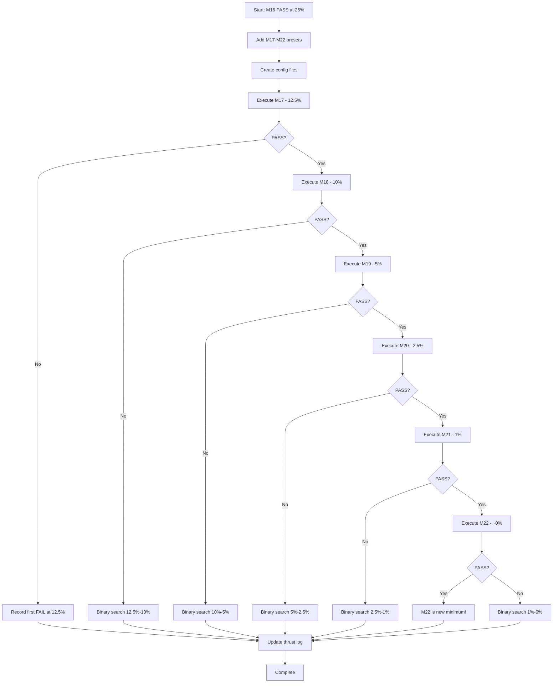

# Phase 4: Extended Minimization Experiments (M17-M22)

## Overview

This plan extends the CVFF base minimization from 25% (M16) down to 0% to find the **absolute minimum viable base** for msi2lmp.exe compatibility.

### Current State

| Preset | Entry % | FRC Lines | Status |
|--------|---------|-----------|--------|
| E20 | 100% | 5571 | PASS (baseline) |
| M04 | 100% (sections removed) | 4663 | PASS |
| M15 | 50% | 1727 | PASS |
| M16 | 25% | 1057 | **PASS (current minimum)** |

### Target Range

Test the complete range from 25% down to 0%:
- M17: 12.5%
- M18: 10%
- M19: 5%
- M20: 2.5%
- M21: 1%
- M22: ~0% (1 entry per section minimum)

## Entry Count Calculations

### Full Section Entry Counts (from cvff_Base_MXenes.frc)

| Section | Full Count |
|---------|------------|
| atom_types | 233 |
| equivalence | 229 |
| morse_bond | 152 |
| quadratic_bond | 240 |
| quadratic_angle | 576 |
| torsion_1 | 154 |
| out_of_plane | 58 |
| nonbond | 139 |
| bond_increments | 902 |

### Calculated Entry Limits by Percentage

| Section | 25% (M16) | 12.5% (M17) | 10% (M18) | 5% (M19) | 2.5% (M20) | 1% (M21) | ~0% (M22) |
|---------|-----------|-------------|-----------|----------|------------|----------|-----------|
| atom_types | 58 | 29 | 23 | 12 | 6 | 2 | 1 |
| equivalence | 57 | 29 | 23 | 11 | 6 | 2 | 1 |
| morse_bond | 38 | 19 | 15 | 8 | 4 | 2 | 1 |
| quadratic_bond | 60 | 30 | 24 | 12 | 6 | 2 | 1 |
| quadratic_angle | 144 | 72 | 58 | 29 | 14 | 6 | 1 |
| torsion_1 | 39 | 19 | 15 | 8 | 4 | 2 | 1 |
| out_of_plane | 15 | 7 | 6 | 3 | 1 | 1 | 1 |
| nonbond | 35 | 17 | 14 | 7 | 3 | 1 | 1 |
| bond_increments | 225 | 113 | 90 | 45 | 23 | 9 | 1 |

## M17-M22 Preset Specifications

### M17 (12.5% entries)

```python
"M17": CvffPruneOptions(
    include_cross_terms=False,
    include_cvff_auto=False,
    max_atom_types=29,
    max_equivalence=29,
    max_morse_bond=19,
    max_quadratic_bond=30,
    max_quadratic_angle=72,
    max_torsion=19,
    max_out_of_plane=7,
    max_nonbond=17,
    max_bond_increments=113,
)
```

### M18 (10% entries)

```python
"M18": CvffPruneOptions(
    include_cross_terms=False,
    include_cvff_auto=False,
    max_atom_types=23,
    max_equivalence=23,
    max_morse_bond=15,
    max_quadratic_bond=24,
    max_quadratic_angle=58,
    max_torsion=15,
    max_out_of_plane=6,
    max_nonbond=14,
    max_bond_increments=90,
)
```

### M19 (5% entries)

```python
"M19": CvffPruneOptions(
    include_cross_terms=False,
    include_cvff_auto=False,
    max_atom_types=12,
    max_equivalence=11,
    max_morse_bond=8,
    max_quadratic_bond=12,
    max_quadratic_angle=29,
    max_torsion=8,
    max_out_of_plane=3,
    max_nonbond=7,
    max_bond_increments=45,
)
```

### M20 (2.5% entries)

```python
"M20": CvffPruneOptions(
    include_cross_terms=False,
    include_cvff_auto=False,
    max_atom_types=6,
    max_equivalence=6,
    max_morse_bond=4,
    max_quadratic_bond=6,
    max_quadratic_angle=14,
    max_torsion=4,
    max_out_of_plane=1,
    max_nonbond=3,
    max_bond_increments=23,
)
```

### M21 (1% entries)

```python
"M21": CvffPruneOptions(
    include_cross_terms=False,
    include_cvff_auto=False,
    max_atom_types=2,
    max_equivalence=2,
    max_morse_bond=2,
    max_quadratic_bond=2,
    max_quadratic_angle=6,
    max_torsion=2,
    max_out_of_plane=1,
    max_nonbond=1,
    max_bond_increments=9,
)
```

### M22 (~0% entries / near-headers-only)

```python
"M22": CvffPruneOptions(
    include_cross_terms=False,
    include_cvff_auto=False,
    max_atom_types=1,
    max_equivalence=1,
    max_morse_bond=1,
    max_quadratic_bond=1,
    max_quadratic_angle=1,
    max_torsion=1,
    max_out_of_plane=1,
    max_nonbond=1,
    max_bond_increments=1,
)
```

**Note**: M22 uses `max_*=1` (1 entry per section) instead of `max_*=0` because:
1. Empty sections may cause parser initialization failures
2. Prior E21 experiment with headers-only failed with validation error
3. Testing with minimal entries validates the hypothesis that base content matters

## Estimated FRC Line Counts

Based on the M16 baseline of 1057 lines at 25%:

| Preset | Entry % | Estimated Lines | Reduction from M16 |
|--------|---------|-----------------|-------------------|
| M17 | 12.5% | ~600 | ~43% |
| M18 | 10% | ~500 | ~53% |
| M19 | 5% | ~300 | ~72% |
| M20 | 2.5% | ~200 | ~81% |
| M21 | 1% | ~100 | ~91% |
| M22 | ~0% | ~50-80 | ~92-95% |

## Implementation Steps

### Step 1: Add M17-M22 Presets to frc_from_scratch.py

**File**: [`src/upm/src/upm/build/frc_from_scratch.py`](src/upm/src/upm/build/frc_from_scratch.py:2165)

Insert after the M16 preset (line 2165):

```python
    # Phase 4: Extended minimization experiments (12.5% → 0%)
    
    # M17: All sections at 12.5%
    "M17": CvffPruneOptions(
        include_cross_terms=False,
        include_cvff_auto=False,
        max_atom_types=29,
        max_equivalence=29,
        max_morse_bond=19,
        max_quadratic_bond=30,
        max_quadratic_angle=72,
        max_torsion=19,
        max_out_of_plane=7,
        max_nonbond=17,
        max_bond_increments=113,
    ),
    
    # M18: All sections at 10%
    "M18": CvffPruneOptions(
        include_cross_terms=False,
        include_cvff_auto=False,
        max_atom_types=23,
        max_equivalence=23,
        max_morse_bond=15,
        max_quadratic_bond=24,
        max_quadratic_angle=58,
        max_torsion=15,
        max_out_of_plane=6,
        max_nonbond=14,
        max_bond_increments=90,
    ),
    
    # M19: All sections at 5%
    "M19": CvffPruneOptions(
        include_cross_terms=False,
        include_cvff_auto=False,
        max_atom_types=12,
        max_equivalence=11,
        max_morse_bond=8,
        max_quadratic_bond=12,
        max_quadratic_angle=29,
        max_torsion=8,
        max_out_of_plane=3,
        max_nonbond=7,
        max_bond_increments=45,
    ),
    
    # M20: All sections at 2.5%
    "M20": CvffPruneOptions(
        include_cross_terms=False,
        include_cvff_auto=False,
        max_atom_types=6,
        max_equivalence=6,
        max_morse_bond=4,
        max_quadratic_bond=6,
        max_quadratic_angle=14,
        max_torsion=4,
        max_out_of_plane=1,
        max_nonbond=3,
        max_bond_increments=23,
    ),
    
    # M21: All sections at 1%
    "M21": CvffPruneOptions(
        include_cross_terms=False,
        include_cvff_auto=False,
        max_atom_types=2,
        max_equivalence=2,
        max_morse_bond=2,
        max_quadratic_bond=2,
        max_quadratic_angle=6,
        max_torsion=2,
        max_out_of_plane=1,
        max_nonbond=1,
        max_bond_increments=9,
    ),
    
    # M22: Near-zero entries (1 per section, testing headers + minimal data)
    "M22": CvffPruneOptions(
        include_cross_terms=False,
        include_cvff_auto=False,
        max_atom_types=1,
        max_equivalence=1,
        max_morse_bond=1,
        max_quadratic_bond=1,
        max_quadratic_angle=1,
        max_torsion=1,
        max_out_of_plane=1,
        max_nonbond=1,
        max_bond_increments=1,
    ),
```

### Step 2: Create Config Files

Create config files for each experiment in:
`workspaces/NIST/nist_calf20_msi2lmp_unbonded_v1/`

Config file template (only `frc_experiment_preset` changes):

```json
{
  "outputs_dir": "./outputs",
  "inputs": {
    "car": "inputs/CALF20.car",
    "mdf": "inputs/CALF20.mdf",
    "parameterset": "inputs/parameterset.json"
  },
  "executables": {
    "msi2lmp": "/home/sf2/LabWork/software/msi2lmp.exe"
  },
  "executables_profiles": {
    "local": {
      "msi2lmp": "/home/sf2/LabWork/software/msi2lmp.exe"
    }
  },
  "selected_profile": "local",
  "params": {
    "timeout_s": 30,
    "normalize_xy": true,
    "normalize_z_to": null,
    "normalize_z_shift": true,
    "normalize_z_center": false,
    "msi2lmp_forcefield_class": null,
    "msi2lmp_use_f_flag": null,
    "msi2lmp_ignore": true,
    "msi2lmp_print_level": null,
    "coord_norm_enabled": true,
    "coord_norm_mode": "wrap_shift",
    "coord_norm_pad_abs": 0.0,
    "coord_norm_pad_frac": 0.0,
    "frc_experiment_preset": "M17"
  }
}
```

Files to create:
- `config_M17.json` (preset: "M17")
- `config_M18.json` (preset: "M18")
- `config_M19.json` (preset: "M19")
- `config_M20.json` (preset: "M20")
- `config_M21.json` (preset: "M21")
- `config_M22.json` (preset: "M22")

### Step 3: Execute Experiments

Execute each experiment sequentially with a shell script or Python runner:

```bash
cd workspaces/NIST/nist_calf20_msi2lmp_unbonded_v1

for preset in M17 M18 M19 M20 M21 M22; do
    echo "=== Running $preset ==="
    rm -rf outputs
    python run.py --config config_${preset}.json
    
    # Record results
    echo "Exit code: $?"
    wc -l outputs/frc_files/cvff_${preset}.frc
    stat outputs/msi2lmp_run/CALF20.data 2>/dev/null || echo "No CALF20.data"
done
```

### Step 4: Record Results

For each experiment, capture:
1. **Exit code**: 0 = PASS, non-zero = FAIL
2. **FRC lines**: `wc -l` on the generated .frc file
3. **CALF20.data status**: exists / size / sha256
4. **Error message** (if FAIL): from msi2lmp stderr or result.json

### Step 5: Analyze Results

Expected outcome patterns:
1. **All PASS**: M22 with 1 entry/section is sufficient → new minimum
2. **Progressive FAIL**: Some threshold between M16 and M22 fails
3. **Immediate FAIL at M17**: 12.5% is already too aggressive

If a gap exists between last PASS and first FAIL (e.g., M19 PASS, M20 FAIL):
- Binary search with intermediate percentages
- Example: Test 3.75% (between 5% and 2.5%)

### Step 6: Update Thrust Log

Append Phase 4 results section to:
[`docs/DevGuides/thrust_log_cvff_base_minimization.md`](docs/DevGuides/thrust_log_cvff_base_minimization.md)

Include:
1. Complete experiment matrix table (100% → 0%)
2. PASS/FAIL boundary identification
3. Failure mode analysis (if applicable)
4. Final minimum viable configuration

### Step 7: Update Minimal Base (if applicable)

If a preset lower than M16 passes (e.g., M19 at 5%), update:
1. [`cvff_minimal_base.py`](src/upm/src/upm/build/cvff_minimal_base.py) with new pre-pruned content
2. Documentation to reflect new minimum

## Success Criteria

| Criterion | Requirement |
|-----------|-------------|
| All M17-M22 executed | Exit code and CALF20.data status recorded |
| PASS/FAIL boundary identified | Know exact minimum % threshold |
| Failure mode documented | For first failing preset |
| Thrust log updated | Complete experiment matrix 100% → 0% |
| Binary search (if needed) | Exact threshold found between consecutive presets |

## Risk Analysis

### Known Risks

1. **E21 precedent**: Headers-only (0 entries) failed with exit 7 validation error
   - **Mitigation**: M22 uses max_*=1 (1 entry per section)

2. **bond_increments sensitivity**: M01/M05 crashed when section was removed
   - **Mitigation**: Section toggle remains True; only entry count reduced

3. **Parser initialization**: Some base entries may be required for type resolution
   - **Mitigation**: Test incrementally (12.5% → 10% → 5% → ...)

### Expected Failure Mode

Based on prior experiments, likely failure mode is:
- **Exit code 7**: Validation error (missing required parameter)
- **Exit code -11 (SIGSEGV)**: Critical section data missing
- **Stall (exit 143/SIGTERM)**: Parameter lookup loop (unlikely with pruning approach)

## Experiment Workflow Diagram



## Ready for Implementation

This plan is complete and ready for Code mode implementation. The key files to modify:

1. **[`frc_from_scratch.py`](src/upm/src/upm/build/frc_from_scratch.py)**: Add M17-M22 presets after line 2165
2. **Config files**: Create 6 new config files in workspace directory
3. **Thrust log**: Append Phase 4 results after execution

Switch to Code mode to begin implementation.
