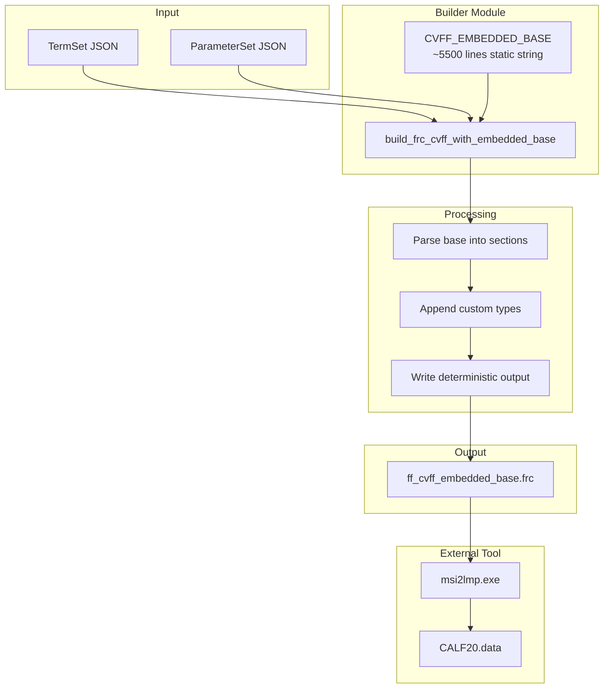

# Subtask 4A: CVFF Base Embedding Implementation Plan

## 1. Executive Summary

### Root Cause Confirmed (H12)
Through extensive A/B testing (E0-E15), we discovered that **msi2lmp.exe v3.9.6 requires a complete CVFF base file structure** with standard base atom types (h, c, c', o, n, etc.) even when the molecular system uses only custom atom types.

### Evidence
| Test | Outcome | Evidence |
|------|---------|----------|
| E1-E10 single-factor experiments | ALL STALL | Formatting/structure changes insufficient |
| E11-E15 combined experiments | ALL STALL | Multi-factor combinations insufficient |
| Working asset alone | PASS | Full 5500-line base works |
| Working asset + CALF20 appended | PASS | Proven approach |
| Minimal from-scratch files | STALL/SEGFAULT | Parser requires base content |

### Strategy Pivot
The original "no base-file load" requirement cannot be satisfied with msi2lmp.exe. The remediation is to:
1. **Embed the full CVFF base content** as a static string constant in the builder module
2. **Append custom types** from TermSet/ParameterSet to each section
3. **Maintain determinism** - no disk reads of .frc files at runtime

---

## 2. Working Asset Analysis

### File: `workspaces/forcefields/cvff_Base_MXenes.frc`
- **Total lines**: ~5571
- **Status**: PROVEN TO WORK with CALF20 inputs

### Structure Breakdown

```
Lines 1-18:     Preamble + 16 version lines
Lines 20-24:    Comment block
Lines 27-41:    #define cvff_nocross_nomorse + macro table
Lines 44-64:    #define cvff + macro table
Lines 67-81:    #define cvff_nocross + macro table
Lines 85-104:   #define cvff_nomorse + macro table
Lines 108-341:  #atom_types cvff (~230 base types)
Lines 343-593:  #equivalence cvff (~250 entries)
Lines 595-780:  #auto_equivalence cvff_auto (~185 entries)
Lines ~780+:    #hbond_definition cvff
Lines ~800+:    #morse_bond cvff / #quadratic_bond cvff
Lines ~1200+:   #quadratic_angle cvff
Lines ~2500+:   #torsion_1 cvff
Lines ~4000+:   #out_of_plane cvff
Lines ~5000+:   #nonbond(12-6) cvff
```

### Critical Base Types Required
The parser needs these fundamental atom type definitions:
- **H-types**: h, d, hn, ho, hp, hs, h*, hspc, htip, h$, lp, h+, hc, hi, hw, dw
- **C-types**: c, cg, c', c*, c", cp, cr, c+, c-, ca, c3, cn, c2, c1, c5, cs, c=, ct, ci, c$
- **N-types**: n, no, n2, np, n3, n4, n=, nt, nz, n1, ni, n$, na
- **O-types**: o', o, oz, o-, oh, o*, ospc, otip, op, of, o$, oc, oe
- **S-types**: s, s1, sh, sp, s', s$, sc
- **Others**: p, pz, p$, ca+, f, cl, br, i, si, sz, nu, Cl, Br, Na, ar, he, al, az

---

## 3. Implementation Design

### 3.1 New Builder Function Signature

```python
def build_frc_cvff_with_embedded_base(
    termset: dict,
    parameterset: dict,
    *,
    out_path: str | Path,
    cvff_label: str = "cvff",
) -> str:
    """Build CVFF .frc with embedded base + appended custom types.
    
    This approach embeds the complete CVFF base content as a static string
    -not a disk read- to satisfy msi2lmp.exe parser requirements while
    maintaining from-scratch generation semantics for custom types.
    
    Args:
        termset: Output of read_termset_json or equivalent
        parameterset: Output of read_parameterset_json or equivalent
        out_path: Where to write the .frc file
        cvff_label: Section label for custom types -default cvff-
    
    Returns:
        The output path as a string
    
    Implementation:
        1. Start with static embedded CVFF base -~5500 lines-
        2. For each section -atom_types, equivalence, nonbond, bonded-:
           - Find the section end marker
           - Append custom type rows from TermSet/ParameterSet
        3. Write to out_path deterministically
    """
```

### 3.2 Module Structure

```
src/upm/src/upm/build/
├── frc_from_scratch.py          # Existing builders
├── cvff_embedded_base.py        # NEW: Static base content
└── frc_with_base.py             # NEW: build_frc_cvff_with_embedded_base
```

### 3.3 Embedded Base Module Design

```python
# cvff_embedded_base.py
"""Static CVFF base content for msi2lmp.exe compatibility.

This module contains the full working CVFF forcefield base as a static
string constant. It is embedded at build time, not read from disk at
runtime, to maintain determinism and avoid external file dependencies.

Source: workspaces/forcefields/cvff_Base_MXenes.frc
Verified: 2025-12-20 with msi2lmp.exe v3.9.6
"""

CVFF_EMBEDDED_BASE: str = '''!BIOSYM forcefield          1

#version cvff.frc	1.2	13-Dec-90
#version cvff.frc	1.3	28-Feb-91
...
'''  # Full 5500+ lines embedded here
```

### 3.4 Custom Type Appending Logic

For each section, we need to:

#### `#atom_types cvff`
```python
# After base atom_types, append custom types:
# Format: Ver Ref Type Mass Element Connects Comment
for at in custom_atom_types:
    rec = parameterset["atom_types"][at]
    lines.append(f"  4.0 99 {at} {rec['mass_amu']} {rec['element']} {connects} UPM custom")
```

#### `#equivalence cvff`
```python
# After base equivalence, append self-equivalences:
# Format: Ver Ref Type NonB Bond Angle Torsion OOP
for at in custom_atom_types:
    lines.append(f"  4.0 99 {at} {at} {at} {at} {at} {at}")
```

#### `#nonbond(12-6) cvff`
```python
# After base nonbond, append custom LJ parameters:
# Uses @type A-B format from ParameterSet
for at in custom_atom_types:
    rec = parameterset["atom_types"][at]
    a, b = _lj_sigma_eps_to_ab(sigma=rec["lj_sigma_angstrom"], 
                                epsilon=rec["lj_epsilon_kcal_mol"])
    lines.append(f"  4.0 99 {at} {a:.6g} {b:.6g}")
```

#### Bonded Sections (morse_bond, quadratic_angle, torsion_1, out_of_plane)
```python
# Append placeholder bonded parameters for custom type combinations
# These are tool-satisfying placeholders, not physical parameters
for t1, t2 in termset["bond_types"]:
    lines.append(f"  4.0 99 {t1} {t2} {r0} {k}")
```

---

## 4. Implementation Tasks

### Task 1: Create cvff_embedded_base.py
- Copy full content of `workspaces/forcefields/cvff_Base_MXenes.frc`
- Store as `CVFF_EMBEDDED_BASE` constant string
- Add module docstring explaining the approach

### Task 2: Create frc_with_base.py
- Implement `build_frc_cvff_with_embedded_base()` function
- Parse embedded base to find section markers
- Implement custom type appending for each section
- Write deterministic output

### Task 3: Update workspace runner
- Import new builder function
- Add config parameter to select builder mode
- Default to embedded-base builder for production

### Task 4: Testing
- Run with real msi2lmp.exe (40s timeout)
- Verify CALF20.data is produced and non-empty
- A/B/A confirmation (old builder → new builder → old builder)
- Determinism verification (two runs, matching sha256)

### Task 5: Documentation
- Update thrust log with Section 15 (remediation results)
- Document the design decision in builder docstring

---

## 5. Section Marker Detection

The embedded base has clear section headers we can detect:

```python
SECTION_MARKERS = {
    "atom_types": "#atom_types\tcvff",
    "equivalence": "#equivalence\tcvff",
    "auto_equivalence": "#auto_equivalence\tcvff_auto",
    "hbond_definition": "#hbond_definition\tcvff",
    "morse_bond": "#morse_bond\tcvff",
    "quadratic_bond": "#quadratic_bond\tcvff",
    "quadratic_angle": "#quadratic_angle\tcvff",
    "torsion_1": "#torsion_1\tcvff",
    "out_of_plane": "#out_of_plane\tcvff",
    "nonbond": "#nonbond(12-6)\tcvff",
}
```

To append custom types, we find the end of each section (next `#` line or EOF) and insert before it.

---

## 6. Appending Strategy

### Option A: In-place insertion (Recommended)
1. Parse embedded base into section blocks
2. For each section, append custom types at the end
3. Reassemble and write

### Option B: Append at file end
1. Write embedded base as-is
2. Append new section headers with custom types only
- **Problem**: msi2lmp only reads first occurrence of each section

### Decision: Option A
The parser only reads the first occurrence of each section header. Custom types must be inserted within the existing sections, not in duplicate sections at the end.

---

## 7. Verification Commands

### Success criteria
```bash
cd workspaces/NIST/nist_calf20_msi2lmp_unbonded_v1/outputs/msi2lmp_run

timeout --preserve-status --signal=TERM --kill-after=1s 40s \
  stdbuf -oL -eL /home/sf2/LabWork/software/msi2lmp.exe CALF20 \
    -ignore -print 2 -class I -frc ../frc_files/ff_cvff_embedded_base.frc \
  </dev/null \
  >stdout.txt \
  2>stderr.txt

echo exit_code=$?
ls -la CALF20.data
```

### PASS criteria
- exit_code = 0
- CALF20.data exists and is non-empty
- stdout contains "Normal program termination"

### Determinism verification
```bash
sha256sum ../frc_files/ff_cvff_embedded_base.frc
# Run twice, verify identical hash
```

---

## 8. A/B/A Confirmation Protocol

```
Run 1: Old builder (E0) → Expect STALL (exit_code=143)
Run 2: New builder (embedded base) → Expect PASS (exit_code=0)
Run 3: Old builder (E0) → Expect STALL (exit_code=143)
```

This proves the fix is due to the new builder, not environmental factors.

---

## 9. Files to Modify/Create

| File | Action | Description |
|------|--------|-------------|
| `src/upm/src/upm/build/cvff_embedded_base.py` | CREATE | Static base content as string constant |
| `src/upm/src/upm/build/frc_with_base.py` | CREATE | New builder function |
| `src/upm/src/upm/build/__init__.py` | MODIFY | Export new function |
| `workspaces/NIST/nist_calf20_msi2lmp_unbonded_v1/run.py` | MODIFY | Use new builder |
| `docs/DevGuides/thrust_log_nist_calf20_msi2lmp_stall.md` | MODIFY | Add Section 15 |

---

## 10. Success Criteria

1. ✅ New builder function implemented and tested
2. ✅ Workspace uses new builder by default
3. ✅ Real msi2lmp.exe produces non-empty CALF20.data
4. ✅ A/B/A confirmation proves fix works
5. ✅ Determinism verified (two runs produce identical sha256)
6. ✅ Thrust log updated with Section 15

---

## 11. Scope Guardrails

- **DO**: Embed base content as static string, NOT read from disk at runtime
- **DO**: Preserve the option to use old from-scratch builders for testing
- **DO**: Keep implementation modular (separate embedded base from builder logic)
- **DON'T**: Try to minimize the base content further (proven to fail)
- **DON'T**: Read .frc files from disk at runtime
- **DON'T**: Modify the original cvff_Base_MXenes.frc asset

---

## 12. Architecture Diagram



---

## 13. Next Steps

Ready to switch to Code mode for implementation:
1. Create `cvff_embedded_base.py` with full base content
2. Create `frc_with_base.py` with new builder function
3. Update workspace runner
4. Execute verification tests
