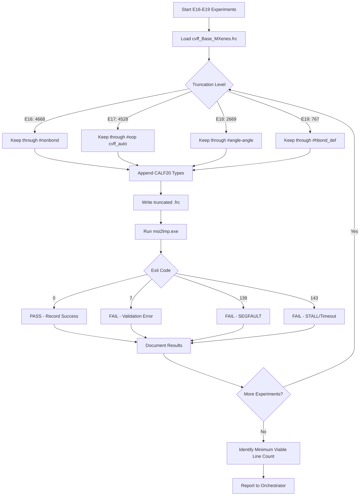

# Subtask 4A-2: Truncation Experiments E16-E19 Implementation Plan

## 1. Context Summary

### Prior Experiment Results

| Test | Lines | Source | Result |
|------|-------|--------|--------|
| E0-E15 | 118-318 | From-scratch generated | **STALL** (exit 143) |
| E21 | ~437 | Asset skeleton + CALF20-only | **NO STALL**, validation error (exit 7) |
| Asset truncated 1000 | ~1000 | Truncated asset | **SEGFAULT** (exit 139) |
| Full asset | 5571 | cvff_Base_MXenes.frc | **PASS** ✓ |

### Key Finding from E21

The skeleton experiment confirmed:
1. **Asset structure prevents the parser stall** - E21 reached validation (exit 7) instead of stalling
2. **Base type content is required** - The `#define` macros reference base types (h, c, c', o, n) that must exist
3. The 1000-line SEGFAULT likely occurred because truncation cut mid-section

## 2. Section Boundaries Analysis

From [`cvff_Base_MXenes.frc`](../workspaces/forcefields/cvff_Base_MXenes.frc):

```
Section                          | Start  | End    | Notes
---------------------------------|--------|--------|---------------------------
Preamble + version               | 1      | 18     | Required header
#define cvff_nocross_nomorse     | 27     | 42     | Macro table variant
#define cvff                     | 44     | 65     | Main macro table
#define cvff_nocross             | 67     | 83     | Macro table variant
#define cvff_nomorse             | 85     | 106    | Macro table variant
#atom_types cvff                 | 108    | 341    | Base atom types
#equivalence cvff                | 343    | 571    | Equivalence mappings
#auto_equivalence cvff_auto      | 573    | 759    | Auto-equivalence
#hbond_definition cvff           | 761    | 766    | H-bond params
#morse_bond cvff                 | 768    | 918    | Morse bond params
#quadratic_bond cvff             | 920    | 1158   | Quadratic bond params
#quadratic_angle cvff            | 1160   | 1735   | Angle params
#bond-bond cvff                  | 1737   | 1937   | Cross-term
#bond-angle cvff                 | 1939   | 2139   | Cross-term
#torsion_1 cvff                  | 2141   | 2294   | Dihedral params
#angle-angle-torsion_1 cvff      | 2296   | 2371   | Cross-term
#out_of_plane cvff               | 2373   | 2430   | Improper params
#out_of_plane-out_of_plane cvff  | 2432   | 2469   | Cross-term
#angle-angle cvff                | 2471   | 2668   | Cross-term (END cvff core)
#morse_bond cvff_auto            | 2670   | 3309   | Auto-generated section
#quadratic_bond cvff_auto        | 3311   | 3950   | Auto-generated section
#quadratic_angle cvff_auto       | 3952   | 4287   | Auto-generated section
#torsion_1 cvff_auto             | 4289   | 4511   | Auto-generated section
#out_of_plane cvff_auto          | 4513   | 4527   | Auto-generated section (END cvff_auto)
#nonbond(12-6) cvff              | 4529   | 4667   | LJ parameters
#bond_increments cvff            | 4669   | 5373   | Charge increments
#reference sections              | 5375   | 5571   | Citation metadata
```

## 3. Truncation Experiment Design

### Strategic Truncation Points

| Preset | Truncate After Line | After Section | What's Removed | Hypothesis |
|--------|---------------------|---------------|----------------|------------|
| **E16** | 4668 | #nonbond(12-6) ends | bond_increments, references | Likely PASS - most content |
| **E17** | 4528 | #out_of_plane cvff_auto | + nonbond section removed | Critical test - LJ required? |
| **E18** | 2669 | #angle-angle cvff | + all cvff_auto sections | Tests if auto sections needed |
| **E19** | 767 | #hbond_definition | + all bonded sections | Minimal - likely FAIL |

### Truncation + CALF20 Append Strategy

For each truncation level, we will:
1. Read the working asset up to the truncation line
2. Parse to find section boundaries
3. Append CALF20 custom type entries to relevant sections:
   - `#atom_types cvff`: Add C_MOF, H_MOF, N_MOF, O_MOF, Zn_MOF
   - `#equivalence cvff`: Add equivalence rows for CALF20 types
   - `#nonbond(12-6) cvff`: Add LJ params for CALF20 types (if section present)

## 4. Implementation Plan

### Step 1: Add `build_frc_asset_truncated()` to [`frc_from_scratch.py`](../src/upm/src/upm/build/frc_from_scratch.py)

```python
def build_frc_asset_truncated(
    termset: dict,
    parameterset: dict,
    *,
    out_path: str | Path,
    truncate_after_line: int,
    append_calf20_to_sections: bool = True,
    msi2lmp_max_atom_type_len: int = 5,
) -> str:
    """Build .frc by truncating working asset at section boundary.
    
    This function:
    1. Reads cvff_Base_MXenes.frc up to truncate_after_line
    2. If append_calf20_to_sections is True, inserts CALF20 types into 
       relevant sections (atom_types, equivalence, nonbond)
    3. Writes the combined output
    
    Args:
        termset: CALF20 termset dict
        parameterset: CALF20 parameterset dict
        out_path: Output .frc path
        truncate_after_line: Line number to truncate after (1-indexed)
        append_calf20_to_sections: Whether to append CALF20 entries
        msi2lmp_max_atom_type_len: Max type name length for aliases
    
    Returns:
        Path to output file
    """
```

### Step 2: Add Preset Entries

Add to [`CVFF_FRC_EXPERIMENT_PRESETS`](../src/upm/src/upm/build/frc_from_scratch.py:708):

```python
# E16-E19: Asset truncation experiments
"E16": "ASSET_TRUNCATED_4668",  # After #nonbond(12-6)
"E17": "ASSET_TRUNCATED_4528",  # After #out_of_plane cvff_auto
"E18": "ASSET_TRUNCATED_2669",  # After #angle-angle cvff
"E19": "ASSET_TRUNCATED_767",   # After #hbond_definition
```

### Step 3: Update Runner

Modify [`run.py`](../workspaces/NIST/nist_calf20_msi2lmp_unbonded_v1/run.py:296) to handle truncation presets:

```python
# E16-E19 are truncation experiments
if preset and preset.startswith("E") and preset[1:].isdigit():
    preset_num = int(preset[1:])
    if 16 <= preset_num <= 19:
        truncation_lines = {
            16: 4668,  # After #nonbond(12-6)
            17: 4528,  # After #out_of_plane cvff_auto
            18: 2669,  # After #angle-angle cvff
            19: 767,   # After #hbond_definition
        }
        build_frc_asset_truncated(
            termset=json.loads(termset_path.read_text()),
            parameterset=json.loads(parameterset_path.read_text()),
            out_path=ff_path,
            truncate_after_line=truncation_lines[preset_num],
        )
```

### Step 4: Create Config Files

Create config files for each experiment in the workspace:
- `config_E16.json`
- `config_E17.json`
- `config_E18.json`
- `config_E19.json`

Each with:
```json
{
  "outputs_dir": "./outputs_E16",
  "inputs": {
    "car": "./inputs/CALF20.car",
    "mdf": "./inputs/CALF20.mdf",
    "parameterset": "./inputs/parameterset.json"
  },
  "params": {
    "frc_experiment_preset": "E16",
    "timeout_s": 40
  },
  "executables": {
    "msi2lmp": "/path/to/msi2lmp.exe"
  }
}
```

## 5. Execution Order

Start with E16 (most content) and work downward:

```
E16 (4668 lines) → Expected: PASS
    ↓
E17 (4528 lines) → Tests if nonbond required
    ↓  
E18 (2669 lines) → Tests if cvff_auto required
    ↓
E19 (767 lines)  → Expected: FAIL (minimal base)
```

This binary search will identify the minimum viable truncation point.

## 6. Expected Results

| Preset | Lines | Expected | Rationale |
|--------|-------|----------|-----------|
| E16 | ~4700 | **PASS** | Has all core sections + LJ params |
| E17 | ~4600 | **PASS or FAIL** | Missing bond_increments may not matter |
| E18 | ~2700 | **FAIL** | Missing LJ params will likely fail |
| E19 | ~800 | **FAIL** | Missing all bonded + nonbonded params |

## 7. Success Criteria

- All 4 experiments execute without timeout
- Clear PASS/FAIL determination for each
- Minimum viable line count identified
- Results documented in `experiment_results_E16_E19.json`

## 8. Files to Create/Modify

### New Files
- `workspaces/NIST/nist_calf20_msi2lmp_unbonded_v1/config_E16.json`
- `workspaces/NIST/nist_calf20_msi2lmp_unbonded_v1/config_E17.json`
- `workspaces/NIST/nist_calf20_msi2lmp_unbonded_v1/config_E18.json`
- `workspaces/NIST/nist_calf20_msi2lmp_unbonded_v1/config_E19.json`
- `workspaces/NIST/nist_calf20_msi2lmp_unbonded_v1/experiment_results_E16_E19.json`

### Modified Files
- [`src/upm/src/upm/build/frc_from_scratch.py`](../src/upm/src/upm/build/frc_from_scratch.py) - Add `build_frc_asset_truncated()` function and presets
- [`workspaces/NIST/nist_calf20_msi2lmp_unbonded_v1/run.py`](../workspaces/NIST/nist_calf20_msi2lmp_unbonded_v1/run.py) - Add truncation preset handling

## 9. Implementation Diagram



## 10. Next Steps

1. Switch to **Code mode** to implement the changes
2. Execute experiments in order: E16 → E17 → E18 → E19
3. Document results
4. Report minimum viable truncation point
