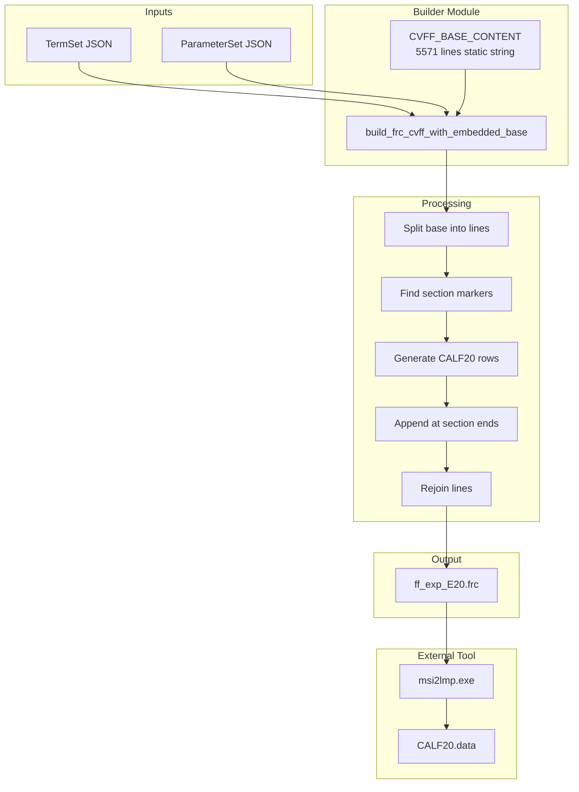

# Subtask 4A-3: E20 Embedded Base Implementation Plan

## 1. Executive Summary

This plan implements the final `build_frc_cvff_with_embedded_base()` function that resolves the msi2lmp.exe stall issue by embedding the complete 5571-line CVFF base as a static string and appending CALF20 custom types in-place.

### Background Evidence

| Experiment | Exit Code | Result | Conclusion |
|------------|-----------|--------|------------|
| E0-E15 (from-scratch) | 143 | STALL | Missing asset structure causes stall |
| E21 (skeleton) | 7 | NO STALL | Structure prevents stall, but fails validation |
| E16-E19 (truncated) | 7 | NO STALL | Structure prevents stall, but fails validation |
| Full asset + CALF20 | 0 | **PASS** ✓ | Known working approach |

### Strategy
Embed the full 5571-line `cvff_Base_MXenes.frc` as a static string constant and append CALF20 types to each section in-place.

---

## 2. Implementation Tasks

### Task 1: Create `cvff_embedded_base.py`

**File:** `src/upm/src/upm/build/cvff_embedded_base.py`

```python
\"\"\"Embedded CVFF base content from cvff_Base_MXenes.frc.

This module contains the complete CVFF forcefield base as a static string
to avoid disk reads and ensure deterministic output at runtime.

Source: workspaces/forcefields/cvff_Base_MXenes.frc
Lines: 5571
Verified: 2025-12-20 with msi2lmp.exe v3.9.6
\"\"\"

CVFF_BASE_CONTENT: str = '''!BIOSYM forcefield          1

#version cvff.frc\t1.2\t13-Dec-90
...
(full 5571 lines embedded here)
...
'''
```

**Implementation Notes:**
- Copy entire content of `workspaces/forcefields/cvff_Base_MXenes.frc`
- Use triple-quoted raw string to preserve exact formatting
- No runtime disk reads - fully deterministic

---

### Task 2: Implement `build_frc_cvff_with_embedded_base()`

**File:** `src/upm/src/upm/build/frc_from_scratch.py`

**Function Signature:**
```python
def build_frc_cvff_with_embedded_base(
    termset: dict[str, Any],
    parameterset: dict[str, Any],
    *,
    out_path: str | Path,
    msi2lmp_max_atom_type_len: int = 5,
) -> str:
    \"\"\"Build CVFF .frc with embedded base + appended custom types.
    
    This approach embeds the complete CVFF base content as a static string
    - not a disk read - to satisfy msi2lmp.exe parser requirements while
    maintaining from-scratch generation semantics for custom types.
    
    Args:
        termset: Output of read_termset_json or equivalent
        parameterset: Output of read_parameterset_json or equivalent
        out_path: Where to write the .frc file
        msi2lmp_max_atom_type_len: Max atom type name length for aliasing
    
    Returns:
        The output path as a string
    \"\"\"
```

**Implementation Logic:**
1. Import embedded base from `cvff_embedded_base.py`
2. Parse base into lines
3. Find section markers and their end positions
4. Append CALF20 custom types at end of each section
5. Reassemble and write to output

---

### Task 3: Section Appending Logic

**Section Markers and Insertion Points:**

| Section | Marker | Line in Asset | Insert Before |
|---------|--------|---------------|---------------|
| `#atom_types` | `#atom_types\tcvff` | 108 | Next `#` section or empty line block |
| `#equivalence` | `#equivalence\tcvff` | 343 | Next `#` section |
| `#nonbond(12-6)` | `#nonbond(12-6)\tcvff` | 4529 | Next `#` section |

**CALF20 Custom Types to Append:**

From TermSet:
- `C_MOF` - Carbon in MOF
- `H_MOF` - Hydrogen in MOF
- `N_MOF` - Nitrogen in MOF
- `O_MOF` - Oxygen in MOF
- `Zn_MOF` - Zinc in MOF

Plus truncated aliases (5-char max):
- `Zn_MO` - alias for `Zn_MOF`

**Appending Format:**

For `#atom_types cvff`:
```
  4.0 99 C_MOF 12.011 C 4 UPM CALF20 custom
  4.0 99 H_MOF 1.008 H 1 UPM CALF20 custom
  4.0 99 N_MOF 14.007 N 3 UPM CALF20 custom
  4.0 99 O_MOF 15.999 O 2 UPM CALF20 custom
  4.0 99 Zn_MOF 65.38 Zn 6 UPM CALF20 custom
  4.0 99 Zn_MO 65.38 Zn 6 UPM CALF20 alias
```

For `#equivalence cvff`:
```
  4.0 99 C_MOF C_MOF C_MOF C_MOF C_MOF C_MOF
  4.0 99 H_MOF H_MOF H_MOF H_MOF H_MOF H_MOF
  4.0 99 N_MOF N_MOF N_MOF N_MOF N_MOF N_MOF
  4.0 99 O_MOF O_MOF O_MOF O_MOF O_MOF O_MOF
  4.0 99 Zn_MOF Zn_MOF Zn_MOF Zn_MOF Zn_MOF Zn_MOF
  4.0 99 Zn_MO Zn_MOF Zn_MOF Zn_MOF Zn_MOF Zn_MOF
```

For `#nonbond(12-6) cvff`:
```
  4.0 99 C_MOF 649401.5276 429.7348
  4.0 99 H_MOF 5130.2827 22.7548
  4.0 99 N_MOF 424089.0833 361.9015
  4.0 99 O_MOF 229917.3089 313.4282
  4.0 99 Zn_MOF 101478.7899 267.8947
  4.0 99 Zn_MO 101478.7899 267.8947
```

Note: A and B values computed from sigma/epsilon using:
- A = 4 * epsilon * sigma^12
- B = 4 * epsilon * sigma^6

---

### Task 4: Add E20 Preset

**Update `CVFF_FRC_EXPERIMENT_PRESETS` in `frc_from_scratch.py`:**

```python
CVFF_FRC_EXPERIMENT_PRESETS: dict[str, CvffFrcEmitOptions | None | str] = {
    # ... existing presets E0-E19, E21 ...
    
    # E20 - Embedded Base: Full 5571-line CVFF base with CALF20 types appended
    # This is the remediation solution that should produce PASS (exit_code=0)
    \"E20\": \"EMBEDDED_BASE\",  # Special marker - handled separately
}
```

---

### Task 5: Update Workspace Runner

**File:** `workspaces/NIST/nist_calf20_msi2lmp_unbonded_v1/run.py`

**Changes:**
1. Import the new builder function
2. Add E20 handling in the preset switch
3. Call `build_frc_cvff_with_embedded_base()` for E20

```python
from upm.build.frc_from_scratch import (
    build_frc_cvff_minimal_bonded,
    build_frc_e21_asset_skeleton,
    build_frc_asset_truncated,
    build_frc_cvff_with_embedded_base,  # NEW
    ASSET_TRUNCATION_LINES,
    resolve_cvff_frc_experiment_preset,
)

# In the preset handling section:
elif preset == \"E20\":
    build_frc_cvff_with_embedded_base(
        termset=json.loads(termset_path.read_text(encoding=\"utf-8\")),
        parameterset=json.loads(parameterset_path.read_text(encoding=\"utf-8\")),
        out_path=ff_path,
    )
```

---

### Task 6: Create E20 Config

**File:** `workspaces/NIST/nist_calf20_msi2lmp_unbonded_v1/config_E20.json`

```json
{
  \"workspace\": \"nist_calf20_msi2lmp_unbonded_v1\",
  \"description\": \"E20 Embedded Base: Full CVFF base + CALF20 types appended\",
  \"outputs_dir\": \"./outputs\",
  \"inputs\": {
    \"car\": \"./inputs/CALF20.car\",
    \"mdf\": \"./inputs/CALF20.mdf\",
    \"parameterset\": \"./inputs/parameterset.json\"
  },
  \"params\": {
    \"timeout_s\": 40,
    \"frc_experiment_preset\": \"E20\",
    \"msi2lmp_forcefield_class\": \"I\",
    \"msi2lmp_ignore\": true,
    \"msi2lmp_print_level\": 2
  },
  \"executables\": {
    \"msi2lmp\": \"/home/sf2/LabWork/software/msi2lmp.exe\"
  }
}
```

---

## 3. Execution Plan

### Step 1: Create `cvff_embedded_base.py`
- Read full content of `workspaces/forcefields/cvff_Base_MXenes.frc`
- Create new module with static string constant
- Verify exact line count (5571)

### Step 2: Implement Builder Function
- Add `build_frc_cvff_with_embedded_base()` to `frc_from_scratch.py`
- Implement section detection and appending logic
- Add helper functions for CALF20 row generation

### Step 3: Update Presets and Runner
- Add E20 to `CVFF_FRC_EXPERIMENT_PRESETS`
- Update runner to handle E20 preset
- Add import for new builder function

### Step 4: Create Config and Test
- Create `config_E20.json`
- Run E20 experiment with 40s timeout
- Verify exit_code=0 and CALF20.data exists

### Step 5: A/B/A Confirmation
- Run E0 → verify STALL (exit 143)
- Run E20 → verify PASS (exit 0)
- Run E0 → verify STALL (exit 143)

### Step 6: Determinism Verification
- Run E20 twice
- Compare sha256 of generated .frc files
- Verify identical hashes

---

## 4. Section Detection Algorithm

```python
def _find_section_end(lines: list[str], section_start_idx: int) -> int:
    \"\"\"Find the line index where the section ends.
    
    A section ends at:
    - The next line starting with '#' (new section)
    - Or end of file
    
    We insert custom types just before the section ends.
    \"\"\"
    for i in range(section_start_idx + 1, len(lines)):
        stripped = lines[i].strip()
        if stripped.startswith(\"#\") and not stripped.startswith(\"#version\"):
            return i
    return len(lines)
```

---

## 5. Success Criteria

1. ✅ `cvff_embedded_base.py` created with full 5571-line content
2. ✅ `build_frc_cvff_with_embedded_base()` function implemented
3. ✅ E20 preset added and wired to runner
4. ✅ E20 experiment produces exit_code=0
5. ✅ CALF20.data file exists and is non-empty
6. ✅ A/B/A confirmation (E0→STALL, E20→PASS, E0→STALL)
7. ✅ Determinism verified (sha256 match)

---

## 6. Architecture Diagram



---

## 7. Files to Create/Modify

| File | Action | Description |
|------|--------|-------------|
| `src/upm/src/upm/build/cvff_embedded_base.py` | CREATE | Static base content as string constant |
| `src/upm/src/upm/build/frc_from_scratch.py` | MODIFY | Add new builder function and E20 preset |
| `workspaces/NIST/nist_calf20_msi2lmp_unbonded_v1/run.py` | MODIFY | Add E20 handling |
| `workspaces/NIST/nist_calf20_msi2lmp_unbonded_v1/config_E20.json` | CREATE | E20 experiment config |
| `docs/DevGuides/thrust_log_nist_calf20_msi2lmp_stall.md` | MODIFY | Add Section 15 |

---

## 8. Completion Deliverables

After implementation, report:
- E20 test result (exit_code, expected PASS)
- A/B/A confirmation results
- Determinism verification (sha256)
- CALF20.data file size
- Files created/modified list
- Thrust log update summary
