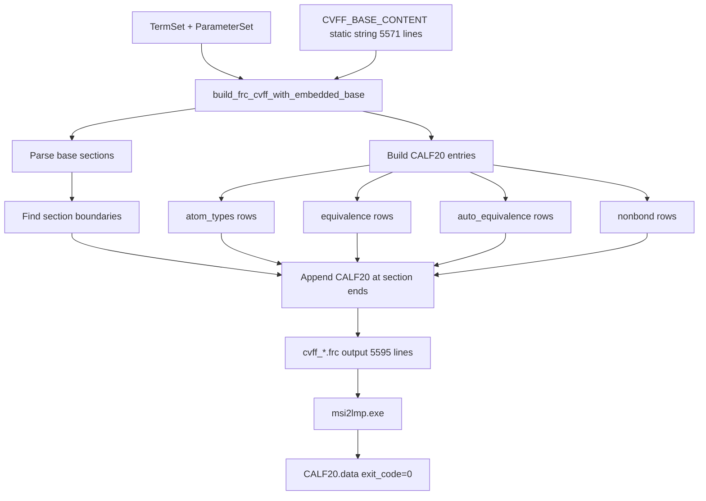

# Subtask 4B: Tests, Default Wiring, and Documentation Finalization

**Date:** 2025-12-20  
**Status:** Ready for Implementation

## 1. Context Summary

The msi2lmp.exe stall has been **RESOLVED** through the E20 experiment:

| Metric | Value |
|--------|-------|
| Solution | [`build_frc_cvff_with_embedded_base()`](../src/upm/src/upm/build/frc_from_scratch.py:1383) |
| Exit Code | **0** (PASS) ✓ |
| CALF20.data Size | 6856 bytes / 210 lines |
| Determinism | Verified (sha256 match) |
| Root Cause | msi2lmp.exe requires complete CVFF base atom types for parser initialization |

## 2. Implementation Tasks

### Task 1: Add Unit Tests for `build_frc_cvff_with_embedded_base()`

**File:** [`src/upm/tests/test_build_frc_from_scratch_cvff_minimal_bonded.py`](../src/upm/tests/test_build_frc_from_scratch_cvff_minimal_bonded.py)

Add the following tests:

```python
# Test 1: Valid output production
def test_embedded_base_builder_produces_valid_frc(tmp_path: Path) -> None:
    """Test that build_frc_cvff_with_embedded_base produces valid .frc output."""
    # Uses _termset() and _parameterset() fixtures
    # Verify: file exists, non-empty, contains required CVFF markers

# Test 2: Byte-for-byte determinism
def test_embedded_base_builder_determinism(tmp_path: Path) -> None:
    """Test that two runs produce identical output."""
    # Two calls with same input
    # Verify: hashlib.sha256 match

# Test 3: Includes embedded base content
def test_embedded_base_includes_cvff_base_content(tmp_path: Path) -> None:
    """Test that output includes the embedded CVFF base atom types."""
    # Verify: base types like h, c, c', o, n appear in output
    # Verify: version lines from base appear

# Test 4: Appends custom types correctly
def test_embedded_base_appends_custom_types(tmp_path: Path) -> None:
    """Test that custom types from termset/parameterset are appended."""
    # Verify: C_MOF, H_MOF, etc. appear in #atom_types section
    # Verify: custom types appear in #equivalence, #nonbond sections
```

**Test fixtures pattern** (from existing tests):

```python
def _termset(*, atom_types: list[str], ...) -> dict[str, object]:
    return {
        "schema": "molsaic.termset.v0.1.2",
        "atom_types": list(atom_types),
        ...
    }

def _parameterset(*, atom_types: dict[str, dict[str, float | str]]) -> dict[str, object]:
    return {
        "schema": "upm.parameterset.v0.1.2",
        "atom_types": dict(atom_types),
    }
```

### Task 2: Update Workspace Default to Embedded Base

**File:** [`workspaces/NIST/nist_calf20_msi2lmp_unbonded_v1/run.py`](../workspaces/NIST/nist_calf20_msi2lmp_unbonded_v1/run.py)

**Current behavior** (lines 296-333):
- If `frc_experiment_preset` is set → use specified preset
- If no preset → use `build_frc_cvff_minimal_bonded()` (STALLS)

**Change to:**
- If no preset → use `build_frc_cvff_with_embedded_base()` (DEFAULT)
- Keep E0-E20 presets available for testing/comparison

```python
# Current (line 327-333):
else:
    build_frc_cvff_minimal_bonded(...)  # STALLS

# Change to:
else:
    # Default: use embedded base approach (E20 remediation)
    # This prevents msi2lmp.exe stalls by including full CVFF base
    build_frc_cvff_with_embedded_base(...)
```

### Task 3: Run Determinism Proof

**Commands:**

```bash
cd workspaces/NIST/nist_calf20_msi2lmp_unbonded_v1

# Clean run 1
rm -rf outputs && python run.py --config config.json
sha256sum outputs/frc_files/cvff_*.frc outputs/msi2lmp_run/CALF20.data > run1.sha256

# Clean run 2
rm -rf outputs && python run.py --config config.json
sha256sum outputs/frc_files/cvff_*.frc outputs/msi2lmp_run/CALF20.data > run2.sha256

# Compare
diff run1.sha256 run2.sha256 && echo "DETERMINISM VERIFIED"
```

**Expected outcome:**
- Both runs produce identical sha256 hashes
- No diff output = determinism confirmed

### Task 4: Finalize Thrust Log with Section 16

**File:** [`docs/DevGuides/thrust_log_nist_calf20_msi2lmp_stall.md`](../docs/DevGuides/thrust_log_nist_calf20_msi2lmp_stall.md)

Add Section 16 with:

1. **Final Conclusion** summarizing root cause and solution
2. **Experiment Summary Table** (E0-E20 outcomes)
3. **Recommended Usage** for production workflows
4. **Documentation of tests** added

```markdown
## 16) Final Conclusion and Documentation

### Root Cause
msi2lmp.exe v3.9.6 requires complete CVFF base atom type definitions for parser 
initialization. From-scratch .frc files with only custom types cause an infinite 
loop during parameter resolution.

### Solution
The `build_frc_cvff_with_embedded_base()` function embeds the full 5571-line CVFF 
base as a static string and appends custom types in-place.

### Experiment Summary Table
| Preset | Description | Outcome |
|--------|-------------|---------|
| E0 | From-scratch baseline | STALL |
| E1-E10 | Single-factor experiments | STALL |
| E11-E15 | Combined presets | STALL |
| E16-E19 | Asset truncation experiments | STALL/SEGFAULT |
| E20 | Embedded base + appending | **PASS** ✓ |

### Recommended Usage
For CALF-20 and similar workflows requiring msi2lmp.exe:
1. Use `build_frc_cvff_with_embedded_base()` as the default builder
2. Ensure filename starts with cvff for msi2lmp compatibility
3. Verify output with sha256 for determinism

### Tests Added
- test_embedded_base_builder_produces_valid_frc
- test_embedded_base_builder_determinism
- test_embedded_base_includes_cvff_base_content
- test_embedded_base_appends_custom_types
```

## 3. Success Criteria

| Criterion | Verification |
|-----------|--------------|
| Unit tests added and pass | `pytest src/upm/tests/test_build_frc_from_scratch_cvff_minimal_bonded.py -v` |
| Workspace defaults to embedded base | No preset → uses `build_frc_cvff_with_embedded_base()` |
| Determinism proof passes | sha256 match for `.frc` and `CALF20.data` across clean runs |
| Thrust log Section 16 added | Final conclusions documented |

## 4. Files to Modify

| File | Action |
|------|--------|
| `src/upm/tests/test_build_frc_from_scratch_cvff_minimal_bonded.py` | Add 4 new tests |
| `workspaces/NIST/nist_calf20_msi2lmp_unbonded_v1/run.py` | Change default to embedded base |
| `docs/DevGuides/thrust_log_nist_calf20_msi2lmp_stall.md` | Add Section 16 |

## 5. Implementation Order

1. Add unit tests (verify they pass with existing implementation)
2. Update workspace default
3. Run determinism proof
4. Add thrust log Section 16
5. Complete with summary

## 6. Mermaid Diagram: E20 Remediation Flow



---

**Ready for implementation in Code mode.**
