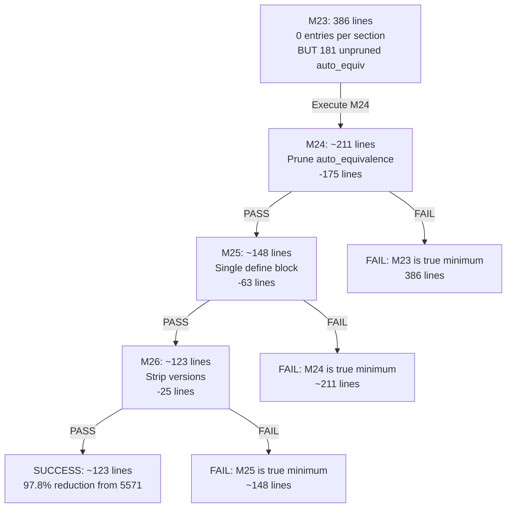

# Subtask 7: Phase 6 - Reach Theoretical Minimum (~123 lines)

## Executive Summary

M23 at 386 lines still contains **181 unpruned auto_equivalence base entries** (46.9%). The theoretical minimum is **~118-123 lines**. This plan implements the final optimizations to reach it.

## Current State Analysis

### M23 Line-by-Line Breakdown (386 lines)

| Category | Lines | Percentage | Notes |
|----------|-------|------------|-------|
| Preamble (BIOSYM + versions) | 18 | 4.7% | Could reduce to 1 line |
| Comments/Blanks | 10 | 2.6% | Could reduce to 0 lines |
| #define blocks (4 macros) | 79 | 20.5% | Could reduce to 1 block (~16 lines) |
| Section headers + comments | 48 | 12.4% | Minimum required |
| CALF20 custom entries | 36 | 9.3% | Required (6 types × 6 sections) |
| **auto_equivalence BASE** | **181** | **46.9%** | **NOT PRUNED - Target for removal!** |
| hbond_definition base | 5 | 1.3% | May be optional |
| Other base entries | 9 | 2.3% | Minimal structure |

### Root Cause: Missing auto_equivalence Pruning

The `#auto_equivalence cvff_auto` section is NOT being pruned because:

1. **Not in `SECTION_LIMIT_MAP`** at [`frc_from_scratch.py:1651`](src/upm/src/upm/build/frc_from_scratch.py:1651):
   ```python
   SECTION_LIMIT_MAP = {
       "atom_types cvff": "max_atom_types",
       "equivalence cvff": "max_equivalence",
       # ... other sections
       # NOTE: auto_equivalence cvff_auto is MISSING!
   }
   ```

2. **No field in `CvffPruneOptions`** at [`frc_from_scratch.py:1600`](src/upm/src/upm/build/frc_from_scratch.py:1600) - there is no `max_auto_equivalence` field

## Implementation Plan

### Phase 6A: Add auto_equivalence to Pruning Infrastructure

**File**: [`src/upm/src/upm/build/frc_from_scratch.py`](src/upm/src/upm/build/frc_from_scratch.py)

#### Step 1: Add `max_auto_equivalence` to `CvffPruneOptions` (line ~1617)

```python
@dataclass(frozen=True)
class CvffPruneOptions:
    # Section toggles
    include_cross_terms: bool = True
    include_cvff_auto: bool = True
    include_bond_increments: bool = True
    include_references: bool = False
    
    # Entry limits
    max_atom_types: int = 0
    max_equivalence: int = 0
    max_auto_equivalence: int = 0  # ADD THIS LINE
    max_morse_bond: int = 0
    max_quadratic_bond: int = 0
    max_quadratic_angle: int = 0
    max_torsion: int = 0
    max_out_of_plane: int = 0
    max_nonbond: int = 0
    max_bond_increments: int = 0
```

#### Step 2: Add to `SECTION_LIMIT_MAP` (line ~1661)

```python
SECTION_LIMIT_MAP: dict[str, str] = {
    "atom_types cvff": "max_atom_types",
    "equivalence cvff": "max_equivalence",
    "auto_equivalence cvff_auto": "max_auto_equivalence",  # ADD THIS LINE
    "morse_bond cvff": "max_morse_bond",
    # ... rest unchanged
}
```

### Phase 6B: Create M24 Preset (Pruned auto_equivalence)

Add to `CVFF_MINIMIZATION_PRESETS` (after M23):

```python
# M24: M23 + auto_equivalence pruned to 0 entries
# Tests: Does pruning auto_equivalence section affect msi2lmp.exe?
# Expected: ~211 lines (386 - 175 base auto_equivalence entries)
"M24": CvffPruneOptions(
    include_cross_terms=False,
    include_cvff_auto=False,
    max_atom_types=-1,
    max_equivalence=-1,
    max_auto_equivalence=-1,  # NEW: 0 entries (header only)
    max_morse_bond=-1,
    max_quadratic_bond=-1,
    max_quadratic_angle=-1,
    max_torsion=-1,
    max_out_of_plane=-1,
    max_nonbond=-1,
    max_bond_increments=-1,
),
```

**Expected lines**: ~211 (386 - 175 = 211)

### Phase 6C: Create M25 Preset (Minimal #define blocks)

If M24 passes, test reducing to a single #define block:

**Approach**: Need to modify preamble handling to emit only `#define cvff` (16 lines instead of 79 lines for 4 macros)

```python
# M25: M24 + single #define block (cvff_nocross_nomorse only)
# Tests: Does msi2lmp.exe require all 4 #define blocks or just one?
# Expected: ~148 lines (211 - 63 from removing 3 #define blocks)
"M25": CvffPruneOptions(
    include_cross_terms=False,
    include_cvff_auto=False,
    max_atom_types=-1,
    max_equivalence=-1,
    max_auto_equivalence=-1,
    max_morse_bond=-1,
    max_quadratic_bond=-1,
    max_quadratic_angle=-1,
    max_torsion=-1,
    max_out_of_plane=-1,
    max_nonbond=-1,
    max_bond_increments=-1,
    minimal_preamble=True,  # NEW: flag to emit minimal preamble
),
```

**Note**: This requires additional preamble handling code.

### Phase 6D: Create M26 Preset (Minimal preamble)

If M25 passes, test removing version lines and comments:

```python
# M26: M25 + minimal preamble (remove #version lines and comments)
# Tests: Does msi2lmp.exe require version/comment metadata?
# Expected: ~123 lines (148 - 25 from version/comments)
"M26": CvffPruneOptions(
    include_cross_terms=False,
    include_cvff_auto=False,
    max_atom_types=-1,
    max_equivalence=-1,
    max_auto_equivalence=-1,
    max_morse_bond=-1,
    max_quadratic_bond=-1,
    max_quadratic_angle=-1,
    max_torsion=-1,
    max_out_of_plane=-1,
    max_nonbond=-1,
    max_bond_increments=-1,
    minimal_preamble=True,
    strip_versions=True,  # NEW: flag to strip #version lines
),
```

## Execution Steps

### Step 1: Implement Phase 6A Code Changes

1. Add `max_auto_equivalence: int = 0` to `CvffPruneOptions`
2. Add `"auto_equivalence cvff_auto": "max_auto_equivalence"` to `SECTION_LIMIT_MAP`

### Step 2: Add M24 Preset and Execute

1. Add M24 preset to `CVFF_MINIMIZATION_PRESETS`
2. Run experiment:
   ```bash
   cd workspaces/NIST/nist_calf20_msi2lmp_unbonded_v1
   python run.py --config config_M24.json
   ```
3. Create config_M24.json:
   ```json
   {
     "inputs": {...},
     "outputs_dir": "outputs_M24",
     "params": {
       "frc_experiment_preset": "M24"
     }
   }
   ```
4. Record PASS/FAIL and line count

### Step 3: Add M25 Preset and Execute (if M24 passes)

1. Implement minimal_preamble handling
2. Add M25 preset
3. Execute and record result

### Step 4: Add M26 Preset and Execute (if M25 passes)

1. Implement strip_versions handling
2. Add M26 preset
3. Execute and record result

### Step 5: Document Results

Update thrust log with Phase 6 section.

## Expected Results

| Preset | Configuration | Expected Lines | Reduction from M23 |
|--------|---------------|----------------|-------------------|
| M23 (current) | 0 entries per section | 386 | baseline |
| **M24** | M23 + prune auto_equiv | **~211** | **45%** |
| **M25** | M24 + single #define | **~148** | **62%** |
| **M26** | M25 + strip versions | **~123** | **68%** |

## Risk Assessment

| Optimization | Risk Level | Mitigation |
|--------------|------------|------------|
| Prune auto_equivalence | Low | Same pattern as other sections |
| Reduce #define blocks | Medium | May affect parser initialization |
| Strip versions/comments | Low | Cosmetic only |

## Success Criteria

1. **M24 PASS**: msi2lmp.exe exits 0, produces valid CALF20.data
2. **M25 PASS**: Same as M24, with smaller file
3. **M26 PASS**: Same as M25, reaching ~123 lines
4. **SHA256 match**: All output CALF20.data match E20 baseline

## Code Locations

| File | Line Range | Modification |
|------|------------|--------------|
| [`frc_from_scratch.py`](src/upm/src/upm/build/frc_from_scratch.py) | 1617 | Add max_auto_equivalence field |
| [`frc_from_scratch.py`](src/upm/src/upm/build/frc_from_scratch.py) | 1661 | Add to SECTION_LIMIT_MAP |
| [`frc_from_scratch.py`](src/upm/src/upm/build/frc_from_scratch.py) | 2299 | Add M24-M26 presets |
| [`thrust_log_cvff_base_minimization.md`](docs/DevGuides/thrust_log_cvff_base_minimization.md) | EOF | Append Phase 6 results |

## Diagram: Phase 6 Reduction Flow



## Final Deliverables

1. Updated `CvffPruneOptions` with `max_auto_equivalence`
2. Updated `SECTION_LIMIT_MAP` with auto_equivalence mapping
3. M24, M25, M26 presets in `CVFF_MINIMIZATION_PRESETS`
4. Phase 6 section in thrust log with results
5. TRUE absolute minimum line count identified

---

*Plan created: 2025-12-20*
