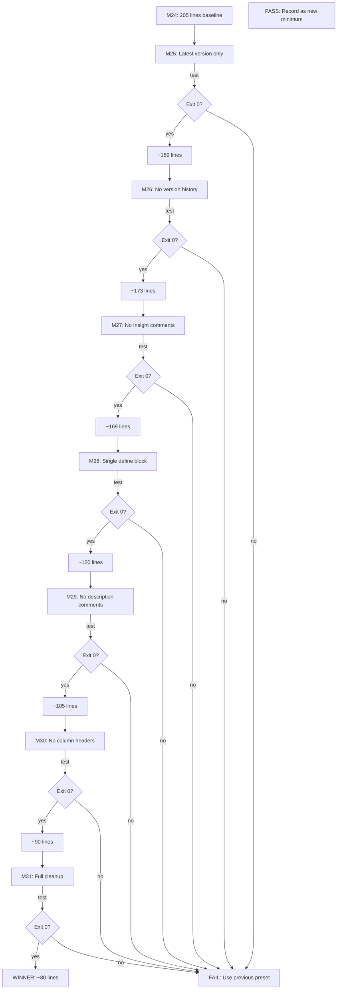

# Phase 7 Implementation Plan: Ultimate Minimization Testing (M25-M31)

## 1) Executive Summary

**Current State**: M24 at 205 lines (96.3% reduction from original 5571 lines)

**Goal**: Test removal of remaining structural overhead to find absolute minimum:
- 16 version history lines
- 4 Insight comment lines
- 3 redundant #define blocks (~52 lines)
- Description comments (> lines)
- Column header comments (!Ver Ref... lines)
- Extra blank lines

**Target**: ~80-120 lines (additional 40-60% reduction from M24)

---

## 2) M24 Structure Breakdown

```
!BIOSYM forcefield          1                     <- Line 1 (REQUIRED)
                                                  <- Line 2 (blank)
#version cvff.frc	1.2	13-Dec-90                 <- Lines 3-18 (16 version lines)
#version cvff.frc	1.3	28-Feb-91
... (14 more version lines)
#version cvff.frc	4.0	24-May-21

! Currently Insight does not handle...            <- Lines 20-23 (4 Insight comments)
! It uses the first occurence...
! can either comment the original...
! line first.

                                                  <- Blanks

#define cvff_nocross_nomorse                      <- Lines 27-42 (1st #define block)
> This is the new format version...
!Ver  Ref  Function  Label
... (function mappings)

#define cvff                                      <- Lines 44-64 (2nd #define block - PRIMARY)
> This is the new format version...
!Ver  Ref  Function  Label
... (includes cross-term mappings)

#define cvff_nocross                              <- Lines 67-81 (3rd #define block)
... 

#define cvff_nomorse                              <- Lines 85-104 (4th #define block)
...

#atom_types	cvff                                  <- Lines 108-120 (section + CALF20 entries)
> Atom type definitions...                        <- Description comment
!Ver  Ref  Type  Mass...                          <- Column header
!---- ---  ----  ----------...                    <- Column header
  2.0  18    C_MOF  12.011000   C   4             <- CALF20 entries
... (5 more CALF20 entries)

... (remaining sections with headers + CALF20 entries)
```

---

## 3) Experiment Matrix

### 3.1 Preamble Cleanup Experiments

| Preset | Change from M24 | Expected Lines | Hypothesis |
|--------|-----------------|----------------|------------|
| **M25** | Remove versions 1-15 (keep only latest v4.0) | **189** | Parser may only need one version |
| **M26** | Remove ALL #version lines | **173** | Version lines may be purely cosmetic |
| **M27** | M26 + Remove Insight comments | **169** | Comments are documentation only |

### 3.2 #define Block Experiments

| Preset | Change from M27 | Expected Lines | Hypothesis |
|--------|-----------------|----------------|------------|
| **M28** | Keep only `#define cvff` block | **~120** | Only one macro definition needed |

### 3.3 Section Cleanup Experiments

| Preset | Change from M28 | Expected Lines | Hypothesis |
|--------|-----------------|----------------|------------|
| **M29** | Remove description comments (> lines) | **~105** | > lines are documentation |
| **M30** | Remove column headers (!Ver Ref... lines) | **~90** | Column headers optional |
| **M31** | Minimize blank lines | **~80** | Reduce to structural minimum |

---

## 4) Implementation Plan

### Step 1: Extend CvffPruneOptions Dataclass

Add new fields to [`CvffPruneOptions`](src/upm/src/upm/build/frc_from_scratch.py:1569):

```python
@dataclass(frozen=True)
class CvffPruneOptions:
    # ... existing section toggles and entry limits ...
    
    # Preamble options (Phase 7)
    keep_version_history: bool = True        # False removes all #version lines
    keep_latest_version_only: bool = False   # Keep only the latest #version line
    keep_insight_comments: bool = True       # False removes Insight version note
    
    # #define block options (Phase 7)
    define_blocks: Literal['all', 'cvff_only'] = 'all'  # 'cvff_only' keeps only #define cvff
    
    # Section cleanup options (Phase 7)
    keep_description_comments: bool = True   # False removes > lines
    keep_column_headers: bool = True         # False removes !Ver Ref... lines
    minimize_blank_lines: bool = False       # True reduces blank lines to minimum
```

### Step 2: Update Builder Logic

Modify [`build_frc_cvff_with_pruned_base()`](src/upm/src/upm/build/frc_from_scratch.py:1818) to handle new options during preamble processing:

```python
def build_frc_cvff_with_pruned_base(...):
    # ... existing code ...
    
    # Parse preamble section
    preamble_lines = sections.get("preamble", (0, 0, []))[2]
    
    # Apply preamble cleanup options
    if prune is not None:
        preamble_lines = _apply_preamble_cleanup(preamble_lines, prune)
    
    # Apply section cleanup options
    if prune is not None:
        for section_key, section_data in sections.items():
            if section_key != "preamble":
                sections[section_key] = _apply_section_cleanup(section_data, prune)
```

Add helper functions:

```python
def _apply_preamble_cleanup(lines: list[str], prune: CvffPruneOptions) -> list[str]:
    """Apply preamble cleanup options."""
    result = []
    latest_version_line = None
    
    for line in lines:
        stripped = line.strip()
        
        # Handle #version lines
        if stripped.startswith("#version"):
            if prune.keep_version_history:
                if prune.keep_latest_version_only:
                    latest_version_line = line  # Keep updating to get latest
                else:
                    result.append(line)
            continue
        
        # Handle Insight comments (lines starting with !)
        if stripped.startswith("! Currently Insight") or stripped.startswith("! It uses"):
            if prune.keep_insight_comments:
                result.append(line)
            continue
        
        # Handle #define blocks
        if stripped.startswith("#define"):
            if prune.define_blocks == 'cvff_only':
                if stripped == "#define cvff":
                    # Keep this block and following lines until next #define or section
                    result.append(line)
                    # ... logic to capture the full block
            else:
                result.append(line)
            continue
        
        # Handle blank lines
        if not stripped and prune.minimize_blank_lines:
            # Skip extra blank lines
            if result and not result[-1].strip():
                continue
        
        result.append(line)
    
    # Add latest version if keeping only latest
    if prune.keep_latest_version_only and latest_version_line:
        result.insert(1, latest_version_line)  # After !BIOSYM
    
    return result


def _apply_section_cleanup(section_lines: list[str], prune: CvffPruneOptions) -> list[str]:
    """Apply section content cleanup options."""
    result = []
    
    for line in section_lines:
        stripped = line.strip()
        
        # Handle description comments (> lines)
        if stripped.startswith(">") and not prune.keep_description_comments:
            continue
        
        # Handle column headers (!Ver Ref... lines but not Insight comments)
        if stripped.startswith("!Ver") or stripped.startswith("!----"):
            if not prune.keep_column_headers:
                continue
        
        # Handle blank line minimization
        if not stripped and prune.minimize_blank_lines:
            if result and not result[-1].strip():
                continue
        
        result.append(line)
    
    return result
```

### Step 3: Create M25-M31 Presets

Add to `CVFF_MINIMIZATION_PRESETS` dictionary:

```python
CVFF_MINIMIZATION_PRESETS: dict[str, CvffPruneOptions] = {
    # ... existing M01-M24 presets ...
    
    # Phase 7: Preamble Cleanup
    "M25": CvffPruneOptions(
        # Inherit M24 base settings
        include_cross_terms=False,
        include_cvff_auto=False,
        max_atom_types=-1,
        max_equivalence=-1,
        max_auto_equivalence=-1,
        max_morse_bond=-1,
        max_quadratic_bond=-1,
        max_quadratic_angle=-1,
        max_torsion=-1,
        max_out_of_plane=-1,
        max_nonbond=-1,
        max_bond_increments=-1,
        # M25 specific: keep only latest version
        keep_version_history=True,
        keep_latest_version_only=True,
    ),
    
    "M26": CvffPruneOptions(
        # ... M24 base settings ...
        keep_version_history=False,  # Remove all version lines
    ),
    
    "M27": CvffPruneOptions(
        # ... M26 settings ...
        keep_version_history=False,
        keep_insight_comments=False,  # Remove Insight comments
    ),
    
    "M28": CvffPruneOptions(
        # ... M27 settings ...
        keep_version_history=False,
        keep_insight_comments=False,
        define_blocks='cvff_only',  # Single #define block
    ),
    
    "M29": CvffPruneOptions(
        # ... M28 settings ...
        keep_version_history=False,
        keep_insight_comments=False,
        define_blocks='cvff_only',
        keep_description_comments=False,  # Remove > lines
    ),
    
    "M30": CvffPruneOptions(
        # ... M29 settings ...
        keep_version_history=False,
        keep_insight_comments=False,
        define_blocks='cvff_only',
        keep_description_comments=False,
        keep_column_headers=False,  # Remove !Ver Ref... lines
    ),
    
    "M31": CvffPruneOptions(
        # ... M30 settings (FULL CLEANUP) ...
        include_cross_terms=False,
        include_cvff_auto=False,
        max_atom_types=-1,
        max_equivalence=-1,
        max_auto_equivalence=-1,
        max_morse_bond=-1,
        max_quadratic_bond=-1,
        max_quadratic_angle=-1,
        max_torsion=-1,
        max_out_of_plane=-1,
        max_nonbond=-1,
        max_bond_increments=-1,
        keep_version_history=False,
        keep_insight_comments=False,
        define_blocks='cvff_only',
        keep_description_comments=False,
        keep_column_headers=False,
        minimize_blank_lines=True,  # Full cleanup
    ),
}
```

### Step 4: Run Experiments

For each preset M25-M31:

```bash
cd workspaces/NIST/nist_calf20_msi2lmp_unbonded_v1

# Generate .frc file with preset
python -c "
from upm.build.frc_from_scratch import build_frc_cvff_with_pruned_base, CVFF_MINIMIZATION_PRESETS
from pathlib import Path
import json

# Load termset and parameterset
termset = json.loads(Path('outputs_M24/termset.json').read_text())
parameterset = json.loads(Path('outputs_M24/parameterset.json').read_text())

# Generate M<N> preset
preset = CVFF_MINIMIZATION_PRESETS['M<N>']
build_frc_cvff_with_pruned_base(
    termset, parameterset,
    out_path='outputs_M<N>/frc_files/cvff_M<N>.frc',
    prune=preset
)
"

# Run msi2lmp.exe
cd outputs_M<N>/msi2lmp_run
timeout --preserve-status 30s stdbuf -oL -eL \
  /home/sf2/LabWork/software/msi2lmp.exe CALF20 \
  -class I -frc ../frc_files/cvff_M<N>.frc \
  </dev/null >stdout.txt 2>stderr.txt
echo "exit_code=$?"
ls -la CALF20.data
wc -l ../frc_files/cvff_M<N>.frc
```

### Step 5: Record Results

Create results table:

| Preset | Config Description | FRC Lines | Exit Code | CALF20.data | Status |
|--------|-------------------|-----------|-----------|-------------|--------|
| M24 | Baseline | 205 | 0 | 6856 bytes | PASS |
| M25 | Latest version only | ? | ? | ? | ? |
| M26 | No version history | ? | ? | ? | ? |
| M27 | No Insight comments | ? | ? | ? | ? |
| M28 | Single #define block | ? | ? | ? | ? |
| M29 | No description comments | ? | ? | ? | ? |
| M30 | No column headers | ? | ? | ? | ? |
| M31 | Full cleanup | ? | ? | ? | ? |

---

## 5) Risk Assessment

| Element | Risk if Removed | Mitigation |
|---------|----------------|------------|
| #version lines | LOW - likely cosmetic | Test in M25/M26 |
| Insight comments | LOW - pure documentation | Test in M27 |
| Extra #define blocks | MEDIUM - parser may look for them | Test in M28 |
| Description comments (>) | LOW - likely cosmetic | Test in M29 |
| Column headers (!Ver Ref) | MEDIUM - may affect parsing | Test in M30 |
| Blank lines | LOW - whitespace only | Test in M31 |

---

## 6) Expected Outcomes

### Best Case (All Pass)
- M31: ~80 lines (61% reduction from M24, 98.6% from E20)
- Absolute minimum structure validated

### Likely Case (Some Fail)
- M28 or M30 may fail if parser expects specific structure
- Fallback to most aggressive passing preset

### Worst Case (Early Fail)
- M25 fails → Version info required
- Stay at M24 (205 lines)

---

## 7) Acceptance Criteria

1. **Each experiment produces deterministic results**
2. **Passing experiments produce identical CALF20.data** (SHA256 match)
3. **Winning preset identified** with line count documented
4. **Thrust log updated** with results table
5. **Required vs optional elements documented**

---

## 8) Implementation Order

1. **Extend CvffPruneOptions** - Add new preamble and section cleanup fields
2. **Add helper functions** - `_apply_preamble_cleanup()` and `_apply_section_cleanup()`
3. **Update builder** - Integrate cleanup functions into `build_frc_cvff_with_pruned_base()`
4. **Create presets** - Add M25-M31 to `CVFF_MINIMIZATION_PRESETS`
5. **Run experiments** - Execute each preset sequentially
6. **Document results** - Update thrust log with findings

---

## 9) Code Changes Summary

### Files to Modify:

1. **[`frc_from_scratch.py`](src/upm/src/upm/build/frc_from_scratch.py)**
   - Add 6 new fields to `CvffPruneOptions` (lines 1569-1620)
   - Add `_apply_preamble_cleanup()` function
   - Add `_apply_section_cleanup()` function  
   - Update `build_frc_cvff_with_pruned_base()` to call cleanup functions
   - Add M25-M31 presets to `CVFF_MINIMIZATION_PRESETS`

2. **[`thrust_log_cvff_base_minimization.md`](docs/DevGuides/thrust_log_cvff_base_minimization.md)**
   - Add Phase 7 section with M25-M31 results

---

## 10) Mermaid Diagram: M25-M31 Experiment Flow



---

*Plan created: 2025-12-20*
*Target: Phase 7 M25-M31 experiments for CVFF Ultimate Minimization*
