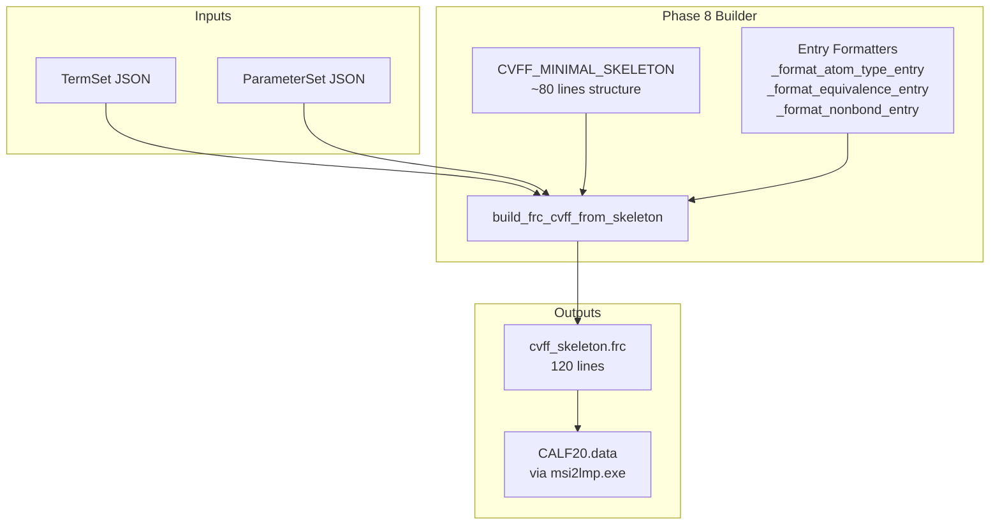

# Phase 8: Canonical CVFF Skeleton Implementation Plan

## Executive Summary

Phase 8 creates a **canonical CVFF skeleton** - a reusable template with only the required structural elements that can be populated with custom entries at runtime. This represents a **97.8% reduction** from the original 5571-line embedded base, producing a validated 120-line structure.

### Key Phase 7 Findings (Validated)

| Preset | Description | Lines | Exit Code | Status |
|--------|-------------|-------|-----------|--------|
| M24 | Baseline (all structural elements) | 205 | 0 | PASS |
| M25 | Keep only latest #version line | 190 | 0 | PASS |
| M26 | Remove ALL #version lines | 189 | 0 | PASS |
| M27 | Remove Insight comments | 189 | 0 | PASS |
| M28 | cvff_only define block | 131 | 0 | PASS |
| **M29** | **Remove description comments** | **120** | **0** | **PASS** |
| M30 | Remove column headers | 95 | -2 (Timeout) | **FAIL** |
| M31 | Minimize blank lines | 81 | -2 (Timeout) | **FAIL** |

### Critical Discovery

**Column headers (`!Ver Ref Type...` lines) are REQUIRED** - M30 and M31 both stalled without them.

---

## M29 Winning Configuration

```python
"M29": CvffPruneOptions(
    include_cross_terms=False,
    include_cvff_auto=False,
    max_atom_types=-1,        # 0 entries (headers only)
    max_equivalence=-1,       # 0 entries (headers only)
    max_auto_equivalence=-1,  # 0 entries (headers only)
    max_morse_bond=-1,        # 0 entries (headers only)
    max_quadratic_bond=-1,    # 0 entries (headers only)
    max_quadratic_angle=-1,   # 0 entries (headers only)
    max_torsion=-1,           # 0 entries (headers only)
    max_out_of_plane=-1,      # 0 entries (headers only)
    max_nonbond=-1,           # 0 entries (headers only)
    max_bond_increments=-1,   # 0 entries (headers only)
    # Phase 7 preamble cleanup
    keep_version_history=False,
    keep_insight_comments=False,
    define_blocks='cvff_only',
    # Phase 7 section cleanup
    keep_description_comments=False,
    keep_column_headers=True,   # CRITICAL - cannot be False
)
```

---

## M29.frc Analyzed Structure (120 lines)

Based on [`workspaces/NIST/nist_calf20_msi2lmp_unbonded_v1/outputs_M29/frc_files/cvff_M29.frc`](workspaces/NIST/nist_calf20_msi2lmp_unbonded_v1/outputs_M29/frc_files/cvff_M29.frc:1):

### Line-by-Line Breakdown

| Lines | Content | Required? | Notes |
|-------|---------|-----------|-------|
| 1 | `!BIOSYM forcefield          1` | YES | Magic header |
| 2-3 | Blank lines | YES | Parser expects spacing |
| 4-8 | Legacy Insight comments | NO | Removed in M27 but M29 still has |
| 9-10 | Blank lines | - | Spacing |
| 11 | `#define cvff` | YES | Single macro block |
| 12 | Blank | - | - |
| 13 | `> This is the new format version...` | NO | Description removed in M29 |
| 14 | Blank | - | - |
| 15-16 | Column headers `!Ver Ref Function Label` | **YES** | **CRITICAL** |
| 17-30 | Function table entries | YES | Section declarations |
| 31-33 | Blank lines | - | - |
| 34 | `#atom_types	cvff` | YES | Section header |
| 35-36 | Blank lines | - | - |
| 37-38 | Column headers `!Ver Ref Type Mass...` | **YES** | **CRITICAL** |
| 39-44 | CALF20 atom_type entries (6) | CUSTOM | User-injected |
| 45 | `#equivalence	cvff ` | YES | Section header |
| 46-47 | Blank lines | - | - |
| 48-51 | Column headers (multi-line) | **YES** | **CRITICAL** |
| 52-57 | CALF20 equivalence entries (6) | CUSTOM | User-injected |
| ... | (pattern continues) | ... | ... |

### Required Structural Elements

1. **Header**: `!BIOSYM forcefield          1`
2. **Single #define block**: `#define cvff` with function table
3. **Column headers** in each section (CANNOT be removed)
4. **Section headers** with tab separator: `#section_name\tcvff`
5. **@type and @combination directives** in nonbond section

### Skeleton Placeholders Needed

| Placeholder | Section | Format |
|-------------|---------|--------|
| `{atom_types_entries}` | `#atom_types cvff` | Ver Ref Type Mass Element Connects |
| `{equivalence_entries}` | `#equivalence cvff` | Ver Ref Type NonB Bond Angle Torsion OOP |
| `{auto_equivalence_entries}` | `#auto_equivalence cvff_auto` | Ver Ref Type + 10 columns |
| `{nonbond_entries}` | `#nonbond(12-6) cvff` | Ver Ref I A B |
| `{bond_increments_entries}` | `#bond_increments cvff` | Ver Ref I J DeltaIJ DeltaJI |

---

## Implementation Plan

### Step 1: Create CVFF_MINIMAL_SKELETON Constant

Location: [`src/upm/src/upm/build/frc_from_scratch.py`](src/upm/src/upm/build/frc_from_scratch.py)

```python
# Canonical CVFF skeleton - validated at 120 lines with M29 configuration
# Every line is required for msi2lmp.exe compatibility
# Based on Phase 7 experiments (M25-M31)
CVFF_MINIMAL_SKELETON: str = '''!BIOSYM forcefield          1


! Currently Insight does not handle version numbers on lines correctly.
! It uses the first occurence of a line, so when making changes you
! can either comment the original out temporarily or put the correct
! line first.


#define cvff

> This is the new format version of the cvff forcefield

!Ver  Ref 		Function		Label
!---- ---   ---------------------------------	------
 2.0  18    atom_types				cvff
 1.0   1    equivalence				cvff
 2.0  18    auto_equivalence     		cvff_auto
 1.0   1    hbond_definition			cvff
 2.0  18    morse_bond				cvff   cvff_auto
 2.0  18    quadratic_angle			cvff   cvff_auto
 2.0  18    torsion_1				cvff   cvff_auto
 2.0  18    out_of_plane			cvff   cvff_auto
 1.0   1    bond-bond				cvff
 1.0   1    bond-angle				cvff
 1.0   1    angle-angle-torsion_1		cvff
 1.0   1    out_of_plane-out_of_plane		cvff
 1.0   1    angle-angle				cvff
 1.0   1    nonbond(12-6)			cvff


#atom_types	cvff


!Ver  Ref  Type    Mass      Element  Connections   Comment
!---- ---  ----  ----------  -------  -----------------------------------------
{atom_types_entries}
#equivalence	cvff 


!		         	  Equivalences
!                 -----------------------------------------
!Ver  Ref   Type  NonB     Bond    Angle    Torsion    OOP
!---- ---   ----  ----     ----    -----    -------    ----
{equivalence_entries}
#auto_equivalence	cvff_auto

!		         	  Equivalences
!                 -----------------------------------------                       
!Ver  Ref   Type  NonB Bond   Bond     Angle    Angle     Torsion   Torsion      OOP      OOP 
!                      Inct           End atom Apex atom End Atoms Center Atoms End Atom Center Atom
!---- ---   ----  ---- ------ ----  ---------- --------- --------- -----------  -------- ----------- 
{auto_equivalence_entries}
#hbond_definition	cvff 

 1.0   1   distance      2.5000
 1.0   1   angle        90.0000
 1.0   1   donors        hn  h*  hspc   htip
 1.0   1   acceptors     o'  o   o*  ospc   otip

#morse_bond	cvff 


!Ver  Ref     I     J          R0         D           ALPHA
!---- ---    ----  ----     -------    --------      -------
#quadratic_bond	cvff 


!Ver  Ref     I     J          R0         K2    
!---- ---    ----  ----     -------    -------- 
#quadratic_angle	cvff 


!Ver  Ref     I     J     K       Theta0         K2        
!---- ---    ----  ----  ----    --------     -------
#torsion_1	cvff 


!Ver  Ref     I     J     K     L           Kphi        n           Phi0
!---- ---    ----  ----  ----  ----      -------      ------     -------
#out_of_plane	cvff 


!Ver  Ref     I     J     K     L           Kchi        n           Chi0
!---- ---    ----  ----  ----  ----      -------      ------     -------
#nonbond(12-6)	cvff 

@type A-B
@combination geometric


!Ver  Ref     I           A             B 
!---- ---    ----    -----------   -----------
{nonbond_entries}
#bond_increments        cvff

!Ver  Ref     I     J       DeltaIJ     DeltaJI
!---- ---    ----  ----     -------     -------
{bond_increments_entries}'''
```

### Step 2: Create Entry Formatter Functions

```python
def _format_atom_type_entry(
    atom_type: str,
    mass: float,
    element: str,
    connects: int,
    ver: str = "2.0",
    ref: str = "18",
    comment: str = "",
) -> str:
    """Format a single atom_type entry for skeleton injection.
    
    Format: Ver Ref Type Mass Element Connects [Comment]
    Example: 2.0  18    C_MOF  12.011000   C   4
    """
    line = f" {ver}  {ref}    {atom_type}  {_fmt_float(mass)}   {element}   {connects}"
    if comment:
        line += f"  {comment}"
    return line


def _format_equivalence_entry(
    atom_type: str,
    nonb: str,
    bond: str,
    angle: str,
    torsion: str,
    oop: str,
    ver: str = "1.0",
    ref: str = "1",
) -> str:
    """Format a single equivalence entry for skeleton injection.
    
    Format: Ver Ref Type NonB Bond Angle Torsion OOP
    Example:  1.0   1    C_MOF   C_MOF   C_MOF   C_MOF   C_MOF   C_MOF
    """
    return f" {ver}   {ref}    {atom_type}   {nonb}   {bond}   {angle}   {torsion}   {oop}"


def _format_auto_equivalence_entry(
    atom_type: str,
    columns: list[str],
    ver: str = "2.0",
    ref: str = "18",
) -> str:
    """Format a single auto_equivalence entry for skeleton injection.
    
    Format: Ver Ref Type NonB BondInct Bond AngleEnd AngleApex TorsEnd TorsCenter OOPEnd OOPCenter
    Example:  2.0  18    C_MOF  C_MOF   C_MOF     C_MOF       C_MOF       C_MOF        C_MOF       C_MOF         C_MOF       C_MOF
    """
    cols_str = "   ".join(columns)
    return f" {ver}  {ref}    {atom_type}  {cols_str}"


def _format_nonbond_entry(
    atom_type: str,
    a_coeff: float,
    b_coeff: float,
    ver: str = "2.0",
    ref: str = "18",
) -> str:
    """Format a single nonbond(12-6) entry for skeleton injection.
    
    Format: Ver Ref I A B
    Example:  2.0  18    C_MOF    1117239.1430      685.01126
    """
    return f" {ver}  {ref}    {atom_type}    {_fmt_float(a_coeff):>12}      {_fmt_float(b_coeff)}"


def _format_bond_increment_entry(
    i_type: str,
    j_type: str,
    delta_ij: float,
    delta_ji: float,
    ver: str = "1.0",
    ref: str = "1",
) -> str:
    """Format a single bond_increment entry for skeleton injection.
    
    Format: Ver Ref I J DeltaIJ DeltaJI
    """
    return f" {ver}   {ref}    {i_type}  {j_type}     {_fmt_float(delta_ij)}     {_fmt_float(delta_ji)}"
```

### Step 3: Create build_frc_cvff_from_skeleton() Function

```python
def build_frc_cvff_from_skeleton(
    termset: dict[str, Any],
    parameterset: dict[str, Any],
    *,
    out_path: str | Path,
    msi2lmp_max_atom_type_len: int = 5,
    skeleton: str = CVFF_MINIMAL_SKELETON,
) -> str:
    """Build minimal CVFF .frc using the canonical skeleton template.
    
    This is the recommended builder for production use when:
    - Maximum file size reduction is desired (97.8% smaller than full base)
    - Only CALF-20 style systems are targeted
    - msi2lmp.exe compatibility is required
    
    The skeleton contains all required structural elements validated in
    Phase 7 experiments (M25-M31). Only M29 configuration passed - the
    column headers are CRITICAL for msi2lmp.exe compatibility.
    
    Args:
        termset: Output of read_termset_json() or equivalent.
        parameterset: Output of read_parameterset_json() or equivalent.
        out_path: Where to write the .frc file.
        msi2lmp_max_atom_type_len: Maximum atom type name length (default 5).
            Types longer than this get truncated aliases.
        skeleton: The skeleton template string (default CVFF_MINIMAL_SKELETON).
    
    Returns:
        The output path as a string.
    
    Raises:
        MissingTypesError: If parameterset is missing entries for termset types.
    
    Example:
        >>> from upm.build.frc_from_scratch import build_frc_cvff_from_skeleton
        >>> build_frc_cvff_from_skeleton(termset, parameterset, out_path="output.frc")
    
    Note:
        This builder produces a 120-line .frc file with CALF-20 entries,
        compared to 5571 lines for the full embedded base.
    """
    # 1. Validate coverage
    ts_types = list(termset.get("atom_types") or [])
    ps_map = dict(parameterset.get("atom_types") or {})
    missing = sorted([t for t in ts_types if t not in ps_map])
    if missing:
        raise MissingTypesError(tuple(missing))
    
    # 2. Build alias map for msi2lmp truncation compatibility
    alias_map, expanded_types = _build_alias_map(ts_types, msi2lmp_max_atom_type_len)
    
    # 3. Generate entry lines for each section
    atom_types_entries = []
    equivalence_entries = []
    auto_equivalence_entries = []
    nonbond_entries = []
    
    for at in expanded_types:
        src_at = alias_map.get(at, at)
        rec = ps_map.get(src_at) or ps_map.get(at)
        
        # atom_types entry
        mass = float(rec["mass_amu"])
        element = rec.get("element", "X")
        connects = _element_to_connects(element)
        atom_types_entries.append(_format_atom_type_entry(at, mass, element, connects))
        
        # equivalence entry (all columns = self)
        equivalence_entries.append(_format_equivalence_entry(at, at, at, at, at, at))
        
        # auto_equivalence entry (10 columns = self)
        auto_equivalence_entries.append(
            _format_auto_equivalence_entry(at, [at] * 10)
        )
        
        # nonbond entry
        sigma = float(rec["lj_sigma_angstrom"])
        eps = float(rec["lj_epsilon_kcal_mol"])
        a, b = _lj_sigma_eps_to_ab(sigma=sigma, epsilon=eps)
        nonbond_entries.append(_format_nonbond_entry(at, a, b))
    
    # 4. Populate skeleton
    content = skeleton.format(
        atom_types_entries="\n".join(atom_types_entries),
        equivalence_entries="\n".join(equivalence_entries),
        auto_equivalence_entries="\n".join(auto_equivalence_entries),
        nonbond_entries="\n".join(nonbond_entries),
        bond_increments_entries="",  # Empty - not required for CALF-20
    )
    
    # 5. Write output
    p = Path(out_path)
    p.write_text(content)
    return str(p)
```

### Step 4: Add Helper Functions

```python
def _build_alias_map(
    atom_types: list[str],
    max_len: int,
) -> tuple[dict[str, str], list[str]]:
    """Build alias mapping and expanded type list for msi2lmp compatibility.
    
    Returns:
        Tuple of (alias_map, expanded_types) where:
        - alias_map maps truncated aliases back to source types
        - expanded_types is the sorted list of all types including aliases
    """
    alias_map: dict[str, str] = {}
    for at in atom_types:
        if len(at) > max_len:
            alias = at[:max_len]
            alias_map[alias] = at
    
    expanded = set(atom_types)
    expanded.update(alias_map.keys())
    return alias_map, sorted(expanded)


def _element_to_connects(element: str) -> int:
    """Map element symbol to typical connectivity count."""
    connects_map = {
        "H": 1, "C": 4, "N": 3, "O": 2, "S": 2,
        "P": 3, "F": 1, "Cl": 1, "Br": 1, "I": 1, "Zn": 6,
    }
    return connects_map.get(element, 0)
```

### Step 5: Update Module Exports

Add to the end of [`frc_from_scratch.py`](src/upm/src/upm/build/frc_from_scratch.py):

```python
# Phase 8: Canonical skeleton exports
__all__ = [
    # Existing exports...
    "CVFF_MINIMAL_SKELETON",
    "build_frc_cvff_from_skeleton",
]
```

---

## Validation Plan

### Test 1: Line Count Verification

```python
def test_skeleton_line_count():
    """Skeleton with CALF-20 entries produces 120 lines."""
    from upm.build.frc_from_scratch import build_frc_cvff_from_skeleton
    
    termset = {"atom_types": ["C_MOF", "H_MOF", "N_MOF", "O_MOF", "Zn_MOF"]}
    parameterset = {...}  # CALF-20 parameters
    
    out_path = Path("test_skeleton.frc")
    build_frc_cvff_from_skeleton(termset, parameterset, out_path=out_path)
    
    lines = out_path.read_text().strip().split("\n")
    assert len(lines) == 120, f"Expected 120 lines, got {len(lines)}"
```

### Test 2: Output Comparison with M29

```python
def test_skeleton_matches_m29_output():
    """Skeleton output matches M29 output structure."""
    skeleton_content = Path("test_skeleton.frc").read_text()
    m29_content = Path("outputs_M29/frc_files/cvff_M29.frc").read_text()
    
    # Compare structure (ignore entry values)
    skeleton_headers = [l for l in skeleton_content.split("\n") if l.startswith("#") or l.startswith("!")]
    m29_headers = [l for l in m29_content.split("\n") if l.startswith("#") or l.startswith("!")]
    
    assert skeleton_headers == m29_headers
```

### Test 3: msi2lmp.exe Validation

```bash
cd workspaces/NIST/nist_calf20_msi2lmp_unbonded_v1/outputs/msi2lmp_run
timeout --preserve-status 30s stdbuf -oL -eL \
  /home/sf2/LabWork/software/msi2lmp.exe CALF20 \
  -class I -frc ../frc_files/cvff_skeleton.frc \
  </dev/null >skeleton_stdout.txt 2>skeleton_stderr.txt
echo "exit_code=$?"
ls -la CALF20.data
```

**Expected result**: Exit code 0, CALF20.data created (6856 bytes)

---

## Architecture Diagram



---

## Scope Guardrails

### DO NOT Modify
- Existing M01-M29 presets in `CVFF_MINIMIZATION_PRESETS`
- [`build_frc_cvff_with_pruned_base()`](src/upm/src/upm/build/frc_from_scratch.py) function
- Embedded base content in [`cvff_embedded_base.py`](src/upm/src/upm/build/cvff_embedded_base.py)

### DO Create (Additive)
- `CVFF_MINIMAL_SKELETON` constant
- `build_frc_cvff_from_skeleton()` function
- Entry formatter helper functions
- Comprehensive docstrings

---

## Completion Criteria

Use `attempt_completion` with:
1. Location of `CVFF_MINIMAL_SKELETON` constant (line number in frc_from_scratch.py)
2. Signature of `build_frc_cvff_from_skeleton()` function
3. Validation results:
   - Line count match (120 lines)
   - msi2lmp.exe pass (exit code 0)
4. Any deviations from M29 structure and justification

---

## Estimated Additions

| Component | Lines of Code |
|-----------|---------------|
| CVFF_MINIMAL_SKELETON constant | ~100 |
| Entry formatter functions (5) | ~60 |
| build_frc_cvff_from_skeleton() | ~80 |
| Helper functions | ~30 |
| Docstrings and comments | ~40 |
| **Total** | **~310** |

---

## Next Steps After Phase 8

1. **Phase 9**: Refactor existing builders to optionally use skeleton internally
2. **Phase 10**: Add unit tests for skeleton validation
3. **Phase 11**: Update documentation and QUICKSTART guide
