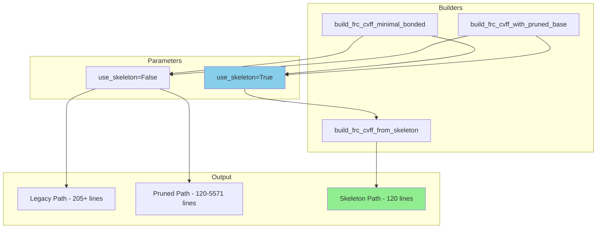

# Phase 9: Skeleton Integration Implementation Plan

## Executive Summary

Phase 9 integrates the canonical CVFF skeleton (created in Phase 8) into the existing builder ecosystem. This enables users to optionally use the minimal skeleton approach for **maximum file size reduction (97.8%)** while maintaining full backwards compatibility.

### Key Objectives
1. Add `use_skeleton: bool = False` parameter to both legacy builders
2. When `use_skeleton=True`, delegate to [`build_frc_cvff_from_skeleton()`](src/upm/src/upm/build/frc_from_scratch.py:3489)
3. Add "M_SKELETON" preset to CVFF_MINIMIZATION_PRESETS registry
4. Create comprehensive tests for skeleton integration
5. Update documentation with skeleton usage examples

---

## Current State Analysis

### Existing Builders

| Builder | Location | Purpose | Lines |
|---------|----------|---------|-------|
| [`build_frc_cvff_minimal_bonded()`](src/upm/src/upm/build/frc_from_scratch.py:153) | Lines 153-607 | Legacy builder with CvffFrcEmitOptions | ~205+ |
| [`build_frc_cvff_with_pruned_base()`](src/upm/src/upm/build/frc_from_scratch.py:2049) | Lines 2049-2262 | M-series preset builder | ~2300 |
| [`build_frc_cvff_from_skeleton()`](src/upm/src/upm/build/frc_from_scratch.py:3489) | Lines 3489-3620 | **NEW** skeleton builder | ~120 |

### Skeleton Infrastructure (Phase 8)
- [`CVFF_MINIMAL_SKELETON`](src/upm/src/upm/build/frc_from_scratch.py:3212) - 100-line template constant
- Helper functions for entry formatting (lines 3315-3425)
- Validated at 120 lines with CALF-20 entries

---

## Implementation Plan

### Step 1: Update build_frc_cvff_minimal_bonded()

**Location**: [`src/upm/src/upm/build/frc_from_scratch.py`](src/upm/src/upm/build/frc_from_scratch.py:153)

#### 1.1 Add Parameter (Line 165)

**Current signature**:
```python
def build_frc_cvff_minimal_bonded(
    termset: dict[str, Any],
    parameterset: dict[str, Any],
    *,
    out_path: str | Path,
    cvff_label: str = "cvff",
    cvff_define: str = "cvff",
    msi2lmp_max_atom_type_len: int = 5,
    emit: "CvffFrcEmitOptions | None" = None,
) -> str:
```

**Modified signature**:
```python
def build_frc_cvff_minimal_bonded(
    termset: dict[str, Any],
    parameterset: dict[str, Any],
    *,
    out_path: str | Path,
    cvff_label: str = "cvff",
    cvff_define: str = "cvff",
    msi2lmp_max_atom_type_len: int = 5,
    emit: "CvffFrcEmitOptions | None" = None,
    use_skeleton: bool = False,  # NEW Phase 9
) -> str:
```

#### 1.2 Add Early Delegation Logic (After Line 195, before emit check)

Insert early return delegation:
```python
    # Phase 9: Skeleton delegation for maximum file size reduction
    if use_skeleton:
        return build_frc_cvff_from_skeleton(
            termset=termset,
            parameterset=parameterset,
            out_path=out_path,
            msi2lmp_max_atom_type_len=msi2lmp_max_atom_type_len,
        )
```

**Critical**: This must come BEFORE the `emit is None` check at line 199 to ensure skeleton takes precedence.

#### 1.3 Update Docstring

Add documentation for the new parameter:
```python
    """Build a CVFF-labeled `.frc` suitable for `msi2lmp.exe`.
    
    ...existing docstring...
    
    Args:
        ...existing args...
        use_skeleton: If True, delegates to build_frc_cvff_from_skeleton()
            for maximum file size reduction (~120 lines vs 205+ lines).
            Ignores all other parameters except termset, parameterset,
            out_path, and msi2lmp_max_atom_type_len. Default False for
            backwards compatibility.
    
    Note:
        When use_skeleton=True, the output is a minimal ~120-line file
        using the canonical skeleton template validated in Phase 7/8.
        This provides 97.8% size reduction compared to the full embedded base.
    """
```

---

### Step 2: Update build_frc_cvff_with_pruned_base()

**Location**: [`src/upm/src/upm/build/frc_from_scratch.py`](src/upm/src/upm/build/frc_from_scratch.py:2049)

#### 2.1 Add Parameter (Line 2056)

**Current signature**:
```python
def build_frc_cvff_with_pruned_base(
    termset: dict[str, Any],
    parameterset: dict[str, Any],
    *,
    out_path: str | Path,
    prune: CvffPruneOptions | None = None,
    msi2lmp_max_atom_type_len: int = 5,
) -> str:
```

**Modified signature**:
```python
def build_frc_cvff_with_pruned_base(
    termset: dict[str, Any],
    parameterset: dict[str, Any],
    *,
    out_path: str | Path,
    prune: CvffPruneOptions | None = None,
    msi2lmp_max_atom_type_len: int = 5,
    use_skeleton: bool = False,  # NEW Phase 9
) -> str:
```

#### 2.2 Add Early Delegation Logic (After Line 2081, before prune check)

Insert early return delegation:
```python
    # Phase 9: Skeleton delegation for maximum file size reduction
    if use_skeleton:
        return build_frc_cvff_from_skeleton(
            termset=termset,
            parameterset=parameterset,
            out_path=out_path,
            msi2lmp_max_atom_type_len=msi2lmp_max_atom_type_len,
        )
```

#### 2.3 Update Docstring

Add documentation:
```python
    """Build CVFF .frc with configurable base pruning for minimization experiments.
    
    ...existing docstring...
    
    Args:
        ...existing args...
        use_skeleton: If True, bypasses pruned base entirely and delegates
            to build_frc_cvff_from_skeleton() for minimal ~120-line output.
            Default False for backwards compatibility.
    
    Note:
        When use_skeleton=True, the `prune` parameter is ignored. This
        provides the absolute minimum viable file size at ~120 lines.
    """
```

---

### Step 3: Add M_SKELETON Preset

**Location**: [`src/upm/src/upm/build/frc_from_scratch.py`](src/upm/src/upm/build/frc_from_scratch.py:2728) - After M31, before closing brace

#### 3.1 Insert Preset

Add after M31 at line 2727:
```python
    # ========================================================================
    # M_SKELETON: Canonical Skeleton (Phase 8/9)
    # Uses build_frc_cvff_from_skeleton() via use_skeleton=True
    # This is a MARKER preset - actual building uses the skeleton builder
    # Result: ~120 lines (97.8% reduction from 5571-line base)
    # ========================================================================
    
    # M_SKELETON: Canonical skeleton preset (120 lines, 97.8% reduction)
    # This preset is a configuration marker - when detected, the builder
    # should set use_skeleton=True to delegate to build_frc_cvff_from_skeleton()
    # The options below mirror M29 (the winning configuration from Phase 7)
    "M_SKELETON": CvffPruneOptions(
        include_cross_terms=False,
        include_cvff_auto=False,
        max_atom_types=-1,
        max_equivalence=-1,
        max_auto_equivalence=-1,
        max_morse_bond=-1,
        max_quadratic_bond=-1,
        max_quadratic_angle=-1,
        max_torsion=-1,
        max_out_of_plane=-1,
        max_nonbond=-1,
        max_bond_increments=-1,
        keep_version_history=False,
        keep_insight_comments=False,
        define_blocks='cvff_only',
        keep_description_comments=False,
        keep_column_headers=True,   # CRITICAL - required for msi2lmp.exe
        minimize_blank_lines=True,
    ),
}
```

---

### Step 4: Create Test Cases

**Location**: [`src/upm/tests/test_build_frc_from_scratch_cvff_minimal_bonded.py`](src/upm/tests/test_build_frc_from_scratch_cvff_minimal_bonded.py)

Add at end of file after existing tests:

```python
# ============================================================================
# Tests for use_skeleton=True integration (Phase 9)
# ============================================================================


def test_cvff_minimal_bonded_use_skeleton_produces_120_lines(tmp_path: Path) -> None:
    """Test that use_skeleton=True produces minimal 120-line output."""
    ts = _termset(
        atom_types=["C_MOF", "H_MOF", "N_MOF", "O_MOF", "Zn_MOF"],
        bond_types=[("C_MOF", "H_MOF")],
        angle_types=[("H_MOF", "C_MOF", "H_MOF")],
        dihedral_types=[],
        improper_types=[],
    )
    ps = _parameterset(
        atom_types={
            "C_MOF": {"element": "C", "mass_amu": 12.011, "lj_sigma_angstrom": 3.4, "lj_epsilon_kcal_mol": 0.1},
            "H_MOF": {"element": "H", "mass_amu": 1.008, "lj_sigma_angstrom": 2.5, "lj_epsilon_kcal_mol": 0.01},
            "N_MOF": {"element": "N", "mass_amu": 14.007, "lj_sigma_angstrom": 3.3, "lj_epsilon_kcal_mol": 0.05},
            "O_MOF": {"element": "O", "mass_amu": 15.999, "lj_sigma_angstrom": 3.1, "lj_epsilon_kcal_mol": 0.06},
            "Zn_MOF": {"element": "Zn", "mass_amu": 65.38, "lj_sigma_angstrom": 2.4, "lj_epsilon_kcal_mol": 0.12},
        }
    )

    out = tmp_path / "skeleton.frc"
    build_frc_cvff_minimal_bonded(ts, ps, out_path=out, use_skeleton=True)
    
    text = out.read_text(encoding="utf-8")
    line_count = len(text.strip().split("\n"))
    
    # Skeleton should produce ~120 lines (base ~100 + 6 atom types * ~3-4 lines each)
    assert 100 <= line_count <= 140, f"Expected 100-140 lines, got {line_count}"
    
    # Verify skeleton structure markers
    assert "!BIOSYM forcefield" in text
    assert "#define cvff" in text
    assert "#atom_types\tcvff" in text
    assert "#nonbond(12-6)\tcvff" in text
    assert "@type A-B" in text
    assert "@combination geometric" in text


def test_cvff_minimal_bonded_use_skeleton_false_preserves_behavior(tmp_path: Path) -> None:
    """Test that use_skeleton=False (default) preserves existing behavior."""
    ts = _termset(
        atom_types=["C_MOF", "H_MOF"],
        bond_types=[("C_MOF", "H_MOF")],
        angle_types=[],
        dihedral_types=[],
        improper_types=[],
    )
    ps = _parameterset(
        atom_types={
            "C_MOF": {"element": "C", "mass_amu": 12.011, "lj_sigma_angstrom": 3.4, "lj_epsilon_kcal_mol": 0.1},
            "H_MOF": {"element": "H", "mass_amu": 1.008, "lj_sigma_angstrom": 2.5, "lj_epsilon_kcal_mol": 0.01},
        }
    )

    # Without use_skeleton - should use legacy path
    out_legacy = tmp_path / "legacy.frc"
    build_frc_cvff_minimal_bonded(ts, ps, out_path=out_legacy)
    
    # With use_skeleton=False - should be identical
    out_explicit = tmp_path / "explicit.frc"
    build_frc_cvff_minimal_bonded(ts, ps, out_path=out_explicit, use_skeleton=False)
    
    assert out_legacy.read_bytes() == out_explicit.read_bytes()


def test_cvff_with_pruned_base_use_skeleton_produces_minimal_output(tmp_path: Path) -> None:
    """Test that use_skeleton=True on pruned builder produces minimal output."""
    from upm.build.frc_from_scratch import build_frc_cvff_with_pruned_base
    
    ts = _termset(
        atom_types=["C_MOF", "H_MOF", "N_MOF", "O_MOF", "Zn_MOF"],
        bond_types=[],
        angle_types=[],
        dihedral_types=[],
        improper_types=[],
    )
    ps = _parameterset(
        atom_types={
            "C_MOF": {"element": "C", "mass_amu": 12.011, "lj_sigma_angstrom": 3.4, "lj_epsilon_kcal_mol": 0.1},
            "H_MOF": {"element": "H", "mass_amu": 1.008, "lj_sigma_angstrom": 2.5, "lj_epsilon_kcal_mol": 0.01},
            "N_MOF": {"element": "N", "mass_amu": 14.007, "lj_sigma_angstrom": 3.3, "lj_epsilon_kcal_mol": 0.05},
            "O_MOF": {"element": "O", "mass_amu": 15.999, "lj_sigma_angstrom": 3.1, "lj_epsilon_kcal_mol": 0.06},
            "Zn_MOF": {"element": "Zn", "mass_amu": 65.38, "lj_sigma_angstrom": 2.4, "lj_epsilon_kcal_mol": 0.12},
        }
    )

    out = tmp_path / "skeleton_pruned.frc"
    build_frc_cvff_with_pruned_base(ts, ps, out_path=out, use_skeleton=True)
    
    text = out.read_text(encoding="utf-8")
    line_count = len(text.strip().split("\n"))
    
    # Skeleton output should be ~120 lines regardless of prune options
    assert 100 <= line_count <= 140, f"Expected 100-140 lines, got {line_count}"


def test_use_skeleton_ignores_emit_and_prune_options(tmp_path: Path) -> None:
    """Test that use_skeleton=True ignores emit options (uses skeleton instead)."""
    ts = _termset(
        atom_types=["C_MOF", "H_MOF"],
        bond_types=[],
        angle_types=[],
        dihedral_types=[],
        improper_types=[],
    )
    ps = _parameterset(
        atom_types={
            "C_MOF": {"element": "C", "mass_amu": 12.011, "lj_sigma_angstrom": 3.4, "lj_epsilon_kcal_mol": 0.1},
            "H_MOF": {"element": "H", "mass_amu": 1.008, "lj_sigma_angstrom": 2.5, "lj_epsilon_kcal_mol": 0.01},
        }
    )

    # With emit options that would normally change output
    out_with_emit = tmp_path / "with_emit.frc"
    build_frc_cvff_minimal_bonded(
        ts, ps, 
        out_path=out_with_emit, 
        use_skeleton=True,
        emit=CvffFrcEmitOptions(bond_model="morse_only"),  # Should be ignored
    )
    
    # Plain skeleton
    out_plain = tmp_path / "plain.frc"
    build_frc_cvff_minimal_bonded(ts, ps, out_path=out_plain, use_skeleton=True)
    
    # Both should be identical (emit is ignored when use_skeleton=True)
    assert out_with_emit.read_bytes() == out_plain.read_bytes()


def test_skeleton_is_byte_deterministic(tmp_path: Path) -> None:
    """Test that skeleton output is byte-deterministic across runs."""
    ts = _termset(
        atom_types=["C_MOF", "H_MOF", "N_MOF", "O_MOF", "Zn_MOF"],
        bond_types=[("C_MOF", "H_MOF")],
        angle_types=[],
        dihedral_types=[],
        improper_types=[],
    )
    ps = _parameterset(
        atom_types={
            "C_MOF": {"element": "C", "mass_amu": 12.011, "lj_sigma_angstrom": 3.4, "lj_epsilon_kcal_mol": 0.1},
            "H_MOF": {"element": "H", "mass_amu": 1.008, "lj_sigma_angstrom": 2.5, "lj_epsilon_kcal_mol": 0.01},
            "N_MOF": {"element": "N", "mass_amu": 14.007, "lj_sigma_angstrom": 3.3, "lj_epsilon_kcal_mol": 0.05},
            "O_MOF": {"element": "O", "mass_amu": 15.999, "lj_sigma_angstrom": 3.1, "lj_epsilon_kcal_mol": 0.06},
            "Zn_MOF": {"element": "Zn", "mass_amu": 65.38, "lj_sigma_angstrom": 2.4, "lj_epsilon_kcal_mol": 0.12},
        }
    )

    p1 = tmp_path / "run1.frc"
    p2 = tmp_path / "run2.frc"
    
    build_frc_cvff_minimal_bonded(ts, ps, out_path=p1, use_skeleton=True)
    build_frc_cvff_minimal_bonded(ts, ps, out_path=p2, use_skeleton=True)
    
    assert p1.read_bytes() == p2.read_bytes()
```

---

### Step 5: Update Test Imports

Add import for `build_frc_cvff_with_pruned_base` in test file if not present:

```python
from upm.build.frc_from_scratch import (
    CvffFrcEmitOptions,
    build_frc_cvff_minimal_bonded,
    build_frc_cvff_with_embedded_base,
    build_frc_cvff_with_pruned_base,  # Add if missing
    resolve_cvff_frc_experiment_preset,
)
```

---

## Validation Commands

### Run Existing Tests (Regression Check)
```bash
cd src/upm && python -m pytest tests/test_build_frc_from_scratch_cvff_minimal_bonded.py -v
```

### Run Skeleton Integration Tests
```bash
cd src/upm && python -m pytest tests/test_build_frc_from_scratch_cvff_minimal_bonded.py::test_cvff_minimal_bonded_use_skeleton_produces_120_lines -v
```

---

## Architecture Diagram



---

## Implementation Sequence

1. **Modify [`build_frc_cvff_minimal_bonded()`](src/upm/src/upm/build/frc_from_scratch.py:153)**:
   - Add `use_skeleton: bool = False` parameter at line 165
   - Add early delegation check after line 195

2. **Modify [`build_frc_cvff_with_pruned_base()`](src/upm/src/upm/build/frc_from_scratch.py:2049)**:
   - Add `use_skeleton: bool = False` parameter at line 2056
   - Add early delegation check after line 2081

3. **Add M_SKELETON preset** at line 2728 (after M31)

4. **Add test cases** to test file

5. **Run validation** to ensure backwards compatibility

---

## Scope Guardrails

- ✅ DO add `use_skeleton` parameter with default `False`
- ✅ DO delegate to `build_frc_cvff_from_skeleton()` when `True`
- ✅ DO add M_SKELETON preset for documentation
- ✅ DO add comprehensive tests
- ❌ DO NOT modify skeleton template or helper functions
- ❌ DO NOT change behavior when `use_skeleton=False`
- ❌ DO NOT break existing presets (M01-M31)

---

## Completion Criteria

- [ ] `use_skeleton` parameter added to both builders
- [ ] Early delegation logic implemented
- [ ] M_SKELETON preset added to registry
- [ ] Test cases pass (new + regression)
- [ ] Docstrings updated with skeleton documentation
