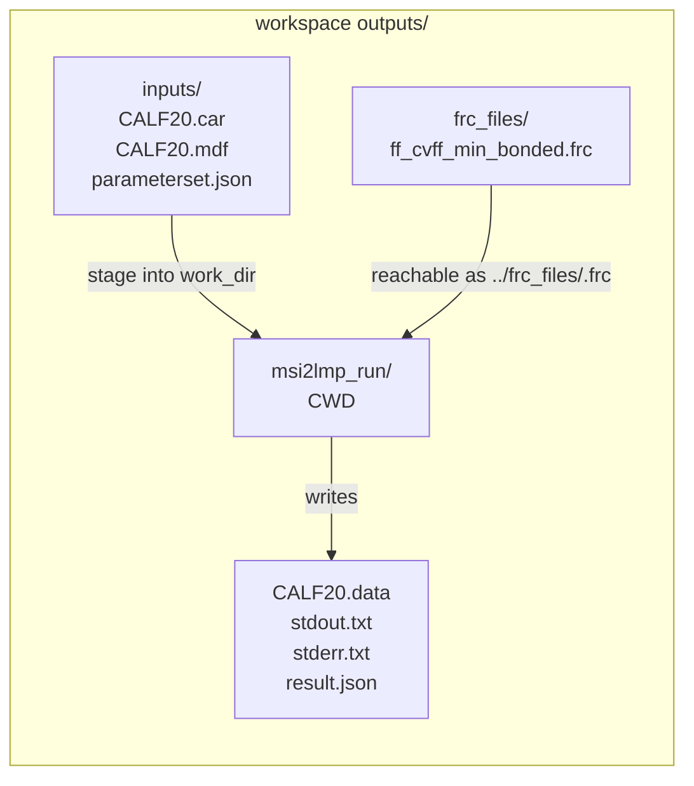

# DevGuide addendum (CALF-20): contract + gotchas for “UPM-generated `.frc` → `msi2lmp`”

This addendum documents the **normative contract** for producing a `.frc` that the CALF-20 `msi2lmp.exe` build will reliably consume, plus the known parser gotchas and deterministic mitigations.

Canonical reproducible example: [`workspaces/NIST/nist_calf20_msi2lmp_unbonded_v1/run.py`](workspaces/NIST/nist_calf20_msi2lmp_unbonded_v1/run.py:1)

Key entry points:

* Deterministic wrapper: [`external.msi2lmp.run()`](src/external/msi2lmp.py:203)
* UPM builder (CALF-20): [`build_frc_cvff_minimal_bonded()`](src/upm/src/upm/build/frc_from_scratch.py:190)
* Workspace runner: [`workspaces/NIST/nist_calf20_msi2lmp_unbonded_v1/run.py`](workspaces/NIST/nist_calf20_msi2lmp_unbonded_v1/run.py:1)

Related reproducibility notes + raw diagnostics recipes: [`docs/development/thrust-logs/msi2lmp_diagnostics_repro.md`](docs/development/thrust-logs/msi2lmp_diagnostics_repro.md:1)

Manual command blocks in this guide use the same executable location as the reproducible diagnostics notes: see [`docs/development/thrust-logs/msi2lmp_diagnostics_repro.md`](docs/development/thrust-logs/msi2lmp_diagnostics_repro.md:4).

---

## 1) Purpose / scope (what this guarantees)

For CALF-20, some `msi2lmp.exe` builds are sensitive to:

1. **CVFF labeling consistency** (forcefield `#define`, section header suffixes, and the chosen `-class`).
2. **Repeated section headers**: some parsers appear to honor **only the first occurrence** of a section.
3. **Minimal/nonbond-only forcefields**: a CVFF-labeled `.frc` that is “too small” can deterministically **hang/stall** after printing `Reading forcefield file`.

This doc defines a contract for generating a `.frc` and staging it so that:

* the wrapper [`external.msi2lmp.run()`](src/external/msi2lmp.py:203) behaves deterministically, and
* manual reproduction commands match wrapper semantics exactly.

Non-goals:

* Physical validity of placeholder bonded parameters. The CALF-20 strategy is **tool-satisfying**, not forcefield-authoring.

---

## 2) End-to-end contract (inputs → staging → outputs)

### 2.1 Inputs (normative)

**Inputs** MUST include:

* A CAR/MDF pair with a shared base name (e.g., `CALF20.car` and `CALF20.mdf`).
* A CVFF-compatible `.frc` generated by UPM using [`build_frc_cvff_minimal_bonded()`](src/upm/src/upm/build/frc_from_scratch.py:190).

Normative repository layout rule:

* The canonical workspace MUST NOT ship any `inputs/*.frc`.
  The `.frc` MUST be generated deterministically at runtime under
  [`outputs/frc_files/ff_cvff_min_bonded.frc`](workspaces/NIST/nist_calf20_msi2lmp_unbonded_v1/run.py:291).

The canonical workspace constructs these from:

* [`workspaces/NIST/nist_calf20_msi2lmp_unbonded_v1/inputs/CALF20.car`](workspaces/NIST/nist_calf20_msi2lmp_unbonded_v1/inputs/CALF20.car)
  + [`workspaces/NIST/nist_calf20_msi2lmp_unbonded_v1/inputs/CALF20.mdf`](workspaces/NIST/nist_calf20_msi2lmp_unbonded_v1/inputs/CALF20.mdf)
* [`workspaces/NIST/nist_calf20_msi2lmp_unbonded_v1/inputs/parameterset.json`](workspaces/NIST/nist_calf20_msi2lmp_unbonded_v1/inputs/parameterset.json)
  (per-atom-type mass + LJ), which is applied and re-exported deterministically in
  [`workspaces/NIST/nist_calf20_msi2lmp_unbonded_v1/run.py`](workspaces/NIST/nist_calf20_msi2lmp_unbonded_v1/run.py:1)

### 2.2 Staging layout and CWD rules (normative)

The wrapper enforces (and manual reproduction MUST match) the staging/CWD rules:

* **CWD** MUST be the `work_dir` (workspace uses [`workspaces/NIST/nist_calf20_msi2lmp_unbonded_v1/outputs/msi2lmp_run/`](workspaces/NIST/nist_calf20_msi2lmp_unbonded_v1/outputs/msi2lmp_run)).
* The forcefield MUST be reachable via [`../frc_files/<ff>.frc`](docs/development/thrust-logs/msi2lmp_diagnostics_repro.md:37) from that CWD.

Why this is normative: `msi2lmp.exe` has legacy behavior where it may attempt to open forcefields from
[`../frc_files/<frc_filename>`](src/external/msi2lmp.py:313) relative to its CWD even if you pass an absolute path; the wrapper compensates by always staging the `.frc` there.

### 2.3 Outputs (normative)

When the executable is present and succeeds:

* [`workspaces/NIST/nist_calf20_msi2lmp_unbonded_v1/outputs/msi2lmp_run/stdout.txt`](workspaces/NIST/nist_calf20_msi2lmp_unbonded_v1/outputs/msi2lmp_run/stdout.txt)
  and [`workspaces/NIST/nist_calf20_msi2lmp_unbonded_v1/outputs/msi2lmp_run/stderr.txt`](workspaces/NIST/nist_calf20_msi2lmp_unbonded_v1/outputs/msi2lmp_run/stderr.txt) MUST exist.
* [`workspaces/NIST/nist_calf20_msi2lmp_unbonded_v1/outputs/msi2lmp_run/result.json`](workspaces/NIST/nist_calf20_msi2lmp_unbonded_v1/outputs/msi2lmp_run/result.json) MUST exist (always written; also exists in missing-tool scenarios).
* [`workspaces/NIST/nist_calf20_msi2lmp_unbonded_v1/outputs/msi2lmp_run/CALF20.data`](workspaces/NIST/nist_calf20_msi2lmp_unbonded_v1/outputs/msi2lmp_run/CALF20.data) MUST exist and be non-empty.

Wrapper output contract is defined by [`external.msi2lmp.run()`](src/external/msi2lmp.py:203).

---

## 3) Canonical workspace run (one command)

From repo root:

```bash
python workspaces/NIST/nist_calf20_msi2lmp_unbonded_v1/run.py \
  --config workspaces/NIST/nist_calf20_msi2lmp_unbonded_v1/config.json
```

This runner:

* stages inputs under [`workspaces/NIST/nist_calf20_msi2lmp_unbonded_v1/outputs/inputs/`](workspaces/NIST/nist_calf20_msi2lmp_unbonded_v1/outputs/inputs) (stable hashing / manifests)
* generates the forcefield under [`workspaces/NIST/nist_calf20_msi2lmp_unbonded_v1/outputs/frc_files/ff_cvff_min_bonded.frc`](workspaces/NIST/nist_calf20_msi2lmp_unbonded_v1/outputs/frc_files/ff_cvff_min_bonded.frc) via [`build_frc_cvff_minimal_bonded()`](src/upm/src/upm/build/frc_from_scratch.py:190)
* runs `msi2lmp.exe` via the deterministic wrapper [`external.msi2lmp.run()`](src/external/msi2lmp.py:203)
* validates outputs and writes a deterministic report in [`workspaces/NIST/nist_calf20_msi2lmp_unbonded_v1/validate_run.py`](workspaces/NIST/nist_calf20_msi2lmp_unbonded_v1/validate_run.py:1)

---

## 4) Staging layout (paths are normative)

For the canonical workspace, the staging tree is:

```text
workspaces/NIST/nist_calf20_msi2lmp_unbonded_v1/
  outputs/
    inputs/
      CALF20.car
      CALF20.mdf
      parameterset.json
    frc_files/
      ff_cvff_min_bonded.frc
    msi2lmp_run/
      CALF20.car
      CALF20.mdf
      CALF20.data            (only if tool succeeds)
      stdout.txt
      stderr.txt
      result.json
```

This mirrors wrapper staging behavior:

* `.car/.mdf` are staged into `work_dir` (CWD) for stable tool I/O.
* `.frc` is staged into [`work_dir/../frc_files/`](src/external/msi2lmp.py:317) for legacy parser robustness.



---

## 5) Forcefield generation strategy (why “CVFF-labeled minimal bonded”)

CALF-20 uses [`build_frc_cvff_minimal_bonded()`](src/upm/src/upm/build/frc_from_scratch.py:190) instead of a minimal nonbond-only `.frc` for three deterministic-compatibility reasons:

1. **CVFF labeling**: the produced `.frc` is CVFF-labeled (e.g., `#atom_types\tcvff`) and includes a CVFF `#define` macro.
2. **First-occurrence wins**: Insight-era parsers may honor only the **first** header occurrence; therefore the builder emits each relevant section exactly once, in a fixed order, to avoid any ambiguity.
3. **Minimal-bonded placeholders prevent stalls**: nonbond-only or missing bonded coverage can cause deterministic stalls in some builds. The builder emits deterministic placeholder bonded terms for every TermSet key (see placeholder rationale in [`build_frc_cvff_minimal_bonded()`](src/upm/src/upm/build/frc_from_scratch.py:174)).

Additional CALF-20 mitigation included in the builder:

* **Atom type truncation**: some builds appear to truncate atom type names during matching. The builder emits deterministic truncated aliases (default max len 5) and duplicates bonded rows to match both forms (see alias logic in [`build_frc_cvff_minimal_bonded()`](src/upm/src/upm/build/frc_from_scratch.py:240)).

Note: MolSAIC v4 intentionally does **not** ship or rely on a committed “base” `.frc` asset. The builder is disk-free and produces the required sections from `termset` + `parameterset` inputs.

---

## 6) Known failure modes + deterministic mitigations

### 6.1 Error: “forcefield name and class appear to be inconsistent”

**Symptom** (deterministic): `msi2lmp.exe` exits with error (or warning with `-ignore`) complaining that the forcefield name/class are inconsistent.

**Root cause**: mismatch between `.frc` labeling/content and the invocation mode.

**Mitigations** (deterministic):

* Prefer “modern mode” invocation with a CVFF-labeled `.frc`:
  * `-class I -frc ../frc_files/<ff>.frc`
* If you must use a non-labeled `.frc`, force “legacy mode” `-f <ff_stem>`.

The wrapper’s deterministic selection/override logic is in:

* [`_build_msi2lmp_argv()`](src/external/msi2lmp.py:77) (mode selection + flag ordering)
* [`_frc_looks_cvff_labeled()`](src/external/msi2lmp.py:49) (content heuristic when `use_f_flag` is not specified)

Reproduction commands and expected output are captured in [`docs/development/thrust-logs/msi2lmp_diagnostics_repro.md`](docs/development/thrust-logs/msi2lmp_diagnostics_repro.md:1).

### 6.2 Hang/stall after `Reading forcefield file`

**Symptom** (deterministic): `msi2lmp.exe` prints up to `Reading forcefield file` and then never returns.

**Root cause** (observed): a CVFF-labeled but “minimal” `.frc` (especially nonbond-only) can cause the binary to stall during parameter resolution.

**Mitigations** (deterministic):

* Do **not** feed CALF-20 the nonbond-only builder output.
* Use [`build_frc_cvff_minimal_bonded()`](src/upm/src/upm/build/frc_from_scratch.py:190) which:
  * emits a CVFF-labeled `.frc` with deterministic placeholder bonded rows to guarantee key coverage
  * mitigates type truncation via alias duplication
* Use a hard timeout + forced line buffering during diagnostics (see §7.3 and [`docs/development/thrust-logs/msi2lmp_diagnostics_repro.md`](docs/development/thrust-logs/msi2lmp_diagnostics_repro.md:1)).

### 6.3 Repeated section header gotcha (which occurrence “wins”)

**Symptom**: you append a new section at the end of the `.frc` (e.g., a second `#atom_types\tcvff`) but `msi2lmp.exe` behaves as if it ignored the appended content.

**Root cause**: some parsers appear to honor only the first section occurrence.

**Mitigation**: insert rows into the first occurrence only (builder does this by locating the first header and inserting before the next `#...` header; see [`build_frc_cvff_minimal_bonded()`](src/upm/src/upm/build/frc_from_scratch.py:424)).

### 6.4 Output “missing” due to buffering / stuck stdin

**Symptom**: stdout/stderr appear empty or sparse, or the process appears interactive.

**Mitigation**: run with:

* `stdbuf -oL -eL` to force line-buffered output
* `</dev/null` to prevent reads from stdin
* `timeout ...` to prevent indefinite hangs

See §7.3 and the hardened template in [`docs/development/thrust-logs/msi2lmp_diagnostics_repro.md`](docs/development/thrust-logs/msi2lmp_diagnostics_repro.md:1).

---

## 7) Manual reproduction commands (wrapper-equivalent)

All commands below MUST be run from the wrapper-equivalent CWD:

```bash
cd workspaces/NIST/nist_calf20_msi2lmp_unbonded_v1/outputs/msi2lmp_run
```

### 7.1 Production (minimal argv)

```bash
/home/sf2/LabWork/software/msi2lmp.exe CALF20 \
  -class I \
  -frc ../frc_files/ff_cvff_min_bonded.frc
```

### 7.2 Debug (inventory + ignores the name/class inconsistency as a warning)

```bash
/home/sf2/LabWork/software/msi2lmp.exe CALF20 \
  -ignore \
  -print 2 \
  -class I \
  -frc ../frc_files/ff_cvff_min_bonded.frc
```

### 7.3 Hardened “hang-proof” template (recommended for diagnostics)

```bash
timeout --preserve-status --signal=TERM --kill-after=1s 30s \
  stdbuf -oL -eL /home/sf2/LabWork/software/msi2lmp.exe CALF20 \
    -ignore -print 2 -class I -frc ../frc_files/ff_cvff_min_bonded.frc \
  </dev/null \
  >stdout.txt \
  2>stderr.txt

echo "exit_code=$?"
```

Interpretation (as used in [`docs/development/thrust-logs/msi2lmp_diagnostics_repro.md`](docs/development/thrust-logs/msi2lmp_diagnostics_repro.md:1)):

* exit code `0` => success
* exit code `143` => killed by SIGTERM (likely a hang)

### 7.4 Wrapper flag selection and overrides (optional, but deterministic)

The wrapper’s mode selection logic is in [`_build_msi2lmp_argv()`](src/external/msi2lmp.py:77), and the heuristic for CVFF-labeled `.frc` detection is [`_frc_looks_cvff_labeled()`](src/external/msi2lmp.py:49).

For the CALF-20 workspace, wrapper controls are exposed via `config.json` parameters that map directly to [`external.msi2lmp.run()`](src/external/msi2lmp.py:203) arguments (see config notes in [`docs/development/thrust-logs/msi2lmp_diagnostics_repro.md`](docs/development/thrust-logs/msi2lmp_diagnostics_repro.md:224)):

* `msi2lmp_forcefield_class` → `forcefield_class` (e.g., `"I"`)
* `msi2lmp_use_f_flag` → `use_f_flag` (force legacy `-f` vs modern `-class/-frc`)
* `msi2lmp_ignore` → `ignore` (adds `-ignore`)
* `msi2lmp_print_level` → `print_level` (adds `-print N`)

---

## 8) Determinism checklist

**Staging / CWD**

* Run `msi2lmp.exe` with CWD = [`workspaces/NIST/nist_calf20_msi2lmp_unbonded_v1/outputs/msi2lmp_run/`](workspaces/NIST/nist_calf20_msi2lmp_unbonded_v1/outputs/msi2lmp_run) (or pass `work_dir` to wrapper) per [`external.msi2lmp.run()`](src/external/msi2lmp.py:203).
* Ensure `.frc` is reachable as [`../frc_files/<ff>.frc`](docs/development/thrust-logs/msi2lmp_diagnostics_repro.md:37) from that CWD (wrapper stages it there per [`external.msi2lmp.run()`](src/external/msi2lmp.py:313)).

**Forcefield generation**

* For CALF-20, generate `.frc` via [`build_frc_cvff_minimal_bonded()`](src/upm/src/upm/build/frc_from_scratch.py:190), not the nonbond-only builder.
* Ensure no duplicate “override” sections are appended; insert into first occurrence only (see [`build_frc_cvff_minimal_bonded()`](src/upm/src/upm/build/frc_from_scratch.py:408)).

**Invocation**

* Prefer modern invocation `-class I -frc <relpath>` with CVFF-labeled `.frc`.
* If debugging, add `-ignore` then `-print N` (wrapper uses stable ordering in [`_build_msi2lmp_argv()`](src/external/msi2lmp.py:77)).

**Artifacts**

* Capture stdout/stderr to files (workspace and wrapper do this deterministically).
* For diagnostics, always use `timeout + stdbuf + </dev/null` to avoid indefinite hangs and buffering ambiguity.
