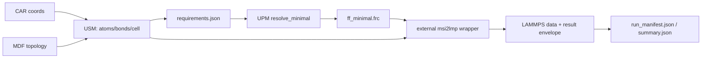

# MolSAIC V4 onboarding notes (USM → Requirements → UPM → external wrappers → workspace outputs)

This writeup is a **read + run + explain** onboarding record for MolSAIC V4.

## 0) Repo mental model (architecture map)

Authoritative overview (repo): [`README.md`](README.md:1)

Key “fits + boundaries” doc (glue package responsibilities): [`docs/reference/MOLSAIC_FIT_AND_USAGE.md`](docs/reference/MOLSAIC_FIT_AND_USAGE.md:1)

### 0.1 Modules (what lives where)

* **USM** (structures): submodule at [`src/usm/`](src/usm:1)
  * Data model: [`src/usm/docs/DATA_MODEL.md`](src/usm/docs/DATA_MODEL.md:1)
  * API surface: [`src/usm/docs/API.md`](src/usm/docs/API.md:1)
  * Core model implementation + schema enforcement: [`USM.__post_init__()`](src/usm/core/model.py:97)
  * Deterministic ops live under [`src/usm/ops/`](src/usm/ops:1) (selection/transform/replicate/merge/compose/renumber/etc.)

* **UPM** (parameters): submodule at [`src/upm/`](src/upm:1)
  * CLI: [`upm.cli.main.app`](src/upm/src/upm/cli/main.py:1)
  * `.frc` codec: [`upm.codecs.msi_frc.parse_frc_text()`](src/upm/src/upm/codecs/msi_frc.py:44), [`upm.codecs.msi_frc.write_frc()`](src/upm/src/upm/codecs/msi_frc.py:108)
  * Requirements model: [`upm.core.model.Requirements`](src/upm/src/upm/core/model.py:121)
  * Minimal resolver: [`upm.core.resolve.resolve_minimal()`](src/upm/src/upm/core/resolve.py:63)
  * v0.1.0 contract doc: [`src/upm/docs/DevGuides/DevGuide_v0.1.0.md`](src/upm/docs/DevGuides/DevGuide_v0.1.0.md:1)

* **External wrappers** (executables): under [`src/external/`](src/external:1)
  * Contract: [`docs/reference/ADAPTER_CONTRACT.md`](docs/reference/ADAPTER_CONTRACT.md:1)
  * Result envelope type: [`ExternalToolResult`](src/external/adapter.py:51)
  * Example wrapper: [`msi2lmp.run()`](src/external/msi2lmp.py:117)

* **MolSAIC “glue” package** (workspace discovery + deterministic manifest helpers): under [`src/molsaic/`](src/molsaic:1)
  * Repo/workspace discovery: [`find_repo_root()`](src/molsaic/workspaces.py:21), [`find_workspace_dir()`](src/molsaic/workspaces.py:98)
  * Deterministic JSON + hashing: [`write_json_stable()`](src/molsaic/manifest_utils.py:27), [`sha256_file()`](src/molsaic/manifest_utils.py:12), [`relpath_posix()`](src/molsaic/manifest_utils.py:35)
  * Fit/boundaries: [`docs/reference/MOLSAIC_FIT_AND_USAGE.md`](docs/reference/MOLSAIC_FIT_AND_USAGE.md:1)

* **Workspaces** (pipelines): under [`workspaces/`](workspaces:1)
  * Workspace contract + determinism conventions: [`docs/getting-started/WORKFLOWS.md`](docs/getting-started/WORKFLOWS.md:1)
  * Canonical “golden pipeline” workspace: [`workspaces/02_usm_upm_msi2lmp_pipeline/run.py`](workspaces/02_usm_upm_msi2lmp_pipeline/run.py:1)

### 0.2 Dataflow (end-to-end)

Source of truth (integrated milestone): [`docs/development/guides/DevGuide_v0.1.1.md`](docs/development/guides/DevGuide_v0.1.1.md:1)

The intended conceptual flow is explicitly stated as:

> **USM (CAR+MDF) → Requirements → UPM minimal `.frc` → `src/external/msi2lmp.py` → LAMMPS data + manifest** ([`docs/development/guides/DevGuide_v0.1.1.md`](docs/development/guides/DevGuide_v0.1.1.md:31))

Concrete “golden pipeline” implementation:



Where each arrow is “owned”:

* **CAR/MDF → USM**: file parsing + normalization + preserved text (USM I/O)
* **USM → requirements.json**: topology requirements derivation (UPM-independent) via [`write_requirements_json()`](src/usm/ops/requirements.py:163)
* **requirements.json → minimal `.frc`**: UPM resolver + export (parameter domain)
* **minimal `.frc` + CAR/MDF → external**: wrapper calls with deterministic envelope + validated outputs
* **workspace outputs**: written under `outputs/` (workspace contract)

## 1) Golden-path runbook (commands actually run)

### 1.1 Repo setup + sanity checks (from repo root)

```bash
git submodule update --init --recursive
python -m pip install -e .
pytest -q
```

Observed: tests passed (`26 passed, 24 skipped`).

### 1.2 Install UPM (separate package)

```bash
python -m pip install -e ./src/upm
```

### 1.3 UPM “minimal subset export flow” (CLI)

Docs: [`src/upm/README.md`](src/upm/README.md:1)

#### 1.3.1 Doc/code mismatch encountered (UPM README quickstart)

Older versions of this repo used to ship a large CVFF/IFF `.frc` asset and referenced it in the UPM README. That pattern is intentionally removed: MolSAIC/UPM workflows must not rely on any pre-supplied “base” `.frc`.

#### 1.3.2 Working “golden path” CLI run (using the repo’s minimal demo `.frc`)

To still exercise the **import → validate → export full → export minimal** flow end-to-end, I used the minimal demo `.frc` already used by the repo’s integrated pipeline:

Input: [`workspaces/02_usm_upm_msi2lmp_pipeline/inputs/mxn_demo_minimal.frc`](workspaces/02_usm_upm_msi2lmp_pipeline/inputs/mxn_demo_minimal.frc:1)

Commands run:

```bash
upm import-frc workspaces/02_usm_upm_msi2lmp_pipeline/inputs/mxn_demo_minimal.frc --name mxn-demo --version v1
upm validate --package mxn-demo@v1
upm export-frc --package mxn-demo@v1 --mode full --out /tmp/full.frc

# minimal export requires a requirements.json; I wrote one to /tmp
cat > /tmp/requirements_mxn.json <<'JSON'
{
  "atom_types": ["cx1", "ti1", "hoy", "omx"],
  "bond_types": [["cx1", "ti1"], ["hoy", "omx"]],
  "angle_types": [["cx1", "ti1", "cx2"]],
  "dihedral_types": []
}
JSON

upm export-frc --package mxn-demo@v1 --mode minimal --requirements /tmp/requirements_mxn.json --out /tmp/min.frc
```

Artifacts produced:

* Package bundle under [`packages/mxn-demo/v1/`](packages:1)
* Full export: `/tmp/full.frc`
* Minimal export: `/tmp/min.frc`

### 1.4 Run the included UPM workspaces

Commands run:

```bash
python src/upm/workspaces/00_quickcheck_import_export/run.py
python src/upm/workspaces/01_minimal_subset_export/run.py
```

Outputs (per UPM README):

* Workspace 00:
  * [`src/upm/workspaces/00_quickcheck_import_export/outputs/full_export.frc`](src/upm/workspaces/00_quickcheck_import_export/outputs:1)
  * [`src/upm/workspaces/00_quickcheck_import_export/outputs/roundtrip_report.json`](src/upm/workspaces/00_quickcheck_import_export/outputs:1)
* Workspace 01:
  * [`src/upm/workspaces/01_minimal_subset_export/outputs/minimal.frc`](src/upm/workspaces/01_minimal_subset_export/outputs:1)

### 1.5 MolSAIC workspace execution pattern (end-to-end)

Docs: workspace contract in [`docs/getting-started/WORKFLOWS.md`](docs/getting-started/WORKFLOWS.md:1)

I ran the canonical integrated “golden pipeline” workspace:

Workspace: [`workspaces/02_usm_upm_msi2lmp_pipeline/run.py`](workspaces/02_usm_upm_msi2lmp_pipeline/run.py:1)

From its workspace directory:

```bash
cd workspaces/02_usm_upm_msi2lmp_pipeline
PYTHONPATH=./src:./src/upm/src python run.py --config ./config.json
```

Outputs landed under:

* [`workspaces/02_usm_upm_msi2lmp_pipeline/outputs/`](workspaces/02_usm_upm_msi2lmp_pipeline/outputs:1)
  * `inputs/` (staged exact copies; see staging logic in [`run.py`](workspaces/02_usm_upm_msi2lmp_pipeline/run.py:123))
  * `requirements.json` (USM-derived)
  * `packages/...` (UPM bundle cache)
  * `ff_minimal.frc` (UPM minimal export)
  * `msi2lmp_run/` (wrapper CWD; stdout/stderr/result.json)
  * `run_manifest.json` (deterministic manifest: relpaths + hashes)

Because the `msi2lmp` executable is not present in this environment, the wrapper returned `status=missing_tool` and still wrote a deterministic envelope (contract requirement). See [`msi2lmp.run()`](src/external/msi2lmp.py:117) and contract note “Missing tool behavior” ([`src/external/msi2lmp.py`](src/external/msi2lmp.py:178)).

#### Determinism confirmation (bytes stable across reruns)

The golden workspace claims byte-stability for key artifacts in its docstring (no timestamps/abs paths) ([`workspaces/02_usm_upm_msi2lmp_pipeline/run.py`](workspaces/02_usm_upm_msi2lmp_pipeline/run.py:5)).

I confirmed identical sha256 across reruns for:

* [`outputs/requirements.json`](workspaces/02_usm_upm_msi2lmp_pipeline/outputs:1)
* [`outputs/ff_minimal.frc`](workspaces/02_usm_upm_msi2lmp_pipeline/outputs:1)
* [`outputs/run_manifest.json`](workspaces/02_usm_upm_msi2lmp_pipeline/outputs:1)

This aligns with the integration test intent described in [`docs/development/reports/v0.1.1_report.md`](docs/development/reports/v0.1.1_report.md:214).

## 2) Key invariants (“determinism-first”) and where enforced

### 2.1 USM determinism invariants

* **Schema + dtypes enforced on construction**: [`USM.__post_init__()`](src/usm/core/model.py:97)
  * guarantees “dense” IDs: `aid` is `0..N-1`, `bid` is `0..M-1` and bond endpoints normalized.
* **Round-trip fidelity via raw preservation**: `preserved_text` stores CAR/MDF header/footer blocks, plus MDF metadata like `@molecule` ordering and connection tokens.
  * documented in [`src/usm/docs/DATA_MODEL.md`](src/usm/docs/DATA_MODEL.md:57)
* **Deterministic operations** (stable ordering + deterministic remaps) are the default expectation; the API states: “All operations are stable and deterministic for identical inputs.” ([`src/usm/docs/API.md`](src/usm/docs/API.md:100)).

### 2.2 Requirements determinism invariants

USM→Requirements derivation is explicitly UPM-independent and deterministic:

* Canonical key forms:
  * bonds `(t1,t2)` canonicalized so `t1 <= t2` via [`_canonicalize_bond_key()`](src/usm/ops/requirements.py:17)
  * angles `(t1,t2,t3)` canonicalized so endpoints satisfy `t1 <= t3` via [`_canonicalize_angle_key()`](src/usm/ops/requirements.py:23)
* Angle enumeration algorithm is deterministic adjacency enumeration (neighbors deduped+sorted), implemented in [`derive_requirements_v0_1()`](src/usm/ops/requirements.py:105)
* Requirements JSON writer is stable: `indent=2`, `sort_keys=True`, newline ([`write_requirements_json()`](src/usm/ops/requirements.py:163))

### 2.3 UPM determinism invariants

* **Normalization**: stable sorting, endpoint canonicalization, and dtype casting in [`normalize_tables()`](src/upm/src/upm/core/tables.py:312)
* **Validation**: schema strictness, uniqueness, and “no silent physics changes” defaults in [`validate_tables()`](src/upm/src/upm/core/validate.py:264)
* **Minimal export failure modes** (explicit, deterministic): missing terms raise [`MissingTermsError`](src/upm/src/upm/core/resolve.py:19), or are returned (with deterministic lists) when `allow_missing=True` in [`resolve_minimal()`](src/upm/src/upm/core/resolve.py:63)
* **`.frc` stable export formatting**: fixed float formatting helper [`_fmt_float()`](src/upm/src/upm/codecs/msi_frc.py:662)

### 2.4 External wrapper determinism invariants

Contract is centralized in [`docs/reference/ADAPTER_CONTRACT.md`](docs/reference/ADAPTER_CONTRACT.md:1) and implemented by:

* unified result envelope: [`ExternalToolResult.to_dict()`](src/external/adapter.py:83)
* deterministic CWD choice + stable `result.json` persistence even on missing tool: [`msi2lmp.run()`](src/external/msi2lmp.py:117)

### 2.5 Workspace manifest determinism invariants

There are **two manifest styles** in this repo:

1) **`outputs/summary.json`**: manifest v1 schema includes timestamps (so it’s not byte-deterministic across runs), see [`docs/reference/manifest.v1.schema.json`](docs/reference/manifest.v1.schema.json:1) and schema discussion in [`docs/reference/MOLSAIC_FIT_AND_USAGE.md`](docs/reference/MOLSAIC_FIT_AND_USAGE.md:168).

2) **`outputs/run_manifest.json`** (golden workspace): intentionally deterministic (relpaths+hashes, no timestamps/abs paths), built in [`manifest_obj`](workspaces/02_usm_upm_msi2lmp_pipeline/run.py:259) using [`write_json_stable()`](src/molsaic/manifest_utils.py:27).

## 3) Answers to the onboarding questions

### 3.1 USM

#### Q: What columns are guaranteed in atoms and what’s nullable? How are IDs normalized?

Authoritative schema list: [`src/usm/docs/DATA_MODEL.md`](src/usm/docs/DATA_MODEL.md:1).

Guaranteed atoms columns (required core):

* `aid`, `name`, `element`, `atom_type`, `charge`, `mass_amu` (nullable), `lj_epsilon_kcal_mol` (nullable), `lj_sigma_angstrom` (nullable), `x`, `y`, `z`, `mol_label`, `mol_index`, `mol_block_name` ([`DATA_MODEL.md`](src/usm/docs/DATA_MODEL.md:7)).

MDF carry-through columns are explicitly noted as nullable (examples: `formal_charge`, `connections_raw`, etc.) ([`DATA_MODEL.md`](src/usm/docs/DATA_MODEL.md:23)).

ID normalization:

* `aid` is “dense 0..N-1” and is recomputed; enforced by [`USM.__post_init__()`](src/usm/core/model.py:97) and described in [`DATA_MODEL.md`](src/usm/docs/DATA_MODEL.md:64).
* `bid` is “dense 0..M-1” and bond endpoints must satisfy `a1 < a2`; also enforced in [`USM.__post_init__()`](src/usm/core/model.py:97) and described in [`DATA_MODEL.md`](src/usm/docs/DATA_MODEL.md:66).

#### Q: What does preserved_text store and why does it matter?

`preserved_text` is a dict storing raw text blocks needed for lossless-ish roundtrip:

* CAR: `car_header_lines`, `car_footer_lines`
* MDF: `mdf_header_lines`, `mdf_footer_lines`, `mdf_molecule_order`

This is explicitly described in “Provenance & preserved text” in [`src/usm/docs/DATA_MODEL.md`](src/usm/docs/DATA_MODEL.md:57). It matters because several formats (especially MDF) contain structured-but-not-tabular metadata that must be re-emitted to preserve fidelity; also MDF “connections” tokens are preserved per-atom as `connections_raw` (lossless token mode) ([`src/usm/docs/DATA_MODEL.md`](src/usm/docs/DATA_MODEL.md:96)).

#### Q: What operations are available and what deterministic guarantees do they make?

Ops surface (selected) is listed in [`src/usm/docs/API.md`](src/usm/docs/API.md:16), including:

* selection: [`select_by_element()`](src/usm/ops/select.py:55) etc.
* transforms: [`translate()`](src/usm/ops/transform.py:16), [`rotate()`](src/usm/ops/transform.py:56), [`wrap_to_cell()`](src/usm/ops/transform.py:86)
* replicate: [`replicate_supercell()`](src/usm/ops/replicate.py:17)
* merge/compose: [`merge_structures()`](src/usm/ops/merge.py:25), [`compose_on_keys()`](src/usm/ops/compose.py:12)
* renumber: [`renumber_atoms()`](src/usm/ops/renumber.py:17), [`renumber_molecules()`](src/usm/ops/renumber.py:33)

Determinism guarantee is stated in the API notes: “All operations are stable and deterministic for identical inputs.” ([`src/usm/docs/API.md`](src/usm/docs/API.md:100)).

### 3.2 UPM

#### Q: What does UPM not store (charges) and why?

UPM explicitly does **not** store charges; charges belong to the structure representation.

Source: [`src/upm/README.md`](src/upm/README.md:11) and reiterated in [`src/upm/docs/DevGuides/DevGuide_v0.1.0.md`](src/upm/docs/DevGuides/DevGuide_v0.1.0.md:14).

#### Q: What exactly is a Requirements object and what produces it today vs later?

In v0.1.0, Requirements is a compact JSON schema describing required parameter keys (atom types + interaction tuples) (see “Requirements JSON schema” in [`DevGuide_v0.1.0`](src/upm/docs/DevGuides/DevGuide_v0.1.0.md:215)).

Today:

* UPM can read Requirements JSON into [`Requirements`](src/upm/src/upm/core/model.py:121) via [`read_requirements_json()`](src/upm/src/upm/io/requirements.py:87).
* In the integrated pipeline, USM produces the v0.1 Requirements JSON via [`write_requirements_json()`](src/usm/ops/requirements.py:163) (UPM-independent, per “Scope boundaries” in [`docs/development/guides/DevGuide_v0.1.1.md`](docs/development/guides/DevGuide_v0.1.1.md:74)).

Later:

* UPM’s “future integration” plan is for “USM will produce the same Requirements object.” ([`src/upm/README.md`](src/upm/README.md:178)).
* v0.1.0 explicitly: “In v0.1.0, requirements come from a JSON file. Later, USM will produce the same Requirements object.” ([`DevGuide_v0.1.0`](src/upm/docs/DevGuides/DevGuide_v0.1.0.md:74)).

#### Q: How does minimal export fail (missing terms) and what artifacts/reporting exist?

At the resolver layer:

* default: missing terms raise [`MissingTermsError`](src/upm/src/upm/core/resolve.py:19)
* debug: `allow_missing=True` returns `(ResolvedFF, MissingTermsError)` with deterministic missing lists ([`resolve_minimal()`](src/upm/src/upm/core/resolve.py:63))

At the CLI layer:

* default: hard error in minimal export when terms are missing ([`export_frc()`](src/upm/src/upm/cli/commands/export_frc.py:54))
* `--allow-missing`: still writes the `.frc`, writes `missing.json`, exits 1 (unless `--force`) ([`export_frc()`](src/upm/src/upm/cli/commands/export_frc.py:154))

### 3.3 MolSAIC integration

#### Q: Where do external tool wrappers live and what’s the contract of their outputs?

Wrappers live under [`src/external/`](src/external:1) and conform to the result envelope described in [`docs/reference/ADAPTER_CONTRACT.md`](docs/reference/ADAPTER_CONTRACT.md:1).

Key envelope fields include `tool`, `argv`, `cwd`, `stdout`, `stderr`, `outputs`, `status`, `outputs_sha256`, and best-effort `tool_version` ([`docs/reference/ADAPTER_CONTRACT.md`](docs/reference/ADAPTER_CONTRACT.md:18)).

The envelope type is the dataclass [`ExternalToolResult`](src/external/adapter.py:51).

#### Q: What’s the intended end-to-end conceptual flow?

This repo’s integrated milestone describes the flow as:

> Structure/Topology → Requirements → Resolve → Export → External conversion/run → Manifest/summary

This is articulated both in UPM’s “Future integration” section ([`src/upm/README.md`](src/upm/README.md:178)) and the integrated DevGuide v0.1.1 architecture statement ([`docs/development/guides/DevGuide_v0.1.1.md`](docs/development/guides/DevGuide_v0.1.1.md:31)).

## 4) Extension points (where to add things safely)

### 4.1 Add a new workspace

Docs: workspace contract in [`docs/getting-started/WORKFLOWS.md`](docs/getting-started/WORKFLOWS.md:1).

Safe pattern:

* Copy [`workspaces/_template/run.py`](workspaces/_template/run.py:1) and [`workspaces/_template/config.json`](workspaces/_template/config.json:1)
* Write all artifacts under `outputs/` (create if missing)
* Use wrapper modules (don’t call subprocess directly) to get deterministic envelopes
* Optionally use manifest helpers like [`write_json_stable()`](src/molsaic/manifest_utils.py:27)

### 4.2 Add a new external adapter

Docs + contract: [`docs/reference/ADAPTER_CONTRACT.md`](docs/reference/ADAPTER_CONTRACT.md:1).

Safe pattern:

* Implement `run(...)->dict` returning [`ExternalToolResult.to_dict()`](src/external/adapter.py:83)
* Follow: deterministic CWD, PATH augmentation via [`augment_env_with_exe_dir()`](src/external/adapter.py:36), output validation, always write `result.json`.

### 4.3 Add a new USM op

USM ops live under [`src/usm/ops/`](src/usm/ops:1).

Safety requirements:

* preserve schema + enforce deterministic IDs by constructing a new USM (triggering [`USM.__post_init__()`](src/usm/core/model.py:97))
* keep ordering deterministic (stable sort / explicit ordering)
* add tests under [`src/usm/tests/`](src/usm/tests:1)

### 4.4 Add a new UPM codec

UPM codecs live under [`src/upm/src/upm/codecs/`](src/upm/src/upm/codecs:1).

Safety requirements:

* keep canonicalization centralized in [`normalize_tables()`](src/upm/src/upm/core/tables.py:312) and validation in [`validate_tables()`](src/upm/src/upm/core/validate.py:264)
* preserve unknown/raw sections explicitly (see raw policy in [`write_frc()`](src/upm/src/upm/codecs/msi_frc.py:108))
* add unit tests under [`src/upm/tests/`](src/upm/tests:1)

## 5) Top 10 gotchas / footguns noticed

1) **Python environment confusion (shadowed `molsaic`)**: `python` imported a different `molsaic` from another checkout, causing `ModuleNotFoundError` for [`molsaic.workspaces`](src/molsaic/workspaces.py:1). Use a clean venv/conda env or enforce `PYTHONPATH=./src` for workspace runs.

2) **Workspace invocation cwd matters**: the golden workspace resolves `--config` relative to `WORKSPACE_DIR` via [`_to_abs()`](workspaces/02_usm_upm_msi2lmp_pipeline/run.py:82). If you pass a path that already includes `workspaces/<name>/...` while running from root, you can accidentally double-prefix and get a missing config error.

3) **UPM README examples should use the in-repo demo `.frc`**: the project direction is that “from scratch” flows must not rely on any pre-supplied `.frc` base. Use the demo input [`mxn_demo_minimal.frc`](workspaces/02_usm_upm_msi2lmp_pipeline/inputs/mxn_demo_minimal.frc:1) for import/export examples.

4) **UPM “packages/” is a side-effect in repo root**: `upm import-frc` defaults to writing under `packages/` (see CLI default in [`import_frc()`](src/upm/src/upm/cli/commands/import_frc.py:21)). Don’t forget to clean it or point `--out-dir` somewhere workspace-local.

5) **Two manifest flavors**: `outputs/summary.json` (schema v1) includes timestamps (non-deterministic across runs) while `run_manifest.json` in the golden workspace is intentionally timestamp-free and byte-deterministic (see [`docs/reference/MOLSAIC_FIT_AND_USAGE.md`](docs/reference/MOLSAIC_FIT_AND_USAGE.md:166)).

6) **Wrapper envelopes are not fully deterministic**: they contain `cwd` and `duration_s` by design (see [`ExternalToolResult`](src/external/adapter.py:51)), so the golden workspace intentionally does **not** hash `result.json` into its deterministic run manifest (see note in [`run.py`](workspaces/02_usm_upm_msi2lmp_pipeline/run.py:232)).

7) **Missing-tool behavior is “soft”**: wrappers can return `status="missing_tool"` without raising (e.g., [`msi2lmp.run()`](src/external/msi2lmp.py:178)). Workspaces/tests must treat this as a legitimate outcome in CI.

8) **Some workspaces assume external assets that are not in-tree**: e.g., [`workspaces/other/usm_lb_sf_carmdf_v1/run.py`](workspaces/other/usm_lb_sf_carmdf_v1/run.py:1) can run but will report missing local asset files; don’t treat it as a canonical runnable demo in a fresh checkout.

9) **Basename collision rule for workspace discovery**: MolSAIC’s workspace lookup is by basename and raises on collisions via [`WorkspaceCollisionError`](src/molsaic/workspaces.py:17). Nested directories are allowed, but duplicate basenames under `workspaces/**` are not.

10) **Determinism depends on explicit canonicalization, not “natural” ordering**: requirements derivation canonicalizes keys and sorts outputs in [`derive_requirements_v0_1()`](src/usm/ops/requirements.py:105) and UPM does stable mergesort sorting in normalizers (e.g., [`_sort_canonical()`](src/upm/src/upm/core/tables.py:133)). Any new code path must follow the same “sort explicitly” discipline.
