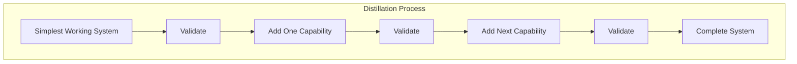
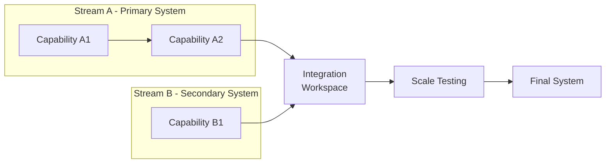
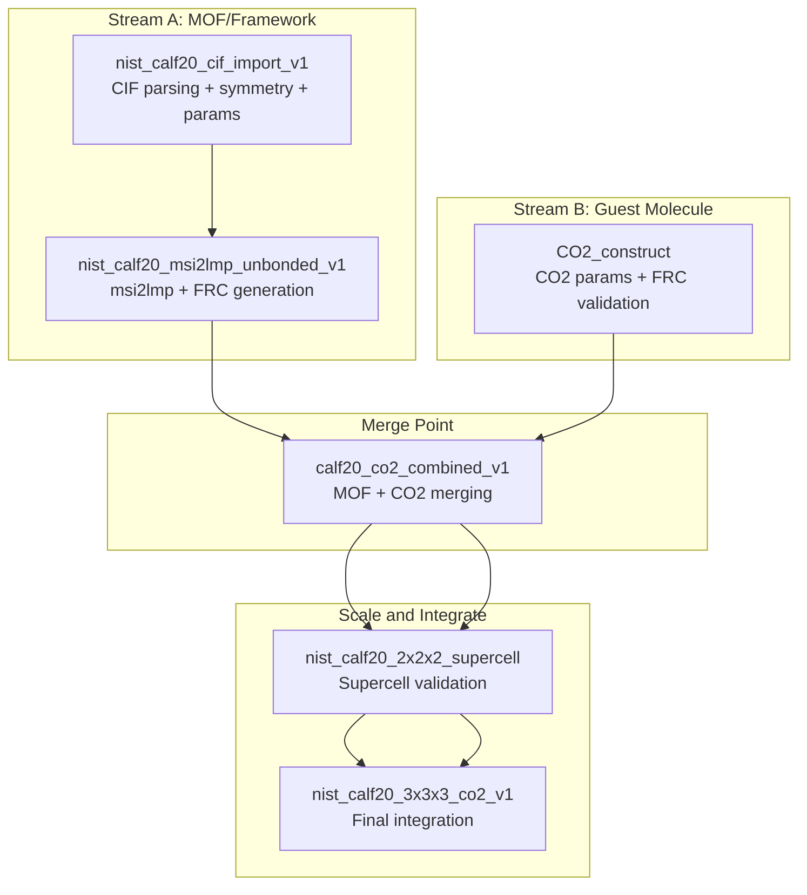

# Iterative Development Playbook

**A Generalizable Guide for Complex Pipeline Implementation**

*Derived from the NIST CALF-20 + CO₂ Diffusion Reference System Development*

---

## Overview

This playbook documents the iterative development methodology used to successfully build a complex computational chemistry pipeline from discrete, validated components. The approach is generalizable to any project requiring:

1. Integration of multiple subsystems
2. External tool dependencies
3. File format transformations
4. Stepwise validation at each layer

The core philosophy: **Build up complexity incrementally, validate each layer before adding the next, and isolate failure modes through focused workspaces.**

---

## Table of Contents

1. [The Distillation Principle](#1-the-distillation-principle)
2. [Workspace Progression Pattern](#2-workspace-progression-pattern)
3. [The Six-Phase Development Cycle](#3-the-six-phase-development-cycle)
4. [Documentation as First-Class Artifact](#4-documentation-as-first-class-artifact)
5. [Validation Strategy](#5-validation-strategy)
6. [Debugging and Remediation](#6-debugging-and-remediation)
7. [Case Study: NIST CALF-20 Pipeline](#7-case-study-nist-calf-20-pipeline)
8. [Playbook Templates](#8-playbook-templates)
9. [Anti-Patterns to Avoid](#9-anti-patterns-to-avoid)

---

## 1. The Distillation Principle

### Core Concept

Complex pipelines are built through **distillation**: starting with the simplest possible working implementation, then progressively adding complexity while maintaining a validated baseline at each step.



### Why This Works

1. **Failure Isolation**: When something breaks, you know exactly which addition caused it
2. **Baseline Preservation**: Each validated stage becomes a known-good fallback
3. **Confidence Building**: Stakeholders see incremental progress
4. **Knowledge Capture**: Each workspace documents one specific capability

### The Golden Rule

> **Never add two untested capabilities at once.** If the combined system fails, you cannot determine which addition caused the failure without backtracking.

### Parallel Stream Development

Complex systems often have **independent subsystems** that can be developed in parallel before merging. This is more efficient than pure sequential development:



**Key Principle**: Each stream develops and validates its components **independently**. Streams only merge when both have validated, working implementations. This prevents debugging confusion from mixed failure sources.

**When to Use Parallel Streams**:
- Components have different dependencies (e.g., MOF vs guest molecule)
- Components can be tested in isolation
- Different team members can work on different streams
- Integration is a distinct, testable step

---

## 2. Workspace Progression Pattern

### Anatomy of a Workspace

Each workspace is a **self-contained, reproducible experiment** with:

```
workspaces/{PROJECT}/{workspace_name}/
├── config.json          # All configurable inputs
├── run.py               # Main execution script
├── validate_run.py      # Validation logic
├── [helper_modules.py]  # Domain-specific helpers
├── inputs/              # Input files (or references to assets)
└── outputs/             # Generated at runtime
    ├── inputs/          # Staged copies of inputs
    ├── [intermediate]/  # Intermediate artifacts
    ├── summary.json     # Execution summary
    └── [final_outputs]  # Target deliverables
```

### Workspace Naming Convention

Use semantic versioning in workspace names:

| Pattern | Meaning |
|---------|---------|
| `{project}_{capability}_v1` | First validated implementation |
| `{project}_{capability}_v2` | Major revision |
| `{project}_{A}_{B}_combined_v1` | Integration of capabilities A and B |

### Example Progression: Parallel Streams

From the NIST CALF-20 project, two independent streams were developed in parallel:

```
┌─────────────────────────────────────────────────────────────────────────────┐
│ STREAM A: MOF/Framework                                                      │
│                                                                              │
│   nist_calf20_cif_import_v1       → CIF parsing, symmetry expansion,        │
│                                     parameter mapping, solvent removal       │
│                                          │                                   │
│                                          ▼                                   │
│   nist_calf20_msi2lmp_unbonded_v1 → msi2lmp integration, FRC generation,    │
│                                     .data file production                    │
└──────────────────────────────────────────┬──────────────────────────────────┘
                                           │
┌──────────────────────────────────────────┼──────────────────────────────────┐
│ STREAM B: Guest Molecule                 │                                   │
│                                          │                                   │
│   CO2_construct                    → CO2 template loading, parameter        │
│                                     extraction from cvff_iff_ILs.frc,       │
│                                     FRC validation via dual-path test       │
│                                          │                                   │
└──────────────────────────────────────────┬──────────────────────────────────┘
                                           │
                                           ▼
┌─────────────────────────────────────────────────────────────────────────────┐
│ MERGE POINT                                                                  │
│                                                                              │
│   calf20_co2_combined_v1          → Structure merging, ChainedSource FRC,   │
│                                     combined msi2lmp execution               │
└──────────────────────────────────────────┬──────────────────────────────────┘
                                           │
                                           ▼
┌─────────────────────────────────────────────────────────────────────────────┐
│ SCALE & INTEGRATE                                                            │
│                                                                              │
│   nist_calf20_2x2x2_supercell     → Supercell replication validation        │
│                                          │                                   │
│                                          ▼                                   │
│   nist_calf20_3x3x3_co2_v1        → FINAL: Full pipeline integration,       │
│                                     27 CO2 placement, extreme validation     │
└─────────────────────────────────────────────────────────────────────────────┘
```

**Key Insight**: `CO2_construct` was developed **independently** from the MOF workspaces. It validated CO2 parameter handling without any dependency on the MOF pipeline. Only after both streams had working implementations did they merge in `calf20_co2_combined_v1`.

Each workspace validates ONE new capability. Parallel streams enable faster development when components are truly independent.

---

## 3. The Six-Phase Development Cycle

### Phase 1: Capability Isolation

**Goal**: Implement and validate a single capability in isolation.

**Actions**:
1. Create a new workspace for the capability
2. Define minimal inputs and expected outputs
3. Implement the core logic
4. Write validation checks
5. Execute and verify

**Output**: A working workspace that proves the capability works standalone.

**Example**: [`nist_calf20_cif_import_v1`](workspaces/NIST/nist_calf20_cif_import_v1/run.py) - Validates CIF parsing + symmetry expansion + coordinate validation.

### Phase 2: External Tool Integration

**Goal**: Wrap external tools with deterministic behavior.

**Actions**:
1. Create wrapper module with stable interface
2. Handle edge cases (timeouts, missing tools, error codes)
3. Capture all outputs (stdout, stderr, artifacts)
4. Test with known-good inputs

**Key Patterns**:
```python
# Deterministic wrapper pattern
def run_external_tool(
    input_path: Path,
    output_prefix: Path,
    exe_path: str,
    timeout_s: int = 600,
    work_dir: Path | None = None,
) -> dict[str, Any]:
    """
    Returns standardized result dict:
    {
        "status": "success" | "timeout" | "error",
        "exit_code": int,
        "duration_s": float,
        "outputs": {
            "stdout_file": Path,
            "stderr_file": Path,
            "primary_output": Path,
        },
        "error": str | None,
    }
    """
```

**Example**: [`external.msi2lmp.run()`](src/external/msi2lmp.py) - Deterministic wrapper for msi2lmp.exe with timeout handling and output staging.

### Phase 3: Parameter Discovery

**Goal**: Understand and document external tool requirements.

**Actions**:
1. Identify what inputs the tool requires
2. Experiment with different configurations
3. Document failure modes and workarounds
4. Create deterministic mitigations

**Documentation Pattern**: Create a DevGuide for complex tools:
- Contract (normative inputs → outputs)
- Known failure modes with symptoms and fixes
- Manual reproduction commands
- Determinism checklist

**Example**: [`DevGuide_CALF20_msi2lmp_frc_contract.md`](docs/development/guides/DevGuide_CALF20_msi2lmp_frc_contract.md) - Documents msi2lmp.exe requirements and failure mode mitigations.

### Phase 4: Incremental Combination

**Goal**: Combine validated capabilities two at a time.

**Actions**:
1. Choose two adjacent capabilities in the pipeline
2. Create combined workspace
3. Implement glue code (data transformations, format conversions)
4. Validate the combination produces expected output
5. Repeat until full pipeline is integrated

**Example Combinations**:
- CIF import + Parameter application → Parametrized MOF
- Parametrized MOF + msi2lmp → Framework .data file
- MOF + CO2 → Combined structure
- Combined structure + msi2lmp → Final .data file

### Phase 5: Scale Testing

**Goal**: Verify the pipeline works at production scale.

**Actions**:
1. Increase input complexity (e.g., 2×2×2 → 3×3×3 supercell)
2. Add more entities (e.g., 1 CO2 → 27 CO2)
3. Monitor performance and memory usage
4. Validate physical/chemical sanity at scale

**Example**: [`nist_calf20_3x3x3_co2_v1`](workspaces/NIST/nist_calf20_3x3x3_co2_v1/run.py) - Final workspace with full 3×3×3 supercell and 27 CO2 molecules.

### Phase 6: Extreme Validation

**Goal**: Comprehensive validation to catch subtle bugs.

**Actions**:
1. Enumerate potential failure modes (brainstorm)
2. Design validation checks for each failure mode
3. Implement multi-phase validation suite
4. Run validation and fix any issues found
5. Document expected values and tolerances

**Example**: [`extreme_validation_calf20_co2.md`](plans/extreme_validation_calf20_co2.md) - 30 validation checks across 5 phases.

---

## 4. Documentation as First-Class Artifact

### Documentation Hierarchy

```
docs/
├── DevGuides/                    # Tool-specific contracts and gotchas
│   ├── DevGuide_{tool}_{context}.md
│   └── thrust_log_{feature}.md   # Running experiment logs
├── methods/                      # Methodology documentation
│   └── {PROCESS}_REQUIREMENTS.md
└── plans/                        # Implementation plans
    └── {version}_{feature}.md

plans/                            # Workspace-level plans
├── {phase}_implementation.md
└── {feature}_remediation.md
```

### Thrust Log Pattern

For complex debugging or optimization efforts, maintain a **thrust log**:

```markdown
# Thrust Log: {Feature/Problem Name}

## 1) Background and Motivation
- Prior state
- Current problem
- Goal

## 2) Hypothesis Set
- H1: {Hypothesis}
- H2: {Hypothesis}

## 3) Experiment Log
| Exp | Configuration | Result | Status |
|-----|---------------|--------|--------|
| E01 | ... | ... | PASS/FAIL |

## 4) Findings
- What worked
- What didn't work
- Final solution

## 5) Implementation
- Code changes made
- Tests added
```

**Example**: [`thrust_log_cvff_base_minimization.md`](docs/development/thrust-logs/thrust_log_cvff_base_minimization.md) - Documents 20+ experiments to find minimal FRC file size.

### Plan Document Pattern

For new implementations, create a plan document:

```markdown
# {Feature} Implementation Plan

## 1. Objective
- Clear goal statement

## 2. Technical Specifications
- Input/output specifications
- Constraints and requirements

## 3. Architecture Overview
- Mermaid diagram of data flow

## 4. Implementation Steps
- Step-by-step breakdown

## 5. Dependencies on Existing Code
| Component | Module | Status |

## 6. Success Criteria
- Measurable outcomes

## 7. Implementation Subtasks
- Ordered list for orchestrator mode
```

---

## 5. Validation Strategy

### Validation Pyramid

```
                    /\
                   /  \
                  / E2E \        ← End-to-end: Full pipeline runs
                 /--------\
                / Physical  \    ← Physical: Bond lengths, charges, geometry
               /-------------\
              / Cross-File    \  ← Consistency: USM ↔ CAR ↔ DATA match
             /------------------\
            / Step Validation    \  ← Pipeline: Each step correct
           /------------------------\
          / Input Validation         \  ← Inputs: Files exist, parse correctly
         /------------------------------\
```

### Validation Check Categories

| Category | What to Check | Example |
|----------|---------------|---------|
| **Existence** | Files exist and are non-empty | `.data file exists and size > 0` |
| **Counts** | Correct number of entities | `atoms = 1269, bonds = 1620` |
| **Ranges** | Values within physical bounds | `bond lengths: 0.9-3.5 Å` |
| **Consistency** | Data matches across files | `CAR coords ≈ DATA coords` |
| **Connectivity** | Topology is correct | `1 connected component` |
| **Geometry** | Correct molecular geometry | `CO2 angle = 180°` |
| **Neutrality** | Charge balance | `total charge ≈ 0` |

### Validation Report Schema

```json
{
  "schema": "validation_report.v0.1",
  "workspace": "workspace_name",
  "timestamp": "ISO8601",
  "overall_status": "PASS|FAIL",
  "checks": [
    {
      "name": "check_name",
      "category": "existence|counts|ranges|...",
      "status": "PASS|FAIL|WARN",
      "expected": "...",
      "actual": "...",
      "message": "..."
    }
  ],
  "metrics": {
    "total_charge": 0.0,
    "min_bond_length": 1.08,
    ...
  }
}
```

---

## 6. Debugging and Remediation

### The Bisection Method

When a combined workspace fails:

1. **Identify the last known-good state** (previous workspace that worked)
2. **Bisect the changes** between known-good and failing state
3. **Create minimal reproduction** workspace
4. **Fix and validate** in isolation
5. **Re-integrate** and re-validate the combination

### Failure Mode Documentation

For each discovered failure mode, document:

```markdown
### Failure: {Symptom}

**Symptom**: {What happens}
**Root Cause**: {Why it happens}
**Mitigation**: {How to fix/avoid}
**Verification**: {How to confirm the fix}
```

### Experiment Matrix Pattern

When debugging tool behavior, create an experiment matrix:

```python
experiments = [
    {"name": "E01", "config": {...}, "expected": "PASS"},
    {"name": "E02", "config": {...}, "expected": "FAIL"},
    ...
]

for exp in experiments:
    result = run_experiment(exp["config"])
    print(f"{exp['name']}: {result['status']}")
```

Save results to JSON for reproducibility.

---

## 7. Case Study: NIST CALF-20 Pipeline

### The Pipeline Goal

Build a system that produces LAMMPS .data files for CALF-20 MOF + CO₂ gas molecules for molecular dynamics simulation of gas diffusion.

### Workspace Progression: Parallel Streams Pattern

This project exemplifies the **parallel streams** development pattern:



### Key Learnings at Each Stage

**Stream A - MOF/Framework (Sequential)**:

| Workspace | Capability Validated | Key Learning |
|-----------|---------------------|--------------|
| `cif_import_v1` | CIF parsing + symmetry expansion | Solvent removal must happen early |
| `msi2lmp_unbonded_v1` | msi2lmp wrapper + FRC generation | CVFF labeling required, minimal FRC causes stalls |

**Stream B - Guest Molecule (Independent)**:

| Workspace | Capability Validated | Key Learning |
| `CO2_construct` | CO2 parameter extraction | Dual-path validation (minimal vs original FRC) |

**Note**: Stream B was developed **independently and in parallel** with Stream A. No dependencies between the streams existed until the merge point.

**Merge and Integration**:

| Workspace | Capability Validated | Key Learning |
|-----------|---------------------|--------------|
| `co2_combined_v1` | Structure merging + ChainedSource | Multiple parameter sources can be chained |
| `2x2x2_supercell` | Replication + topology validation | Cross-boundary bonds need image flags |
| `3x3x3_co2_v1` | Full integration | Programmatic placement avoids packmol dependency |

### Debugging Thrust: msi2lmp.exe Stalls

The msi2lmp.exe stall issue required a dedicated debugging thrust:

1. **Problem**: Minimal FRC files caused infinite stalls
2. **Experiments**: 20+ configurations tested (E00-E20)
3. **Root Cause**: Parser requires complete CVFF base types
4. **Solution**: Embed pruned CVFF base (81% reduction achieved)
5. **Documentation**: Thrust log with all experiments and results

### Final Validation: 30 Checks Across 5 Phases

The extreme validation suite verified:
- Phase 1: Input file validation
- Phase 2: Pipeline step validation  
- Phase 3: LAMMPS data file parsing
- Phase 4: Physical/chemical sanity
- Phase 5: Cross-file consistency

**Result**: All 30 checks pass.

---

## 8. Playbook Templates

### Template: New Workspace

```python
#!/usr/bin/env python3
"""
{workspace_name}: {One-line description}

This workspace runner:
1. {Step 1}
2. {Step 2}
...

Run: python run.py [--config config.json]
"""
from __future__ import annotations

import argparse
import json
import sys
from pathlib import Path
from typing import Any

# Bootstrap imports
def _bootstrap_repo_src_on_path(start_dir: Path) -> Path:
    p = start_dir.resolve()
    for cand in (p, *p.parents):
        if (cand / "pyproject.toml").is_file():
            src_root = cand / "src"
            if str(src_root) not in sys.path:
                sys.path.insert(0, str(src_root))
            return cand
    raise RuntimeError(f"Could not locate repo root from: {start_dir}")

WORKSPACE_DIR = Path(__file__).resolve().parent
REPO_ROOT = _bootstrap_repo_src_on_path(WORKSPACE_DIR)

# Project imports here
# from module import function

def main(argv: list[str] | None = None) -> int:
    ap = argparse.ArgumentParser(description="{description}")
    ap.add_argument("--config", default="config.json")
    args = ap.parse_args(argv)
    
    # Load config
    cfg_path = WORKSPACE_DIR / args.config
    cfg = json.loads(cfg_path.read_text())
    
    outputs_dir = WORKSPACE_DIR / cfg.get("outputs_dir", "outputs")
    outputs_dir.mkdir(parents=True, exist_ok=True)
    
    # Implementation here
    print("[1] Step 1...")
    print("[2] Step 2...")
    
    # Write summary
    summary = {"status": "success", "results": {}}
    (outputs_dir / "summary.json").write_text(json.dumps(summary, indent=2))
    
    return 0

if __name__ == "__main__":
    sys.exit(main())
```

### Template: config.json

```json
{
  "outputs_dir": "./outputs",
  "inputs": {
    "primary_input": "path/to/input",
    "secondary_input": "path/to/other"
  },
  "executables": {
    "external_tool": "/path/to/tool"
  },
  "params": {
    "timeout_s": 600,
    "option_a": true,
    "option_b": 42
  }
}
```

### Template: validate_run.py

```python
"""Validation module for {workspace_name}."""
from pathlib import Path
from typing import Any
import json

def validate_outputs(outputs_dir: Path) -> list[dict[str, Any]]:
    """Run all validation checks."""
    checks = []
    
    # Check 1: File existence
    data_file = outputs_dir / "output.data"
    checks.append({
        "name": "output_file_exists",
        "status": "PASS" if data_file.exists() else "FAIL",
        "expected": "file exists",
        "actual": str(data_file.exists()),
    })
    
    # Check 2: File non-empty
    if data_file.exists():
        size = data_file.stat().st_size
        checks.append({
            "name": "output_file_nonempty",
            "status": "PASS" if size > 0 else "FAIL",
            "expected": "> 0 bytes",
            "actual": f"{size} bytes",
        })
    
    # Add more checks...
    
    return checks

def validate_and_write_report(outputs_dir: Path) -> tuple[Path, dict]:
    """Run validation and write report."""
    checks = validate_outputs(outputs_dir)
    
    all_pass = all(c["status"] == "PASS" for c in checks)
    
    report = {
        "schema": "validation_report.v0.1",
        "overall_status": "PASS" if all_pass else "FAIL",
        "checks": checks,
    }
    
    report_path = outputs_dir / "validation_report.json"
    report_path.write_text(json.dumps(report, indent=2))
    
    return report_path, report
```

---

## 9. Anti-Patterns to Avoid

### Anti-Pattern 1: Big Bang Integration

❌ **Wrong**: Build all components separately, then integrate everything at once.

✅ **Right**: Integrate incrementally, validating each combination.

### Anti-Pattern 2: Implicit Dependencies

❌ **Wrong**: Assume files exist or tools are installed without checking.

✅ **Right**: Explicitly validate all inputs at the start of each run.

### Anti-Pattern 3: Silent Failures

❌ **Wrong**: Catch exceptions and continue without logging.

✅ **Right**: Capture all errors, write to stderr/log, and propagate failure status.

### Anti-Pattern 4: Hardcoded Paths

❌ **Wrong**: Hardcode absolute paths in source code.

✅ **Right**: Use config.json for all configurable paths.

### Anti-Pattern 5: Undocumented Experiments

❌ **Wrong**: Try random configurations until something works.

✅ **Right**: Systematically document experiments in a thrust log.

### Anti-Pattern 6: Validating Only Happy Path

❌ **Wrong**: Only check that outputs exist.

✅ **Right**: Validate physical/chemical sanity, cross-file consistency, edge cases.

### Anti-Pattern 7: Skipping Intermediate Validation

❌ **Wrong**: Run the full pipeline and only check final output.

✅ **Right**: Validate after each pipeline step to catch errors early.

---

## Quick Reference Card

### New Project Checklist

- [ ] Create first workspace for simplest capability
- [ ] Write config.json with all inputs
- [ ] Implement run.py with step-by-step logging
- [ ] Write validate_run.py with at least 3 checks
- [ ] Execute and verify outputs
- [ ] Commit workspace with summary.json

### Adding New Capability

- [ ] Create new workspace (don't modify existing)
- [ ] Copy proven patterns from previous workspace
- [ ] Implement single new capability
- [ ] Validate the new capability in isolation
- [ ] Create combined workspace to integrate
- [ ] Validate the combination

### Debugging Failures

- [ ] Identify last known-good workspace
- [ ] Create minimal reproduction case
- [ ] Start thrust log with hypothesis
- [ ] Test hypotheses systematically (one at a time)
- [ ] Document root cause and fix
- [ ] Add regression validation check

### Release Readiness

- [ ] All workspaces have passing validation
- [ ] End-to-end execution produces expected outputs
- [ ] Extreme validation suite passes (if applicable)
- [ ] Documentation is up to date
- [ ] Summary.json captures all key metrics

---

## Conclusion

This playbook represents hard-won lessons from building a complex computational chemistry pipeline. The key principles:

1. **Distill complexity** into validated incremental steps
2. **Isolate capabilities** in focused workspaces
3. **Document everything** - experiments, failures, and solutions
4. **Validate aggressively** at every layer
5. **Never combine untested changes**

Following this methodology, even the most complex integrations become tractable through systematic, validated progression from simple to complex.

---

*This playbook was derived from the NIST CALF-20 + CO₂ Diffusion Reference System development, December 2025.*
