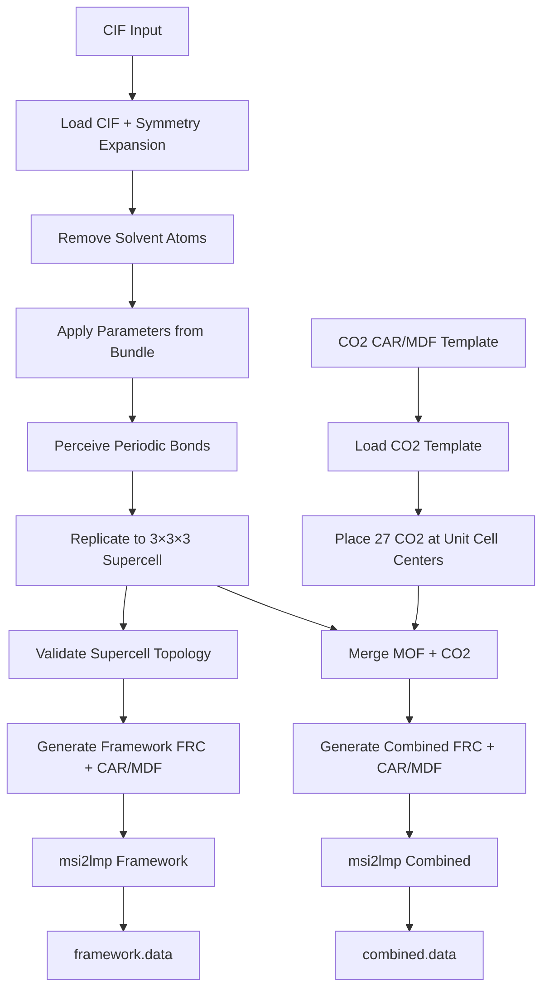

# Extreme Validation Plan: CALF-20 3×3×3 + CO₂ Pipeline

## Overview

This document outlines comprehensive validation checks for the CALF-20 3×3×3 + CO₂ workspace pipeline. The goal is to catch any potential bugs in coordinate transformations, bond connectivity, parameter mapping, and file format conversions.

## Pipeline Flow



## Potential Failure Modes (Brainstorm)

### 1. CIF/Symmetry Expansion Issues
- **Missing symmetry operations** - not all equivalent atoms generated
- **Duplicate atoms** - same position generated multiple times  
- **Fractional coordinate precision loss** - rounding errors
- **Wrong unit cell parameters** - parsing errors

### 2. Solvent Removal Issues
- **Wrong atoms removed** - name pattern matching bugs
- **Orphaned bonds** - bonds to removed atoms not cleaned up
- **Aid renumbering errors** - bond indices pointing to wrong atoms

### 3. Parameter Mapping Issues
- **Missing atom type mappings** - atoms without parameters
- **Incorrect charges** - wrong charge values assigned
- **LJ parameter errors** - wrong epsilon/sigma values
- **Element mismatch** - wrong mass assigned

### 4. Periodic Bond Perception Issues
- **Missing bonds** - cutoff too tight, tolerance issues
- **Spurious bonds** - false positive bonds
- **Cross-boundary bond errors** - PBC image flags wrong
- **Bond order assignment** - single vs double vs aromatic

### 5. Supercell Replication Issues
- **Coordinate translation errors** - atoms at wrong positions
- **Bond image flag errors** - ix/iy/iz wrong for cross-cell bonds
- **Connected component fragmentation** - bonds broken at cell boundaries
- **Coordinate overflow** - atoms outside expected box

### 6. CO2 Placement Issues
- **Wrong fractional-to-Cartesian conversion** - lattice matrix errors
- **CO2 not at unit cell centers** - position calculation bug
- **CO2 overlapping MOF atoms** - collision
- **Missing CO2 molecules** - count mismatch
- **CO2 geometry distortion** - bond angles/lengths wrong

### 7. Structure Merge Issues
- **Aid collision** - duplicate atom IDs
- **Bond index mismatch** - bonds referencing wrong atoms
- **Cell parameter conflict** - which cell to use
- **Provenance loss** - metadata not preserved

### 8. FRC Generation Issues
- **Missing parameters** - types without force field entries
- **Wrong parameter format** - msi2lmp parsing fails
- **Section ordering** - incorrect FRC file structure
- **Comment/label issues** - msi2lmp confusion

### 9. CAR/MDF Writing Issues
- **Coordinate precision truncation** - digits lost
- **Atom name length limits** - names too long
- **Bond ordering** - a1 > a2 issues
- **Formal charge formatting** - syntax errors

### 10. msi2lmp Conversion Issues
- **Parameter lookup failures** - unknown atom types
- **Coordinate transformation** - fractional vs Cartesian
- **Topology inference errors** - angles/dihedrals/impropers
- **Box tilt limits exceeded** - triclinic issues

---

## Validation Checks by Phase

### Phase 1: Input/Source Validation

#### 1.1 CIF File Validation
```python
def validate_cif_input:
    - Check file exists and is readable
    - Parse and extract unit cell parameters
    - Count atoms in asymmetric unit
    - Verify expected atom elements (C, N, O, Zn, H for CALF-20)
    - Check symmetry operations count
```

#### 1.2 Reference Bundle Validation
```python
def validate_reference_bundle:
    - Check manifest.json exists and is valid
    - Check atoms.csv has required columns
    - Verify atom_type mapping coverage
    - Check charge values are reasonable (-2 to +2 for MOF)
    - Verify LJ parameters are non-zero
```

#### 1.3 CO2 Template Validation
```python
def validate_co2_template:
    - Check exactly 3 atoms (C, O, O)
    - Check exactly 2 bonds (C-O, C-O)
    - Verify CO2 is linear (angle ~180°)
    - Check C-O bond length (~1.16 Å)
    - Verify charges sum to zero
```

### Phase 2: Step-by-Step Pipeline Validation

#### 2.1 After CIF Load
```python
def validate_post_cif_load(usm):
    - Check atom count matches expected (44 for unit cell)
    - Verify all atoms have valid fractional coordinates
    - Check no duplicate positions (within tolerance)
    - Verify element distribution matches expected formula
    - Check unit cell parameters match CIF header
```

#### 2.2 After Solvent Removal
```python
def validate_post_solvent_removal(usm, pre_usm):
    - Check correct number of atoms removed (0 for clean CIF)
    - Verify no bonds reference removed atom IDs
    - Check all remaining atoms have contiguous AIDs
    - Verify element counts unchanged if no solvent
```

#### 2.3 After Parameter Application
```python
def validate_post_parameter_application(usm):
    - Check all atoms have atom_type assigned
    - Verify all atoms have charge value
    - Check charge reasonableness: Zn ~+0.7, O ~-0.5, etc.
    - Verify LJ parameters present and non-zero
    - Check masses match element (Zn=65.4, C=12.01, etc.)
```

#### 2.4 After Bond Perception
```python
def validate_post_bond_perception(usm):
    - Check bond count matches expected (58 for unit cell)
    - Verify all bonds have valid a1, a2 references
    - Check a1 < a2 (canonical ordering)
    - Verify bond image flags (ix, iy, iz) are set
    - Calculate and check bond lengths (0.9-3.5 Å range)
    - Verify Zn coordination is 5
```

#### 2.5 After Supercell Replication
```python
def validate_post_replication(usm, unit_usm, dims):
    - Check atom count = unit_count * na * nb * nc
    - Check bond count scales correctly
    - Verify single connected component
    - Check cell parameters scaled by dims
    - Validate coordinates within supercell box
    - Sample atom position: verify translation correct
    - Check cross-boundary bonds have correct image flags
```

#### 2.6 After CO2 Placement
```python
def validate_co2_placement(co2_usm, supercell_cell, dims):
    - Check exactly 27 CO2 molecules (81 atoms)
    - Check exactly 54 CO2 bonds
    - Verify each CO2 at unit cell center position
    - Check CO2 geometry preserved (bond length, linearity)
    - Verify CO2 charges sum to zero per molecule
    - Check no CO2-CO2 overlap (min distance > 2.5 Å)
    - Verify unique atom names
```

#### 2.7 After Structure Merge
```python
def validate_post_merge(combined_usm, mof_usm, co2_usm):
    - Check atom count = MOF atoms + CO2 atoms
    - Check bond count = MOF bonds + CO2 bonds
    - Verify no bonds between MOF and CO2
    - Check AIDs are contiguous
    - Verify cell parameters from MOF preserved
    - Check all atom types present in combined
```

### Phase 3: LAMMPS Data File Deep Validation

#### 3.1 Header Validation
```python
def validate_lammps_header(data_file):
    - Parse atom count, verify matches expected
    - Parse bond/angle/dihedral/improper counts
    - Parse type counts
    - Parse box dimensions
    - Verify triclinic tilt factors (xy, xz, yz)
```

#### 3.2 Masses Section
```python
def validate_lammps_masses(data_file):
    - Check all type IDs sequential starting at 1
    - Verify masses match expected elements
    - Check comments match atom type labels
```

#### 3.3 Pair Coeffs Section
```python
def validate_lammps_pair_coeffs(data_file):
    - Check all type IDs have coefficients
    - Verify epsilon values positive
    - Verify sigma values positive and reasonable (2-4 Å)
    - Cross-check with FRC file
```

#### 3.4 Bond/Angle/Dihedral/Improper Coeffs
```python
def validate_lammps_bonded_coeffs(data_file):
    - Check all type IDs covered
    - Verify force constants positive
    - Verify equilibrium values reasonable
    - Check style comments match expected
```

#### 3.5 Atoms Section
```python
def validate_lammps_atoms(data_file, ref_usm):
    - Check atom count matches header
    - Verify all atom IDs sequential 1..N
    - Check molecule IDs assigned
    - Verify charges match reference
    - Check coordinates within box bounds
    - Cross-check positions with CAR file
    - Verify image flags set correctly
```

#### 3.6 Bonds Section
```python
def validate_lammps_bonds(data_file, ref_usm):
    - Check bond count matches header
    - Verify all bond IDs sequential 1..N  
    - Check bond type IDs valid
    - Verify atom references valid (1..N_atoms)
    - Cross-check with MDF topology
```

#### 3.7 Angles/Dihedrals/Impropers Sections
```python
def validate_lammps_higher_order(data_file):
    - Check counts match header
    - Verify IDs sequential
    - Check type IDs valid
    - Verify atom references valid
    - Check angle/dihedral atom connectivity makes sense
```

### Phase 4: Physical/Chemical Sanity Checks

#### 4.1 Total Charge
```python
def validate_total_charge(usm_or_data):
    - Sum all atom charges
    - Verify framework near-neutral (|Q| < 0.01)
    - Verify CO2 exactly neutral per molecule
    - Verify combined system near-neutral
```

#### 4.2 Bond Distances
```python
def validate_bond_distances(usm, data_file):
    - Calculate all bond lengths from coordinates
    - Check all bonds 0.9 Å < r < 3.5 Å
    - Specific checks:
      * C-C: 1.3-1.6 Å
      * C-N: 1.2-1.5 Å  
      * C-O: 1.1-1.5 Å (1.16 for CO2)
      * C-H: 0.9-1.2 Å
      * N-N: 1.2-1.5 Å
      * Zn-N: 2.0-2.3 Å
      * Zn-O: 2.0-2.3 Å
```

#### 4.3 Minimum Interatomic Distances
```python
def validate_no_overlaps(data_file):
    - Build neighbor list
    - Find minimum non-bonded distance
    - Check min distance > 1.5 Å (no severe overlaps)
    - Check MOF-CO2 min distance > 2.0 Å
```

#### 4.4 Metal Coordination
```python
def validate_zn_coordination(usm):
    - Find all Zn atoms
    - Count bonded neighbors for each
    - Verify all Zn are 5-coordinate
    - Check neighbor elements (should be N and O)
```

#### 4.5 CO2 Geometry
```python
def validate_co2_geometry(data_file):
    - For each CO2 molecule:
      * Find C and two O atoms
      * Calculate O-C-O angle
      * Verify angle 175-180° (linear)
      * Calculate C-O distances
      * Verify ~1.16 Å
```

#### 4.6 Box Dimensions
```python
def validate_box_dimensions(data_file, expected_cell):
    - Parse box bounds and tilt
    - Calculate a, b, c, alpha, beta, gamma
    - Compare to expected supercell dimensions
    - Tolerance: 0.001 Å for lengths, 0.01° for angles
```

### Phase 5: Cross-File Consistency Checks

#### 5.1 USM ↔ CAR/MDF Consistency
```python
def validate_usm_car_mdf_consistency(usm, car_path, mdf_path):
    - Reload CAR/MDF files
    - Compare atom counts
    - Compare coordinates (tolerance 1e-4)
    - Compare atom names/types
    - Compare bonds (MDF vs USM.bonds)
```

#### 5.2 CAR/MDF ↔ LAMMPS Consistency  
```python
def validate_car_lammps_consistency(car_path, data_path):
    - Compare atom counts
    - Compare coordinates (may have transformation)
    - Verify atom ordering preserved
```

#### 5.3 FRC ↔ LAMMPS Consistency
```python
def validate_frc_lammps_consistency(frc_path, data_path):
    - Parse FRC atom types
    - Compare with LAMMPS Masses section comments
    - Verify pair coefficients match FRC nonbond section
    - Check bond coefficients match FRC bond section
```

#### 5.4 Framework vs Combined Consistency
```python
def validate_framework_combined_consistency(fw_data, combined_data):
    - Verify framework atoms appear in combined
    - Check framework atom coordinates match
    - Verify framework charges match
    - Check combined has additional CO2 atoms
```

---

## Implementation Design

### Module Structure
```
workspaces/NIST/nist_calf20_3x3x3_co2_v1/
├── extreme_validate.py      # Main validation module
├── validate_lammps_data.py  # LAMMPS .data file parser/validator
├── validate_geometry.py     # Geometric/physical checks
├── validate_consistency.py  # Cross-file consistency checks
└── run_validation.py        # CLI runner
```

### Key Classes
```python
class LammpsDataParser:
    def __init__(self, path: Path)
    def header() -> dict  # counts, box
    def masses() -> list[tuple[int, float, str]]
    def pair_coeffs() -> list[tuple[int, float, float, str]]
    def bond_coeffs() -> list
    def atoms() -> pd.DataFrame  # id, mol, type, q, x, y, z, ix, iy, iz
    def bonds() -> pd.DataFrame  # id, type, a1, a2
    def angles() -> pd.DataFrame
    def dihedrals() -> pd.DataFrame
    def impropers() -> pd.DataFrame

class ValidationResult:
    check_name: str
    passed: bool
    message: str
    details: dict

class ValidatorSuite:
    def add_check(name: str, func: Callable) -> None
    def run_all() -> list[ValidationResult]
    def summary() -> dict
```

### Output Report Schema
```json
{
  "schema": "molsaic.extreme_validation_report.v0.1",
  "workspace": "nist_calf20_3x3x3_co2_v1",
  "timestamp": "2024-12-23T...",
  "overall_status": "PASS|FAIL",
  "phases": {
    "phase1_inputs": {"status": "PASS", "checks": [...]},
    "phase2_pipeline": {"status": "PASS", "checks": [...]},
    "phase3_lammps": {"status": "PASS", "checks": [...]},
    "phase4_physics": {"status": "PASS", "checks": [...]},
    "phase5_consistency": {"status": "PASS", "checks": [...]}
  },
  "failed_checks": [],
  "warnings": [],
  "metrics": {
    "total_charge_framework": 0.0,
    "total_charge_combined": 0.0,
    "min_bond_length": 1.08,
    "max_bond_length": 2.15,
    "min_nonbond_distance": 2.34,
    "co2_angle_deviation_max": 0.5
  }
}
```

---

## Execution Plan

1. **Create `extreme_validate.py`** - Main validation module with all checks
2. **Create LAMMPS parser** - Robust parsing of .data files
3. **Create geometry validators** - Distance, angle calculations  
4. **Create consistency validators** - Cross-file comparisons
5. **Create runner script** - CLI for running validation
6. **Add integration test** - pytest for the validation suite
7. **Run validation** - Execute and report results
8. **Fix any issues found** - Debug and remediate

---

## Expected Values for CALF-20 3×3×3 + 27 CO₂

| Metric | Framework | Combined |
|--------|-----------|----------|
| Atoms | 1188 | 1269 |
| Bonds | 1566 | 1620 |
| Atom types | 5 | 7 |
| Bond types | 7 | 8 |
| Zn atoms | 108 | 108 |
| CO2 molecules | 0 | 27 |
| Total charge | ~0 | ~0 |
| Box a | ~26.74 Å | ~26.74 Å |
| Box b | ~29.08 Å | ~29.08 Å |
| Box c | ~28.45 Å | ~28.45 Å |
