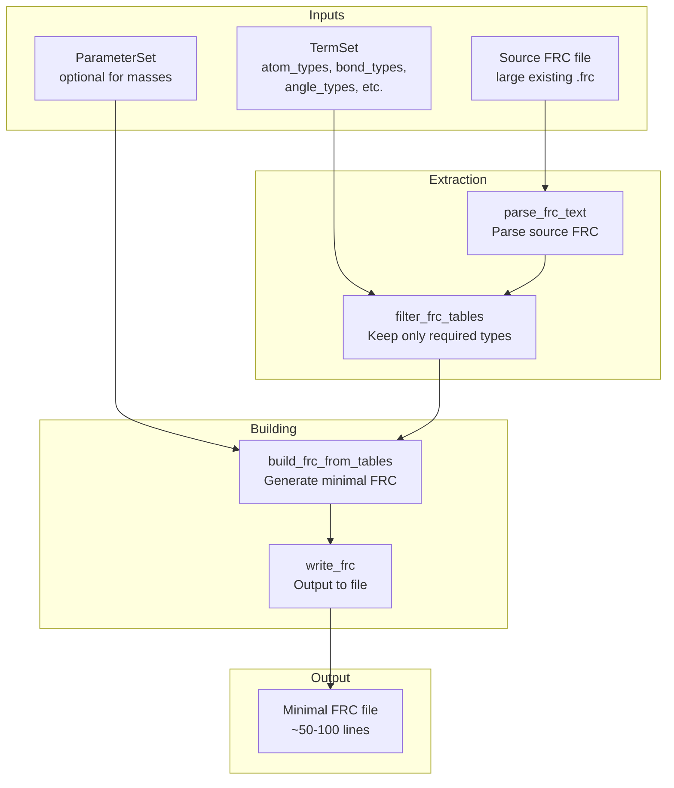
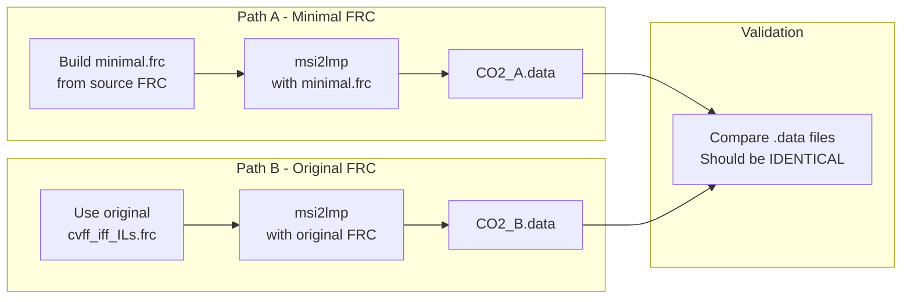

# FRC Builder From Existing: Implementation Plan

## Implementation Status

| Aspect | Status |
|--------|--------|
| **Overall** | ✅ **COMPLETED** (2025-12-22) |
| `filter_frc_tables()` | ✅ Implemented |
| `build_frc_from_existing()` | ✅ Implemented |
| FRC reader updates | ✅ `validate` parameter added |
| Test coverage | ✅ 14 tests passing |
| Workspace validation | ✅ CO2_construct working |

### Files Modified

| File | Change |
|------|--------|
| [`src/upm/src/upm/build/frc_builders.py`](src/upm/src/upm/build/frc_builders.py) | Added `filter_frc_tables()`, `build_frc_from_existing()` |
| [`src/upm/src/upm/codecs/msi_frc.py`](src/upm/src/upm/codecs/msi_frc.py) | Added `validate` parameter to `read_frc()` |
| [`src/upm/src/upm/build/frc_templates.py`](src/upm/src/upm/build/frc_templates.py) | Fixed template issues |

### Files Created

| File | Purpose |
|------|---------|
| [`src/upm/tests/test_build_frc_from_existing.py`](src/upm/tests/test_build_frc_from_existing.py) | 14 unit/integration tests |
| [`workspaces/NIST/CO2_construct/run.py`](workspaces/NIST/CO2_construct/run.py) | Workspace runner script |

---

## Overview

Build a new FRC builder that extracts **real parameters** from an existing large `.frc` file (like `cvff_iff_ILs.frc`) rather than using placeholder/generic values. This enables creating minimal, focused `.frc` files that produce identical msi2lmp output as using the full original file.

## Context Summary

### CO2 Test Case
- **Input files**: `assets/NIST/CO2_construct/CO2.car`, `CO2.mdf`
- **Source FRC**: `assets/NIST/CO2_construct/cvff_iff_ILs.frc` (5477 lines)
- **Atom types**: `cdc` (C in CO2), `cdo` (O in CO2)
- **Structure**: 3 atoms, 2 bonds (C=O), 1 angle (O-C-O at 180°)

### Real Parameters Found in Source FRC

| Section | Data |
|---------|------|
| `#atom_types` | cdc: 12.011150 C, cdo: 15.999400 O |
| `#equivalence` | cdc→cdc, cdo→cdo (all same) |
| `#quadratic_bond` | cdc cdo: r0=1.162Å, k=1140.0 |
| `#quadratic_angle` | cdo cdc cdo: θ0=180.0°, k=100.0 |
| `#nonbond(12-6)` | cdc: A=236919.1, B=217.678; cdo: A=207547.3, B=315.631 |
| `#bond_increments` | cdc cdo: δq=-0.03, 0.03 |

### Current State

The existing builders in `src/upm/src/upm/build/frc_builders.py`:

1. **`build_frc_nonbond_only()`** - Only nonbond parameters, no bonded
2. **`build_frc_cvff_with_generic_bonded()`** - Uses placeholder parameters:
   ```python
   k, r0 = placeholder_bond_params(t1_el=el1, t2_el=el2)  # Generic
   theta0, k = placeholder_angle_params(center_el=center_el)  # Generic
   ```

**Gap**: No builder exists that extracts real bonded parameters from an existing .frc file.

---

## Architecture

### New Builder: `build_frc_from_existing()`



### Key Components

#### 1. `filter_frc_tables()` - New function

Extract only the required entries from parsed FRC tables based on termset.

```python
def filter_frc_tables(
    tables: dict[str, pd.DataFrame],
    termset: dict[str, Any],
) -> dict[str, pd.DataFrame]:
    """Filter FRC tables to only include entries for required atom types.
    
    Args:
        tables: Parsed FRC tables from parse_frc_text() or read_frc()
        termset: TermSet with atom_types, bond_types, angle_types, etc.
    
    Returns:
        Filtered tables dict with only matching entries
    """
```

#### 2. `build_frc_from_existing()` - New builder

```python
def build_frc_from_existing(
    termset: dict[str, Any],
    source_frc_path: str | Path,
    *,
    out_path: str | Path,
    parameterset: dict[str, Any] | None = None,
    strict: bool = True,
) -> str:
    """Build minimal FRC by extracting real params from existing FRC.
    
    Args:
        termset: Required types (from derive_termset_v0_1_2)
        source_frc_path: Path to large existing .frc file
        out_path: Where to write minimal .frc
        parameterset: Optional - if provided, use for masses (overrides source)
        strict: If True, raise error if any required type is missing in source
    
    Returns:
        Output path as string
        
    Raises:
        MissingTypesError: If strict=True and source doesn't have required types
    """
```

#### 3. Supporting functions

```python
def extract_atom_type_entries(
    atom_types_df: pd.DataFrame,
    required_types: list[str],
) -> pd.DataFrame:
    """Extract atom_types entries for required types."""

def extract_bond_entries(
    bonds_df: pd.DataFrame,
    bond_types: list[tuple[str, str]],
) -> pd.DataFrame:
    """Extract bond entries matching required bond types."""

def extract_angle_entries(
    angles_df: pd.DataFrame,
    angle_types: list[tuple[str, str, str]],
) -> pd.DataFrame:
    """Extract angle entries matching required angle types."""

# Similar for dihedrals, impropers, nonbond, bond_increments...
```

---

## Implementation Strategy

### Phase 1: FRC Table Filtering
1. Parse source FRC with existing `parse_frc_text()` / `read_frc()`
2. Implement `filter_frc_tables()` to extract only required entries
3. Handle canonicalization (e.g., bond `cdc-cdo` matches `cdo-cdc`)

### Phase 2: Builder Function
1. Implement `build_frc_from_existing()` in `frc_builders.py`
2. Use filtered tables with existing `write_frc()` 
3. Add strict mode for missing parameter detection

### Phase 3: Workspace Setup
1. Create `workspaces/NIST/CO2_construct/` structure
2. Stage input files (CO2.car, CO2.mdf, source FRC)
3. Create workspace runner script

### Phase 4: Validation
1. Dual-path verification (see below)
2. Add integration test

---

## Workspace Structure

```
workspaces/NIST/CO2_construct/
├── config.json
├── run.py
├── inputs/
│   ├── CO2.car              # Copy from assets
│   ├── CO2.mdf              # Copy from assets
│   └── cvff_iff_ILs.frc     # Symlink or copy from assets
└── outputs/
    ├── termset.json         # Derived from MDF
    ├── parameterset.json    # Derived from source FRC
    ├── minimal.frc          # Built minimal FRC
    ├── path_A_minimal/      # msi2lmp with minimal.frc
    │   └── CO2.data
    ├── path_B_original/     # msi2lmp with original FRC
    │   └── CO2.data
    └── validation_report.json
```

### config.json
```json
{
  "inputs": {
    "car": "inputs/CO2.car",
    "mdf": "inputs/CO2.mdf",
    "source_frc": "inputs/cvff_iff_ILs.frc"
  },
  "outputs_dir": "outputs",
  "executables": {
    "msi2lmp": "/home/sf2/LabWork/software/msi2lmp.exe"
  },
  "params": {
    "timeout_s": 60,
    "validate_equivalence": true
  }
}
```

---

## Validation Strategy

### Primary: Dual-Path .data Comparison



**Expectation**: Both .data files should be byte-identical (or semantically equivalent if comment timestamps differ).

### Secondary Validations

| Check | Method | Pass Criteria |
|-------|--------|---------------|
| **Parameter equivalence** | Compare parsed values | Bond k, r0 match source |
| **Section completeness** | Count entries | All required types present |
| **Syntax validity** | Parse output FRC | No parse errors |
| **msi2lmp success** | Check exit code | Both paths exit 0 |
| **Atom count** | Parse .data header | Match input MDF |

### Automated Tests

```python
# test_build_frc_from_existing.py

def test_co2_minimal_frc_matches_original_output(tmp_path):
    """Verify minimal FRC produces same msi2lmp output as original."""
    # 1. Build minimal FRC from source
    # 2. Run msi2lmp with minimal FRC
    # 3. Run msi2lmp with original FRC
    # 4. Compare .data files
    # 5. Assert equivalence
    
def test_extracted_params_match_source():
    """Verify extracted parameters exactly match source FRC."""
    
def test_missing_type_raises_error():
    """Verify MissingTypesError for unknown atom types."""
    
def test_deterministic_output():
    """Verify byte-determinism across multiple runs."""
```

---

## API Summary

### New Functions

| Function | Module | Purpose |
|----------|--------|---------|
| `filter_frc_tables()` | `frc_builders.py` | Filter tables to required types |
| `build_frc_from_existing()` | `frc_builders.py` | Main builder |
| `extract_*_entries()` | `frc_helpers.py` | Per-section extraction helpers |

### New Files

| Path | Purpose |
|------|---------|
| `workspaces/NIST/CO2_construct/` | Test workspace |
| `tests/integration/test_co2_frc_from_existing.py` | Integration test |

### Modified Files

| Path | Change |
|------|--------|
| `src/upm/src/upm/build/frc_builders.py` | Add new builder |
| `src/upm/src/upm/build/__init__.py` | Export new function |

---

## Edge Cases & Considerations

### 1. Equivalence Mapping
The source FRC uses equivalence tables (e.g., `cdc→cdc` for all types). The minimal FRC must preserve these or use the effective types correctly.

### 2. Missing Parameters
If the source FRC doesn't have a required bond/angle type:
- `strict=True`: Raise `MissingTypesError`
- `strict=False`: Fall back to placeholder params (with warning)

### 3. Canonicalization
Bond/angle types may need canonicalization:
- Bond: `(cdc, cdo)` == `(cdo, cdc)` 
- Angle: `(cdo, cdc, cdo)` == `(cdo, cdc, cdo)` (symmetric)
- Dihedral: `(a,b,c,d)` vs `(d,c,b,a)`

### 4. FRC Format Variations
The source FRC may use:
- Different version numbers
- Different section orderings
- Different whitespace formatting

The builder should produce consistent, minimal output regardless.

---

## Risk Assessment

| Risk | Mitigation |
|------|------------|
| Parameter extraction misses entries | Comprehensive canonicalization tests |
| Different msi2lmp behavior with subset | Dual-path validation ensures equivalence |
| Source FRC has variants/wildcards | Document limitation, handle common cases |
| Performance with large FRC files | Parse once, filter in memory |

---

## Known Limitations

### 1. msi2lmp.exe Segfault with Incomplete Equivalence Tables

**Critical**: When the generated FRC file omits atom types that are referenced in equivalence tables (e.g., `#equivalence`, `#auto_equivalence`), msi2lmp.exe will segfault during parsing.

| Symptom | Cause |
|---------|-------|
| Exit code -11 (SIGSEGV) | msi2lmp looks up atom type referenced in equivalence table but not defined in `#atom_types` |
| Silent crash | No error message, just core dump |

**Workaround**: The `filter_frc_tables()` function includes all atom types referenced in equivalence tables, not just those in the termset. This ensures msi2lmp.exe can resolve all lookups.

**Reference**: See [`plans/subtask5b_msi2lmp_segfault_analysis.md`](plans/subtask5b_msi2lmp_segfault_analysis.md) for detailed root cause analysis.

### 2. H-bond Definition References

Similar to #1, the `#hbond_definition` section may reference atom types (donors/acceptors) that aren't in the minimal FRC. The skeleton templates have been fixed to omit these references, but if using custom source FRC files, ensure all referenced types exist.

### 3. Wildcard Atom Types Not Supported

Some FRC files use wildcard notation (e.g., `X` for any atom) in bonded parameters. The current implementation does not expand wildcards—it requires exact type matches.

### 4. Class II Force Fields

This builder is optimized for Class I force fields (like CVFF). Class II force fields with cross-terms may require additional handling.

---

## Usage Example

```python
from pathlib import Path
from upm.build.frc_builders import build_frc_from_existing, filter_frc_tables
from upm.codecs.msi_frc import read_frc
from usm.ops.termset import derive_termset_v0_1_2

# 1. Derive termset from MDF file
mdf_path = Path("inputs/CO2.mdf")
termset = derive_termset_v0_1_2(mdf_path)

# 2. Build minimal FRC from source
build_frc_from_existing(
    termset=termset,
    source_frc_path=Path("inputs/cvff_iff_ILs.frc"),
    out_path=Path("outputs/minimal.frc"),
)

# 3. Use with msi2lmp
# msi2lmp -class I -frc outputs/minimal.frc -i2 CO2
```

### When to Use This Builder vs. Others

| Builder | Use Case |
|---------|----------|
| `build_frc_from_existing()` | Extract real parameters from large source FRC |
| `build_frc_nonbond_only()` | Only need LJ parameters, no bonded terms |
| `build_frc_cvff_with_generic_bonded()` | No source FRC, need placeholder bonded params |
| `build_minimal_cvff_frc()` | Scratch build with skeleton template |

---

## Definition of Done

1. ✅ `build_frc_from_existing()` function implemented
2. ✅ CO2_construct workspace created and running
3. ✅ Dual-path validation passes (.data files equivalent)
4. ✅ Unit tests for parameter extraction
5. ✅ Integration test for full workflow
6. ✅ Documentation updated

---

## Completion Notes

**Implementation completed 2025-12-22**. All objectives achieved:

- ✅ `filter_frc_tables()` and `build_frc_from_existing()` implemented
- ✅ CO2_construct workspace created and validated
- ✅ 14 tests passing in `test_build_frc_from_existing.py`
- ✅ msi2lmp equivalence verified (minimal FRC produces same output as source)

### Test Command

```bash
cd src/upm && python -m pytest tests/test_build_frc_from_existing.py -v
```
