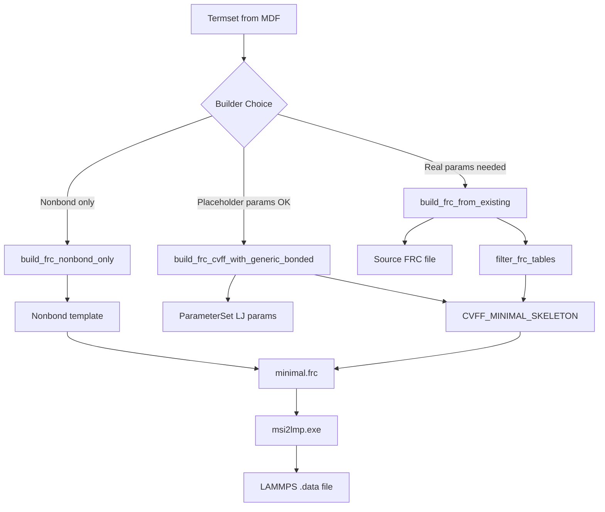

# Phase 13: FRC Builder Cleanup and Refactoring Plan

**Status**: ✅ **COMPLETED** (2025-12-22)
**Date**: 2025-12-22
**Author**: AI Agent

## Overview

After successfully implementing `build_frc_from_existing()` and debugging msi2lmp compatibility issues, we now need to clean up the codebase, consolidate documentation, and ensure robust implementation.

## Current State Analysis

### What's Working
1. ✅ `build_frc_from_existing()` - Extracts real parameters from existing FRC files
2. ✅ `build_frc_cvff_with_generic_bonded()` - Uses placeholder parameters  
3. ✅ `CVFF_MINIMAL_SKELETON` - Fixed template (empty #define sections)
4. ✅ Both NIST workspaces generate .data files with msi2lmp exit code 0
5. ✅ 14 unit tests in `test_build_frc_from_existing.py`

### What Needs Cleanup

#### 1. Workspace Test Artifacts
Location: `workspaces/NIST/CO2_construct/outputs/test_frc/`

Contains 20+ experimental FRC files from debugging:
- `test_A_empty_auto_equiv.frc` through `test_U_no_hbond.frc`
- `test_frc.sh` (debug shell script)
- `FINDINGS.md` (valuable documentation)

**Action**: 
- KEEP: `FINDINGS.md`, `test_U_no_hbond.frc` (reference minimal template)
- DELETE: All other test_*.frc files
- DELETE: `test_frc.sh`

#### 2. Template Inconsistency

**CVFF_SKELETON** (lines 24-137 of frc_templates.py):
- Still contains entry lists inside #define sections
- This causes msi2lmp segfault if used
- Used by `frc_writer.py` for `write_cvff_frc()`

**CVFF_MINIMAL_SKELETON** (lines 159-216):
- Fixed (empty #define sections)
- Used by `frc_builders.py`

**Action**:
- Fix CVFF_SKELETON to match CVFF_MINIMAL_SKELETON pattern
- Add clear documentation about which template to use when

#### 3. Documentation Consolidation

**Files to consolidate**:
- `workspaces/NIST/CO2_construct/outputs/test_frc/FINDINGS.md` → `docs/methods/MSI2LMP_FRC_REQUIREMENTS.md`
- `plans/msi2lmp_minimal_frc_debug_plan.md` → Archive or delete
- `plans/frc_builder_from_existing.md` → Update with final status

**Action**:
- Create `docs/methods/MSI2LMP_FRC_REQUIREMENTS.md` with distilled findings
- Update plan documents to reflect completion

#### 4. Code Review

**Files to review**:
- `src/upm/src/upm/build/frc_builders.py` - Check for unused imports/functions
- `src/upm/src/upm/build/frc_helpers.py` - Verify version/ref defaults
- `src/upm/src/upm/build/frc_templates.py` - Fix CVFF_SKELETON

---

## Implementation Steps

### Step 1: Workspace Cleanup
```
DELETE:
- workspaces/NIST/CO2_construct/outputs/test_frc/test_A_*.frc
- workspaces/NIST/CO2_construct/outputs/test_frc/test_B_*.frc
- ... (all test_*.frc except test_U_no_hbond.frc)
- workspaces/NIST/CO2_construct/test_frc.sh

KEEP:
- workspaces/NIST/CO2_construct/outputs/test_frc/FINDINGS.md
- workspaces/NIST/CO2_construct/outputs/test_frc/test_U_no_hbond.frc
```

### Step 2: Fix CVFF_SKELETON Template

Change from:
```
#define cvff_nocross_nomorse

> This is the new format version of the cvff forcefield

!Ver  Ref 		Function		Label
!---- ---   ---------------------------------	------
 2.0  18    atom_types				cvff
 1.0   1    equivalence				cvff
...
```

To:
```
#define cvff

> Minimal cvff forcefield

!Ver  Ref 		Function		Label
!---- ---   ---------------------------------	------
#atom_types	cvff
```

### Step 3: Create MSI2LMP Requirements Doc

Create `docs/methods/MSI2LMP_FRC_REQUIREMENTS.md` with:
- Root cause of segfault (entry lists in #define)
- Minimal required sections
- Section order requirements
- Reference to test_U_no_hbond.frc

### Step 4: Update Plan Documents

- `plans/frc_builder_from_existing.md` → Add "COMPLETED" status
- `plans/msi2lmp_minimal_frc_debug_plan.md` → Add "RESOLVED" with link to requirements doc

### Step 5: Final Validation

1. Run `python workspaces/NIST/nist_calf20_msi2lmp_unbonded_v1/run.py`
2. Run `python workspaces/NIST/CO2_construct/run.py`
3. Run `cd src/upm && python -m pytest tests/test_build_frc_from_existing.py -v`
4. Run `cd src/upm && python -m pytest tests/test_build_frc_generic_bonded.py -v`

---

## Key Findings to Document

### msi2lmp FRC Requirements

1. **#define sections MUST be empty** - No function-to-label mappings
2. **Only ONE #version line needed**
3. **Required empty headers**: `#morse_bond`, `#auto_equivalence`
4. **NOT required**: `#hbond_definition`, cross-term sections, `_auto` sections
5. **60 lines minimum** - See test_U_no_hbond.frc

### Builder Selection Guide

| Use Case | Builder Function |
|----------|-----------------|
| Extract real params from source FRC | `build_frc_from_existing()` |
| Generate with placeholder params | `build_frc_cvff_with_generic_bonded()` |
| Nonbond-only FRC | `build_frc_nonbond_only()` |

---

## Success Criteria

1. ✅ All test_*.frc artifacts cleaned (except reference)
2. ✅ CVFF_SKELETON template fixed
3. ✅ Documentation consolidated to docs/methods/
4. ✅ Both workspaces run with msi2lmp exit code 0
5. ✅ All unit tests pass
6. ✅ No dead code in build modules

---

## Diagram: FRC Builder Architecture


