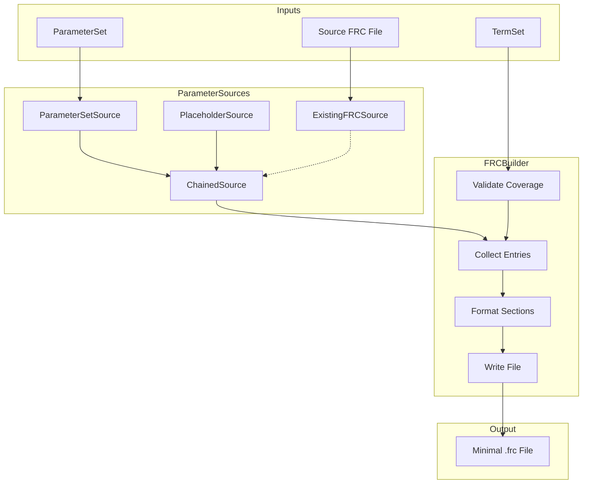

# Phase 14: Unified FRC Builder Architecture

## Executive Summary

This plan proposes a unified, extensible FRC builder architecture to replace the current fragmented implementation. The new design uses a **Protocol-based Parameter Source** pattern that enables clean separation of concerns, easy extensibility, and better testability.

## Current State Analysis

### Current Builder Functions

| Function | Template | Parameter Source | Status |
|----------|----------|------------------|--------|
| `build_frc_nonbond_only()` | `write_frc()` with minimal mode | ParameterSet (LJ only) | Active |
| `build_frc_cvff_with_generic_bonded()` | `CVFF_MINIMAL_SKELETON` | ParameterSet + Placeholder bonded | Active (RECOMMENDED) |
| `build_frc_from_existing()` | `CVFF_MINIMAL_SKELETON` | Source FRC file | Active |
| `write_cvff_frc()` | `CVFF_SKELETON` | `FRCInput` dataclass | Active |
| `build_minimal_cvff_frc()` | `CVFF_SKELETON` | `FRCInput` dataclass | Active (facade) |
| `build_frc_cvff_with_minimal_base()` | N/A | N/A | **DEPRECATED** |

### Identified Problems

#### 1. Duplicate Formatting Functions
```
frc_helpers.py:
  - format_skeleton_atom_type_entry()
  - format_skeleton_equivalence_entry()
  - format_skeleton_bond_entry()
  - format_skeleton_angle_entry()
  - format_skeleton_nonbond_entry()
  ... (10+ functions)

frc_writer.py:
  - _format_atom_type_entry()
  - _format_equivalence_entry()
  - _format_bond_entry()
  - _format_angle_entry()
  - _format_nonbond_entry()
  ... (similar set)

frc_input.py:
  - _lj_sigma_eps_to_ab() (duplicated from frc_helpers.py)
  - _element_to_connects() (different from skeleton_element_to_connects)
  - _placeholder_bond_params() (duplicated)
  - _placeholder_angle_params() (duplicated)
```

#### 2. Two Incompatible Template Approaches
- **Template String Injection**: `CVFF_MINIMAL_SKELETON.format(...)` with specific placeholder names
- **FRCInput Dataclass**: Typed entries → `write_cvff_frc()` with different placeholder names

#### 3. No Parameter Source Abstraction
Current code mixes:
- Placeholder params: hardcoded in helper functions
- Real params from source FRC: parsed via `read_frc()` + `filter_frc_tables()`
- Params from ParameterSet: LJ conversion via `lj_sigma_eps_to_ab()`

#### 4. Inconsistent Alias Handling
- `build_skeleton_alias_map()` in frc_helpers.py
- `_expand_with_aliases()` in frc_input.py (duplicated logic)

#### 5. Mixed Concerns
- File writing mixed with parameter generation
- Termset/parameterset validation mixed with formatting

---

## Proposed Architecture

### Design Principles

1. **Single Responsibility**: Each module handles one concern
2. **Open/Closed**: Open for extension (new sources), closed for modification
3. **Dependency Inversion**: High-level builder depends on abstractions (Protocol)
4. **Strategy Pattern**: Parameter sources are interchangeable strategies

### High-Level Architecture

```
┌─────────────────────────────────────────────────────────────────────┐
│                         FRCBuilder (Facade)                         │
│  - Unified entry point for all FRC generation                      │
│  - Takes TermSet + ParameterSource + Config                        │
│  - Orchestrates: validate → collect → format → write               │
└─────────────────────────────────────────────────────────────────────┘
                                    │
                                    ▼
┌─────────────────────────────────────────────────────────────────────┐
│                     ParameterSource (Protocol)                      │
│  - Abstract interface for getting parameter values                  │
│  - get_atom_type_info(atom_type) → AtomTypeInfo | None             │
│  - get_bond_params(t1, t2) → BondParams | None                     │
│  - get_angle_params(t1, t2, t3) → AngleParams | None               │
│  - get_torsion_params(t1, t2, t3, t4) → TorsionParams | None       │
│  - get_oop_params(t1, t2, t3, t4) → OOPParams | None               │
│  - get_nonbond_params(atom_type) → NonbondParams | None            │
└─────────────────────────────────────────────────────────────────────┘
              ▲                      ▲                      ▲
              │                      │                      │
┌─────────────┴─────────┐ ┌─────────┴──────────┐ ┌────────┴─────────┐
│ PlaceholderSource     │ │ ParameterSetSource │ │ ExistingFRCSource│
│ - Generic bonded vals │ │ - From USM PS dict │ │ - From .frc file │
│ - Element-based r0/k  │ │ - LJ σ/ε → A/B     │ │ - Parsed tables  │
│ - No LJ params        │ │ - No bonded        │ │ - Full data      │
└───────────────────────┘ └────────────────────┘ └──────────────────┘
              ▲                      ▲
              │                      │
              └──────────┬───────────┘
                         ▼
┌─────────────────────────────────────────────────────────────────────┐
│                     ChainedSource (Composite)                       │
│  - Chains multiple sources with fallback logic                     │
│  - Try source A first, fallback to source B if None                │
│  - Example: ExistingFRC → Placeholder                              │
└─────────────────────────────────────────────────────────────────────┘
```

### Module Structure

```
src/upm/src/upm/build/
├── __init__.py                    # Public exports
├── frc_templates.py               # CVFF_CANONICAL_TEMPLATE (unchanged)
│
├── parameter_sources/             # NEW: Package for parameter sources
│   ├── __init__.py                # Protocol + ChainedSource export
│   ├── protocol.py                # ParameterSource Protocol
│   ├── placeholder.py             # PlaceholderSource implementation
│   ├── parameterset.py            # ParameterSetSource implementation
│   └── existing_frc.py            # ExistingFRCSource implementation
│
├── entries.py                     # NEW: Consolidated entry dataclasses
│                                  # - AtomTypeEntry, BondEntry, etc.
│                                  # - AtomTypeInfo, BondParams, etc. (param types)
│
├── formatters.py                  # NEW: Consolidated formatting functions
│                                  # - format_atom_type(), format_bond(), etc.
│                                  # - All template string generation
│
├── frc_builder.py                 # NEW: FRCBuilder class (main entry point)
│
├── alias_manager.py               # NEW: msi2lmp truncation handling
│                                  # - AliasConfig dataclass
│                                  # - build_alias_map()
│
├── validators.py                  # NEW: TermSet/ParameterSet validation
│                                  # - validate_termset_coverage()
│                                  # - MissingTypesError (moved here)
│
└── _legacy.py                     # Backward-compat shims for old API
                                   # - build_frc_nonbond_only() → FRCBuilder
                                   # - build_frc_cvff_with_generic_bonded() → FRCBuilder
                                   # - build_frc_from_existing() → FRCBuilder
                                   # - write_cvff_frc() → FRCBuilder
```

---

## Detailed Component Design

### 1. Parameter Types (entries.py)

```python
from dataclasses import dataclass
from typing import Optional

@dataclass(frozen=True)
class AtomTypeInfo:
    """Parameters for #atom_types section."""
    mass_amu: float
    element: str
    connects: int

@dataclass(frozen=True)
class NonbondParams:
    """Parameters for #nonbond(12-6) section."""
    lj_a: float
    lj_b: float

@dataclass(frozen=True)
class BondParams:
    """Parameters for #quadratic_bond section."""
    r0: float
    k: float

@dataclass(frozen=True)
class AngleParams:
    """Parameters for #quadratic_angle section."""
    theta0_deg: float
    k: float

@dataclass(frozen=True)
class TorsionParams:
    """Parameters for #torsion_1 section."""
    kphi: float
    n: int
    phi0: float

@dataclass(frozen=True)
class OOPParams:
    """Parameters for #out_of_plane section."""
    kchi: float
    n: int
    chi0: float
```

### 2. ParameterSource Protocol (parameter_sources/protocol.py)

```python
from typing import Protocol, Optional, runtime_checkable

@runtime_checkable
class ParameterSource(Protocol):
    """Protocol for FRC parameter sources.
    
    Implementations provide parameter values for atom types, bonds, angles,
    torsions, out-of-plane, and nonbond interactions. Methods return None
    when the source doesn't have data for the requested type.
    """
    
    def get_atom_type_info(self, atom_type: str) -> Optional[AtomTypeInfo]:
        """Get mass, element, connects for an atom type."""
        ...
    
    def get_nonbond_params(self, atom_type: str) -> Optional[NonbondParams]:
        """Get LJ A/B coefficients for an atom type."""
        ...
    
    def get_bond_params(self, t1: str, t2: str) -> Optional[BondParams]:
        """Get r0, k for a bond type (canonicalized internally)."""
        ...
    
    def get_angle_params(self, t1: str, t2: str, t3: str) -> Optional[AngleParams]:
        """Get theta0, k for an angle type (canonicalized internally)."""
        ...
    
    def get_torsion_params(self, t1: str, t2: str, t3: str, t4: str) -> Optional[TorsionParams]:
        """Get kphi, n, phi0 for a torsion type."""
        ...
    
    def get_oop_params(self, t1: str, t2: str, t3: str, t4: str) -> Optional[OOPParams]:
        """Get kchi, n, chi0 for an OOP type."""
        ...
```

### 3. ChainedSource (parameter_sources/protocol.py)

```python
class ChainedSource:
    """Composite source that chains multiple sources with fallback."""
    
    def __init__(self, sources: list[ParameterSource]) -> None:
        self._sources = sources
    
    def get_atom_type_info(self, atom_type: str) -> Optional[AtomTypeInfo]:
        for source in self._sources:
            result = source.get_atom_type_info(atom_type)
            if result is not None:
                return result
        return None
    
    # ... similar for all other methods
```

### 4. PlaceholderSource (parameter_sources/placeholder.py)

```python
class PlaceholderSource:
    """Provides generic/placeholder parameters based on element types.
    
    This source generates tool-satisfying (not physical) parameters
    to enable msi2lmp.exe to run without the -ignore flag.
    
    Does NOT provide:
    - Atom type info (mass, element, connects) - requires external source
    - Nonbond params (LJ A/B) - requires external source
    
    Does provide:
    - Bond params based on element pair
    - Angle params based on center element
    - Torsion params (zero-barrier defaults)
    - OOP params (minimal defaults)
    """
    
    def __init__(self, element_map: dict[str, str]) -> None:
        """
        Args:
            element_map: atom_type → element mapping from external source
        """
        self._element_map = element_map
    
    def get_atom_type_info(self, atom_type: str) -> None:
        return None  # Must come from external source
    
    def get_nonbond_params(self, atom_type: str) -> None:
        return None  # Must come from external source
    
    def get_bond_params(self, t1: str, t2: str) -> Optional[BondParams]:
        el1 = self._element_map.get(t1, "X")
        el2 = self._element_map.get(t2, "X")
        return _placeholder_bond(el1, el2)
    
    # ... etc.
```

### 5. ParameterSetSource (parameter_sources/parameterset.py)

```python
class ParameterSetSource:
    """Provides parameters from USM-derived ParameterSet dict.
    
    Provides:
    - Atom type info (mass, element, connects)
    - Nonbond params (LJ σ/ε → A/B conversion)
    
    Does NOT provide:
    - Bond/angle/torsion/OOP params (use PlaceholderSource fallback)
    """
    
    def __init__(self, parameterset: dict[str, Any]) -> None:
        self._ps = parameterset.get("atom_types", {})
    
    def get_atom_type_info(self, atom_type: str) -> Optional[AtomTypeInfo]:
        rec = self._ps.get(atom_type)
        if rec is None:
            return None
        return AtomTypeInfo(
            mass_amu=float(rec["mass_amu"]),
            element=str(rec.get("element", "X")),
            connects=_element_to_connects(rec.get("element", "X")),
        )
    
    def get_nonbond_params(self, atom_type: str) -> Optional[NonbondParams]:
        rec = self._ps.get(atom_type)
        if rec is None:
            return None
        sigma = float(rec["lj_sigma_angstrom"])
        epsilon = float(rec["lj_epsilon_kcal_mol"])
        a, b = _lj_sigma_eps_to_ab(sigma, epsilon)
        return NonbondParams(lj_a=a, lj_b=b)
    
    # Bond/angle/torsion/oop return None - use ChainedSource with Placeholder
```

### 6. ExistingFRCSource (parameter_sources/existing_frc.py)

```python
class ExistingFRCSource:
    """Provides parameters extracted from an existing .frc file.
    
    Provides all parameter types parsed from the source FRC file.
    """
    
    def __init__(self, frc_path: Path, termset: dict[str, Any]) -> None:
        """Load and filter FRC tables for termset atom types."""
        tables, _ = read_frc(frc_path, validate=False)
        self._tables = filter_frc_tables(tables, termset)
        self._build_lookup_indices()
    
    def _build_lookup_indices(self) -> None:
        """Build dict lookups for O(1) parameter access."""
        # atom_types: atom_type → row
        # bonds: (t1, t2) → row (canonicalized)
        # angles: (t1, t2, t3) → row (canonicalized)
        ...
    
    def get_atom_type_info(self, atom_type: str) -> Optional[AtomTypeInfo]:
        row = self._atom_types.get(atom_type)
        if row is None:
            return None
        return AtomTypeInfo(
            mass_amu=float(row["mass_amu"]),
            element=str(row["element"]),
            connects=_parse_connects_from_notes(row["notes"]),
        )
    
    # ... similar for all other methods
```

### 7. FRCBuilder Class (frc_builder.py)

```python
from dataclasses import dataclass, field
from pathlib import Path
from typing import Any, Optional

@dataclass
class FRCBuilderConfig:
    """Configuration for FRCBuilder."""
    msi2lmp_max_type_len: int = 5
    expand_aliases: bool = False
    strict: bool = True
    forcefield_label: str = "cvff"

class FRCBuilder:
    """Unified FRC file builder.
    
    This is the recommended entry point for all FRC generation.
    
    Example:
        >>> source = ChainedSource([
        ...     ParameterSetSource(parameterset),
        ...     PlaceholderSource(element_map),
        ... ])
        >>> builder = FRCBuilder(termset, source)
        >>> builder.write("output.frc")
    """
    
    def __init__(
        self,
        termset: dict[str, Any],
        parameter_source: ParameterSource,
        config: Optional[FRCBuilderConfig] = None,
    ) -> None:
        self._termset = termset
        self._source = parameter_source
        self._config = config or FRCBuilderConfig()
    
    def validate(self) -> list[str]:
        """Validate parameter coverage. Returns list of missing types."""
        missing = []
        for at in self._termset.get("atom_types", []):
            if self._source.get_atom_type_info(at) is None:
                missing.append(f"atom_type:{at}")
            if self._source.get_nonbond_params(at) is None:
                missing.append(f"nonbond:{at}")
        
        for bond in self._termset.get("bond_types", []):
            if self._source.get_bond_params(bond[0], bond[1]) is None:
                missing.append(f"bond:{bond[0]}-{bond[1]}")
        
        # ... similar for angles, torsions, oops
        return missing
    
    def build(self) -> str:
        """Build FRC content string."""
        # 1. Validate (if strict)
        if self._config.strict:
            missing = self.validate()
            if missing:
                raise MissingTypesError(tuple(missing))
        
        # 2. Build alias map (if expanding)
        alias_map = {}
        if self._config.expand_aliases:
            alias_map = build_alias_map(
                self._termset.get("atom_types", []),
                self._config.msi2lmp_max_type_len,
            )
        
        # 3. Collect entries from source
        atom_type_entries = self._collect_atom_types(alias_map)
        equivalence_entries = self._collect_equivalences(alias_map)
        bond_entries = self._collect_bonds()
        angle_entries = self._collect_angles()
        torsion_entries = self._collect_torsions()
        oop_entries = self._collect_oops()
        nonbond_entries = self._collect_nonbonds(alias_map)
        bond_increment_entries = self._collect_bond_increments()
        
        # 4. Format and populate template
        return CVFF_CANONICAL_TEMPLATE.format(
            atom_types_entries="\n".join(atom_type_entries),
            equivalence_entries="\n".join(equivalence_entries),
            auto_equivalence_entries="",  # Must be empty per FINDINGS.md
            bond_entries="\n".join(bond_entries),
            angle_entries="\n".join(angle_entries),
            torsion_entries=_join_with_trailing_newline(torsion_entries),
            oop_entries=_join_with_trailing_newline(oop_entries),
            nonbond_entries="\n".join(nonbond_entries),
            bond_increments_entries="\n".join(bond_increment_entries),
        )
    
    def write(self, path: Path | str) -> str:
        """Build and write FRC to file."""
        content = self.build()
        out = Path(path)
        out.parent.mkdir(parents=True, exist_ok=True)
        out.write_text(content, encoding="utf-8")
        return str(out)
```

### 8. Legacy Compatibility (_legacy.py)

```python
"""Backward-compatible wrappers for deprecated functions.

These functions wrap the new FRCBuilder API to maintain compatibility
with existing code. They emit deprecation warnings and delegate to
FRCBuilder internally.
"""

import warnings
from pathlib import Path
from typing import Any

from .frc_builder import FRCBuilder, FRCBuilderConfig
from .parameter_sources import ChainedSource, ParameterSetSource, PlaceholderSource, ExistingFRCSource

def build_frc_nonbond_only(
    termset: dict[str, Any],
    parameterset: dict[str, Any],
    *,
    out_path: str | Path,
) -> str:
    """DEPRECATED: Use FRCBuilder with ParameterSetSource instead."""
    warnings.warn(
        "build_frc_nonbond_only is deprecated. Use FRCBuilder with ParameterSetSource.",
        DeprecationWarning,
        stacklevel=2,
    )
    # ... delegate to FRCBuilder

def build_frc_cvff_with_generic_bonded(
    termset: dict[str, Any],
    parameterset: dict[str, Any],
    *,
    out_path: str | Path,
    msi2lmp_max_atom_type_len: int = 5,
    expand_aliases: bool = False,
) -> str:
    """DEPRECATED: Use FRCBuilder with ChainedSource instead."""
    # Build element map for PlaceholderSource
    ps_map = parameterset.get("atom_types", {})
    element_map = {at: ps_map.get(at, {}).get("element", "X") for at in termset.get("atom_types", [])}
    
    source = ChainedSource([
        ParameterSetSource(parameterset),
        PlaceholderSource(element_map),
    ])
    
    config = FRCBuilderConfig(
        msi2lmp_max_type_len=msi2lmp_max_atom_type_len,
        expand_aliases=expand_aliases,
    )
    
    builder = FRCBuilder(termset, source, config)
    return builder.write(out_path)

def build_frc_from_existing(
    termset: dict[str, Any],
    source_frc_path: str | Path,
    *,
    out_path: str | Path,
    parameterset: dict[str, Any] | None = None,
    strict: bool = True,
) -> str:
    """DEPRECATED: Use FRCBuilder with ExistingFRCSource instead."""
    source = ExistingFRCSource(Path(source_frc_path), termset)
    
    config = FRCBuilderConfig(strict=strict)
    
    builder = FRCBuilder(termset, source, config)
    return builder.write(out_path)
```

---

## Migration Strategy

### Phase 1: Create New Modules (Non-Breaking)
1. Create `parameter_sources/` package with Protocol and implementations
2. Create `entries.py` with consolidated param types
3. Create `formatters.py` with consolidated formatting
4. Create `frc_builder.py` with FRCBuilder class
5. Create `validators.py` with validation logic
6. Create `alias_manager.py` with alias handling

### Phase 2: Wire Legacy Functions (Non-Breaking)
1. Create `_legacy.py` with backward-compat wrappers
2. Update `__init__.py` to import from `_legacy.py`
3. All existing tests should still pass

### Phase 3: Update Workspaces (Optional)
1. Update workspace scripts to use new FRCBuilder API
2. Remove deprecation warnings from workspace usage

### Phase 4: Deprecation Notices
1. Add deprecation warnings to legacy functions
2. Document migration path in README

### Phase 5: Cleanup (Future)
1. Remove legacy functions after deprecation period
2. Remove duplicate code from old modules

---

## Benefits of New Architecture

| Aspect | Before | After |
|--------|--------|-------|
| **Extensibility** | Add new function for each source | Implement ParameterSource protocol |
| **Testability** | Mock entire functions | Mock ParameterSource interface |
| **Composability** | Hardcoded logic | ChainedSource for fallback |
| **Templates** | 3 variants with different placeholders | 1 canonical template |
| **Formatting** | Duplicated in 3+ places | Single formatters.py |
| **Validation** | Mixed with generation | Separate validators.py |
| **Aliases** | Duplicated logic | Single alias_manager.py |

---

## Mermaid Diagram: Data Flow



---

## Usage Examples

### Example 1: Generic Bonded (Most Common)
```python
from upm.build import FRCBuilder, FRCBuilderConfig
from upm.build.parameter_sources import ChainedSource, ParameterSetSource, PlaceholderSource

# Build element map from parameterset
element_map = {at: ps["atom_types"].get(at, {}).get("element", "X") 
               for at in termset["atom_types"]}

# Chain sources: try ParameterSet first, fallback to Placeholder
source = ChainedSource([
    ParameterSetSource(parameterset),
    PlaceholderSource(element_map),
])

# Build FRC
builder = FRCBuilder(termset, source)
builder.write("output.frc")
```

### Example 2: From Existing FRC
```python
from upm.build import FRCBuilder
from upm.build.parameter_sources import ExistingFRCSource

source = ExistingFRCSource("cvff_iff_ILs.frc", termset)
builder = FRCBuilder(termset, source)
builder.write("minimal_co2.frc")
```

### Example 3: Custom Fallback Chain
```python
# Try existing FRC first, then ParameterSet, finally Placeholder
source = ChainedSource([
    ExistingFRCSource("custom.frc", termset),
    ParameterSetSource(parameterset),
    PlaceholderSource(element_map),
])
```

---

## Files to Create

1. `src/upm/src/upm/build/parameter_sources/__init__.py`
2. `src/upm/src/upm/build/parameter_sources/protocol.py`
3. `src/upm/src/upm/build/parameter_sources/placeholder.py`
4. `src/upm/src/upm/build/parameter_sources/parameterset.py`
5. `src/upm/src/upm/build/parameter_sources/existing_frc.py`
6. `src/upm/src/upm/build/entries.py`
7. `src/upm/src/upm/build/formatters.py`
8. `src/upm/src/upm/build/frc_builder.py`
9. `src/upm/src/upm/build/alias_manager.py`
10. `src/upm/src/upm/build/validators.py`
11. `src/upm/src/upm/build/_legacy.py`

## Files to Modify

1. `src/upm/src/upm/build/__init__.py` - Update exports
2. Keep existing files for compatibility during transition

## Tests to Create

1. `src/upm/tests/test_parameter_sources.py` - Unit tests for each source
2. `src/upm/tests/test_frc_builder.py` - Integration tests for builder
3. `src/upm/tests/test_chained_source.py` - Fallback logic tests

---

## Risks and Mitigations

| Risk | Mitigation |
|------|------------|
| Breaking existing tests | Legacy wrappers maintain exact same signatures |
| Circular imports | Parameter sources are leaf modules with no internal deps |
| Performance regression | Index-based lookups in ExistingFRCSource |
| Over-engineering | Start with 3 sources, add more as needed |

---

## Decision Points for Review

1. **Should we emit deprecation warnings immediately?**
   - Recommendation: No, wait for Phase 4 after workspaces are migrated

2. **Should FRCBuilder use the old template placeholder names or new ones?**
   - Recommendation: Use CVFF_CANONICAL_TEMPLATE (already standardized)

3. **Should we keep FRCInput dataclass or replace with ParameterSource?**
   - Recommendation: Keep for now, mark deprecated in Phase 4

4. **Should ExistingFRCSource require termset in constructor?**
   - Recommendation: Yes, for filtering at load time (performance)

---

## Next Steps

1. **Review this plan** - Get user approval before implementation
2. **Switch to orchestrator** - Break into subtasks for implementation
3. **Implement Phase 1** - Create new modules (non-breaking)
4. **Implement Phase 2** - Wire legacy compatibility
5. **Run all tests** - Verify no regressions
6. **Update workspaces** - Migrate to new API
