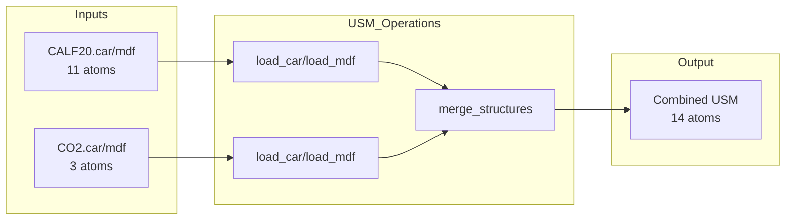
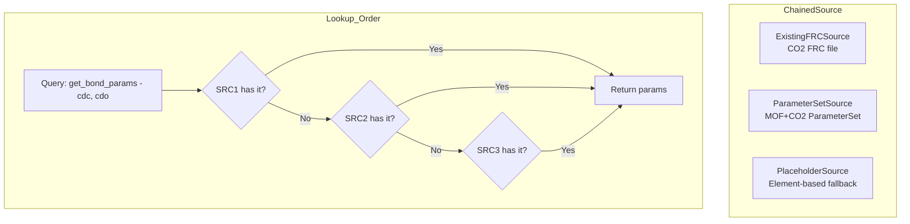

# Phase 16: Combined MOF+CO2 Workspace

**Status**: Planning  
**Created**: 2024-12-22  
**Last Updated**: 2024-12-22

## Objective

Create a new workspace that combines a Metal-Organic Framework (CALF-20 MOF) with CO2 molecules into a single USM structure, generates a unified FRC file, and runs msi2lmp to produce a LAMMPS .data file.

The key insight is to use a **hybrid parameter sourcing strategy**:
- **CO2**: Real parameters from existing `.frc` file (accurate for production simulations)
- **MOF**: Generic/placeholder bonded parameters + ParameterSet-derived nonbond parameters (tool-satisfying)

This enables running molecular dynamics with physically accurate CO2 interactions while the MOF provides the structural framework with tool-satisfying parameters.

---

## Background

### Existing Workspaces

| Workspace | Input | FRC Strategy | Status |
|-----------|-------|--------------|--------|
| `CO2_construct` | CO2 only | `ExistingFRCSource` - extracts real params from cvff_iff_ILs.frc | ✅ Working |
| `nist_calf20_msi2lmp_unbonded_v1` | MOF only | `ChainedSource[ParameterSetSource, PlaceholderSource]` | ✅ Working |
| **NEW: Combined MOF+CO2** | MOF + CO2 | `ChainedSource[ExistingFRCSource, ParameterSetSource, PlaceholderSource]` | 🔄 Planning |

### Source Structures

**CALF-20 MOF** (from `workspaces/NIST/nist_calf20_msi2lmp_unbonded_v1/inputs/`):
- File: `CALF20.car` + `CALF20.mdf`
- Atoms: 11 atoms (Zn, N, O, C, H)
- Atom types: `C_MOF`, `H_MOF`, `N_MOF`, `O_MOF`, `Zn_MOF`
- ParameterSet: Provides LJ σ/ε parameters for nonbond

**CO2** (from `workspaces/NIST/CO2_construct/inputs/`):
- File: `CO2.car` + `CO2.mdf`
- Atoms: 3 atoms (C, O, O)
- Atom types: `cdc`, `cdo`
- Source FRC: `assets/NIST/CO2_construct/cvff_iff_ILs.frc` (real parameters)

---

## Technical Architecture

### USM Structure Merge



**Merge Strategy**: Use `merge_structures()` from `src/usm/ops/merge.py`:
- Concatenates atoms with remapped AIDs
- Concatenates bonds with updated endpoint references
- Reconciles cell metadata (use MOF cell - CO2 has no cell)

### Termset and ParameterSet Derivation

After merging, derive:
1. **Termset**: `derive_termset_v0_1_2(combined_usm)` → atom_types, bond_types, angle_types, dihedral_types, improper_types
2. **ParameterSet**: Combine MOF parameterset with CO2 parameters extracted from FRC

**Expected Combined Termset**:
```json
{
  "atom_types": ["C_MOF", "H_MOF", "N_MOF", "O_MOF", "Zn_MOF", "cdc", "cdo"],
  "bond_types": [
    ["C_MOF", "H_MOF"], ["C_MOF", "N_MOF"], ["Zn_MOF", "N_MOF"], ["Zn_MOF", "O_MOF"],
    ["cdc", "cdo"]
  ],
  "angle_types": [
    ["...MOF angles..."],
    ["cdo", "cdc", "cdo"]
  ]
}
```

### FRC Generation Strategy



**Chaining Order** (priority high to low):
1. **ExistingFRCSource(co2_frc_path, termset)**: Provides CO2 real parameters
2. **ParameterSetSource(combined_parameterset)**: Provides nonbond σ/ε → A/B for all atoms
3. **PlaceholderSource(element_map)**: Provides generic bonded params for MOF

**What each source provides**:

| Parameter Type | CO2 (cdc, cdo) | MOF (C_MOF, etc.) |
|----------------|----------------|-------------------|
| atom_type_info | ExistingFRCSource | ParameterSetSource |
| nonbond | ExistingFRCSource | ParameterSetSource |
| bond | ExistingFRCSource | PlaceholderSource |
| angle | ExistingFRCSource | PlaceholderSource |
| torsion | ExistingFRCSource (if present) | PlaceholderSource |
| oop | ExistingFRCSource (if present) | PlaceholderSource |

---

## Implementation Plan

### Step 1: Directory Structure

```
workspaces/NIST/calf20_co2_combined_v1/
├── config.json
├── run.py
├── validate_run.py
├── inputs/
│   ├── CALF20.car          # Copy from nist_calf20_msi2lmp_unbonded_v1
│   ├── CALF20.mdf          # Copy from nist_calf20_msi2lmp_unbonded_v1
│   ├── CO2.car             # Copy from CO2_construct
│   ├── CO2.mdf             # Copy from CO2_construct
│   └── mof_parameterset.json   # MOF LJ parameters
└── outputs/                # Generated at runtime
```

### Step 2: config.json

```json
{
  "inputs": {
    "mof_car": "inputs/CALF20.car",
    "mof_mdf": "inputs/CALF20.mdf",
    "co2_car": "inputs/CO2.car",
    "co2_mdf": "inputs/CO2.mdf",
    "mof_parameterset": "inputs/mof_parameterset.json",
    "co2_source_frc": "/path/to/assets/NIST/CO2_construct/cvff_iff_ILs.frc"
  },
  "outputs_dir": "outputs",
  "executables": {
    "msi2lmp": "/home/sf2/LabWork/software/msi2lmp.exe"
  },
  "params": {
    "timeout_s": 120,
    "coord_norm_enabled": true,
    "coord_norm_mode": "wrap_shift"
  }
}
```

### Step 3: run.py Workflow

```python
# Pseudocode outline

# 1. Load MOF and CO2 structures
mof_usm = compose_on_keys(load_car(mof_car), load_mdf(mof_mdf))
co2_usm = compose_on_keys(load_car(co2_car), load_mdf(co2_mdf))

# 2. Merge structures
combined_usm = merge_structures([mof_usm, co2_usm], cell_policy="first")

# 3. Apply MOF ParameterSet (fills LJ params for MOF atoms)
combined_usm = apply_parameterset(combined_usm, mof_parameterset)

# 4. Derive combined termset
termset = derive_termset_v0_1_2(combined_usm)

# 5. Build combined parameterset (MOF + CO2 derived from source FRC)
combined_ps = build_combined_parameterset(mof_parameterset, co2_source_frc, termset)

# 6. Build ChainedSource
element_map = {at: get_element(at) for at in termset["atom_types"]}
source = ChainedSource([
    ExistingFRCSource(co2_source_frc, termset),
    ParameterSetSource(combined_ps),
    PlaceholderSource(element_map),
])

# 7. Generate FRC
builder = FRCBuilder(termset, source, FRCBuilderConfig(strict=False))
builder.write(output_frc_path)

# 8. Write combined CAR/MDF for msi2lmp
save_car(combined_usm, combined_car)
save_mdf(combined_usm, combined_mdf)

# 9. Run msi2lmp
msi2lmp.run(base_name=combined_base, frc_file=output_frc, ...)

# 10. Validate output
validate_and_write_report(...)
```

### Step 4: CO2 ParameterSet Derivation

The CO2 source FRC contains σ/ε values that need to be extracted and converted to our ParameterSet format. Options:

**Option A: Manual extraction**
Parse the FRC to extract atom_types table with mass, element, lj_a, lj_b, then convert A/B → σ/ε.

**Option B: Use read_frc() + extract**
```python
from upm.codecs.msi_frc import read_frc

tables, _ = read_frc(co2_frc_path, validate=False)
atom_types_df = tables["atom_types"]
# Filter for cdc, cdo and extract parameters
```

**Conversion formulas**:
- A = 4εσ¹² → σ = (A/4ε)^(1/12)
- B = 4εσ⁶ → ε = B²/(4A)

### Step 5: Validation

After generating the LAMMPS .data file:

1. **Structure validation**: Confirm atom counts (14 atoms), bond counts, angle counts
2. **Parameter coverage**: All required types have params (no -ignore flag needed)
3. **Bond length sanity**: Check min/max bond lengths are reasonable
4. **FRC inspection**: Verify both CO2 and MOF entries present

---

## Potential Challenges

### Challenge 1: Cross-type Interactions

**Issue**: If CO2 forms bonds/angles with MOF atoms (e.g., CO2 adsorption with hydrogen bonding), we need parameters for cross-type interactions like `cdo-H_MOF`.

**Solution**: PlaceholderSource handles this via element-based fallback. For example, `cdo-H_MOF` would use the H-involving bond defaults (k=340.0, r0=1.09).

### Challenge 2: ExistingFRCSource Filtering

**Issue**: ExistingFRCSource filters the source FRC by termset. The combined termset includes MOF atom types not present in the CO2 FRC, so those entries won't be found.

**Solution**: This is fine - ExistingFRCSource returns `None` for types not in its filtered tables, and ChainedSource falls back to subsequent sources.

### Challenge 3: Cell Compatibility

**Issue**: MOF has a defined cell; CO2 is a single molecule with no cell.

**Solution**: Use `merge_structures(cell_policy="first")` to use MOF's cell. The CO2 molecule will be placed within this cell.

### Challenge 4: Molecule Positioning

**Issue**: Need to position CO2 relative to MOF (e.g., in a pore).

**Solution for v1**: Accept default positioning (atoms concatenated). Future versions could use PackMol or explicit translation.

---

## Success Criteria

1. ✅ Combined USM contains 14 atoms (11 MOF + 3 CO2)
2. ✅ Combined termset has 7 atom types (5 MOF + 2 CO2)
3. ✅ FRC file generated with entries for all types
4. ✅ msi2lmp runs successfully without -ignore flag
5. ✅ LAMMPS .data file validates with correct counts
6. ✅ Bond lengths are within expected ranges

---

## Timeline and Subtasks

| Subtask | Description | Dependencies |
|---------|-------------|--------------|
| 16.1 | Create workspace directory structure | None |
| 16.2 | Copy input files and create config.json | 16.1 |
| 16.3 | Implement CO2 parameterset extraction | 16.2 |
| 16.4 | Implement run.py with merge + FRC generation | 16.3 |
| 16.5 | Add validate_run.py | 16.4 |
| 16.6 | Test end-to-end and fix issues | 16.5 |
| 16.7 | Document results | 16.6 |

---

## Appendix: Key Files Reference

### Source Parameter Sources

| Source | File | Notes |
|--------|------|-------|
| ExistingFRCSource | `src/upm/src/upm/build/parameter_sources/existing_frc.py` | Parses .frc and provides O(1) lookups |
| ParameterSetSource | `src/upm/src/upm/build/parameter_sources/parameterset.py` | Converts σ/ε → A/B |
| PlaceholderSource | `src/upm/src/upm/build/parameter_sources/placeholder.py` | Element-based generic params |
| ChainedSource | `src/upm/src/upm/build/parameter_sources/protocol.py` | Chains sources with fallback |

### USM Operations

| Operation | File | Notes |
|-----------|------|-------|
| merge_structures | `src/usm/ops/merge.py` | Combines multiple USMs |
| compose_on_keys | `src/usm/ops/compose.py` | Joins CAR+MDF |
| derive_termset_v0_1_2 | `src/usm/ops/termset.py` | Extracts topology types |

### FRC Builder

| Component | File | Notes |
|-----------|------|-------|
| FRCBuilder | `src/upm/src/upm/build/frc_builder.py` | Main entry point |
| FRCBuilderConfig | `src/upm/src/upm/build/frc_builder.py` | Configuration options |
