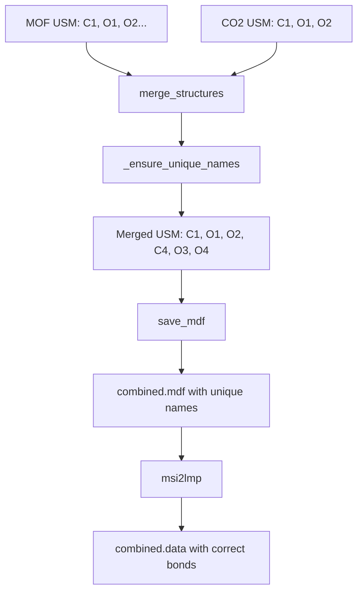

# Phase 19: Bond Connectivity Remediation Plan

## Problem Statement

The combined MOF+CO2 workspace (`calf20_co2_combined_v1`) generates a LAMMPS `.data` file with **missing CO2 bonds**. The CO2 molecule should have 2 bonds (C-O double bonds) and 1 angle (O-C-O linear), but the current output has **0 bonds for CO2 atoms**.

## Root Cause Analysis

### Evidence from File Comparison

**CO2.data (manually generated - CORRECT):**
```
3 atoms
2 bonds      ✓
1 angles     ✓
```

**combined.data (pipeline generated - BROKEN):**
```
14 atoms
14 bonds     ← Should be 16 (14 MOF + 2 CO2)
29 angles    ← Missing cdo-cdc-cdo angle
```

### Atom Name Collision

The issue stems from **duplicate atom names** after structure merge:

| Source | Atoms with Name Collisions |
|--------|---------------------------|
| MOF (CALF-20) | C1, O1, O2 |
| CO2 | C1, O1, O2 |

After merge, both molecules are in a single `@molecule` block in the MDF file.

### MDF Connection Resolution Issue

In `combined.mdf`:
```
XXXX_1:C1           C C_MOF  ... N1 N3 H1A     ← MOF carbon
XXXX_1:O1           O O_MOF  ... Zn1 C3        ← MOF oxygen
XXXX_1:O2           O O_MOF  ... Zn1 C3        ← MOF oxygen
...
XXXX_1:C1           C cdc    ... O1 O2         ← CO2 carbon (COLLISION!)
XXXX_1:O1           O cdo    ... C1            ← CO2 oxygen (COLLISION!)
XXXX_1:O2           O cdo    ... C1            ← CO2 oxygen (COLLISION!)
```

When CO2's C1 declares connections to "O1 O2", msi2lmp matches the **first O1 and O2** in the file (MOF's oxygens), not CO2's oxygens.

### Error from msi2lmp

```
Unable to find angle data for O_MOFcdc cdc O_MOF
```

This confirms msi2lmp is trying to create an angle between MOF oxygens and CO2 carbon - an impossible bond.

---

## Solution Design

### Approach: Atom Name Renumbering During Merge

Modify `merge_structures()` to **automatically rename atoms** when name collisions occur.

**Before merge:**
- MOF: Zn1, N1, N2, N3, O1, O2, C1, H1A, C2, H2A, C3
- CO2: C1, O1, O2

**After merge (with renumbering):**
- MOF: Zn1, N1, N2, N3, O1, O2, C1, H1A, C2, H2A, C3 (unchanged)
- CO2: C4, O3, O4 (renamed to avoid collision)

### Algorithm

```python
def _make_unique_atom_names(atoms_parts: list[pd.DataFrame]) -> list[pd.DataFrame]:
    """Rename atoms to ensure unique names across merged structure."""
    seen_names: dict[str, int] = {}  # name -> max suffix seen
    result = []
    
    for df in atoms_parts:
        df = df.copy()
        new_names = []
        for name in df["name"]:
            base = extract_base_name(name)  # "C1" -> ("C", 1)
            if name in seen_names:
                # Find next available suffix
                suffix = seen_names.get(base, 0) + 1
                while f"{base}{suffix}" in seen_names:
                    suffix += 1
                new_name = f"{base}{suffix}"
                seen_names[new_name] = suffix
                new_names.append(new_name)
            else:
                seen_names[name] = extract_suffix(name)
                new_names.append(name)
        df["name"] = new_names
        result.append(df)
    
    return result
```

### Files to Modify

1. **`src/usm/ops/merge.py`**
   - Add `_make_unique_atom_names()` function
   - Call it in `merge_structures()` before concatenating atoms
   - Ensure connections_raw is updated to reflect new names

2. **`src/usm/io/mdf.py`** (if needed)
   - Verify `_compose_connections_for_atom()` uses updated names correctly
   - May need to use `write_normalized_connections=True` to regenerate connections

3. **Tests**
   - Add `test_merge_unique_names()` to verify no name collisions after merge
   - Add `test_merge_preserves_bonds()` to verify bonds are correct

---

## Detailed Implementation Steps

### Step 19.1: Add Name Uniqueness Helper

Create helper function in `merge.py`:

```python
def _extract_name_parts(name: str) -> tuple[str, int]:
    """Extract base and numeric suffix from atom name.
    
    Examples:
        'C1' -> ('C', 1)
        'H2A' -> ('H2A', 0)  # suffix not purely numeric
        'Zn1' -> ('Zn', 1)
        'O2' -> ('O', 2)
    """
    import re
    match = re.match(r'^([A-Za-z]+)(\d+)$', name)
    if match:
        return match.group(1), int(match.group(2))
    return name, 0
```

### Step 19.2: Implement Name Collision Resolution

```python
def _ensure_unique_names(atoms_parts: list[pd.DataFrame]) -> list[pd.DataFrame]:
    """Ensure all atom names are unique across merged structure."""
    all_names: set[str] = set()
    result = []
    
    for idx, df in enumerate(atoms_parts):
        df = df.copy()
        name_mapping: dict[str, str] = {}  # old_name -> new_name
        new_names = []
        
        for name in df["name"].astype(str):
            if name in all_names:
                # Collision! Generate new name
                base, num = _extract_name_parts(name)
                suffix = num + 1
                new_name = f"{base}{suffix}"
                while new_name in all_names:
                    suffix += 1
                    new_name = f"{base}{suffix}"
                name_mapping[name] = new_name
                new_names.append(new_name)
                all_names.add(new_name)
            else:
                new_names.append(name)
                all_names.add(name)
        
        df["name"] = new_names
        
        # Update connections_raw if present
        if "connections_raw" in df.columns and name_mapping:
            df = _update_connections_raw(df, name_mapping)
        
        result.append(df)
    
    return result
```

### Step 19.3: Update connections_raw

The connections_raw column stores text like "O1 O2". When we rename atoms, we need to update these references:

```python
def _update_connections_raw(df: pd.DataFrame, name_mapping: dict[str, str]) -> pd.DataFrame:
    """Update connections_raw column with renamed atom names."""
    if "connections_raw" not in df.columns:
        return df
    
    def update_conn(conn_str: str) -> str:
        if not isinstance(conn_str, str):
            return conn_str
        tokens = conn_str.split()
        new_tokens = []
        for tok in tokens:
            # Handle bond order suffix like "C1/2.0"
            if "/" in tok:
                name_part, order_part = tok.split("/", 1)
                new_name = name_mapping.get(name_part, name_part)
                new_tokens.append(f"{new_name}/{order_part}")
            else:
                new_tokens.append(name_mapping.get(tok, tok))
        return " ".join(new_tokens)
    
    df["connections_raw"] = df["connections_raw"].apply(update_conn)
    return df
```

### Step 19.4: Integrate into merge_structures()

Modify `merge_structures()`:

```python
def merge_structures(usms: List[USM], cell_policy: str = "strict") -> USM:
    # ... existing code ...
    
    atoms_parts: List[pd.DataFrame] = []
    # ... collect atoms_parts ...
    
    # NEW: Ensure unique names across all parts
    atoms_parts = _ensure_unique_names(atoms_parts)
    
    # ... rest of merge logic ...
```

### Step 19.5: Add Tests

```python
def test_merge_unique_atom_names():
    """Test that merge_structures renames atoms to avoid collisions."""
    # Create two structures with overlapping names
    atoms1 = pd.DataFrame({
        "aid": [0, 1, 2],
        "name": ["C1", "O1", "O2"],
        "element": ["C", "O", "O"],
    })
    atoms2 = pd.DataFrame({
        "aid": [0, 1, 2],
        "name": ["C1", "O1", "O2"],
        "element": ["C", "O", "O"],
    })
    
    usm1 = USM(atoms=atoms1, bonds=None, ...)
    usm2 = USM(atoms=atoms2, bonds=None, ...)
    
    merged = merge_structures([usm1, usm2])
    
    # Check no duplicate names
    names = merged.atoms["name"].tolist()
    assert len(names) == len(set(names)), f"Duplicate names: {names}"
    
    # Original names should be preserved for first structure
    assert "C1" in names
    assert "O1" in names
    assert "O2" in names
    
    # Second structure should have renamed atoms
    assert "C2" in names or "C3" in names  # Renamed
    assert "O3" in names or "O4" in names  # Renamed
```

---

## Expected Results After Fix

### combined.mdf (after fix)

```
XXXX_1:C1           C C_MOF  ... N1 N3 H1A
XXXX_1:O1           O O_MOF  ... Zn1 C3
XXXX_1:O2           O O_MOF  ... Zn1 C3
...
XXXX_1:C4           C cdc    ... O3 O4       ← Renamed!
XXXX_1:O3           O cdo    ... C4          ← Renamed!
XXXX_1:O4           O cdo    ... C4          ← Renamed!
```

### combined.data (after fix)

```
14 atoms
16 bonds        ← 14 MOF + 2 CO2 ✓
30 angles       ← Includes cdo-cdc-cdo ✓
```

### Bonds Section (after fix)

```
Bonds

     1   1      1      2    # Zn_MO-N_MOF
     ...
    14   6      9     10    # C_MOF-H_MOF
    15   7     12     13    # cdc-cdo (NEW!)
    16   7     12     14    # cdc-cdo (NEW!)
```

---

## Validation Checklist

- [ ] All 14 atoms present in combined structure
- [ ] 16 bonds total (14 MOF + 2 CO2)
- [ ] 30 angles total (29 MOF + 1 CO2)
- [ ] CO2 atoms have unique names (e.g., C4, O3, O4)
- [ ] connections_raw updated to reflect new names
- [ ] msi2lmp runs without "Unable to find angle data" error
- [ ] Generated .data file matches expected structure
- [ ] All existing tests pass

---

## Mermaid: Data Flow



---

## Risk Assessment

| Risk | Mitigation |
|------|------------|
| Renaming breaks CAR/MDF name consistency | save_car also uses atom names from DataFrame |
| Existing tests depend on atom names | Tests should be name-agnostic |
| Performance impact | Name checking is O(n), acceptable |
| Bond order in connections_raw | Handle `/` suffix in renaming logic |

---

## Files Changed Summary

| File | Changes |
|------|---------|
| `src/usm/ops/merge.py` | Add `_ensure_unique_names()`, integrate into `merge_structures()` |
| `src/usm/tests/test_merge.py` | Add `test_merge_unique_atom_names()` |
| `workspaces/NIST/calf20_co2_combined_v1/` | Re-run and validate outputs |

---

## Definition of Done

1. ✅ `merge_structures()` produces unique atom names
2. ✅ `connections_raw` is updated with new names  
3. ✅ `combined.mdf` has no name collisions
4. ✅ `msi2lmp` runs without errors
5. ✅ `combined.data` has 16 bonds (14 MOF + 2 CO2)
6. ✅ `combined.data` has 30 angles (29 MOF + 1 CO2)
7. ✅ All existing tests pass
8. ✅ New test validates name uniqueness
