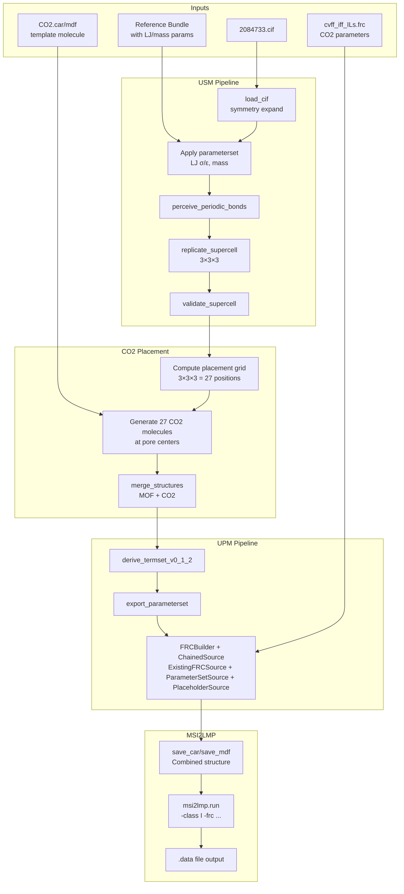

# v0.1 Reference System: CALF-20 + CO₂ Diffusion Pipeline

**Status:** Draft / Implementation Plan  
**Target:** First end-to-end demo of MS → supercell → guest packing → msi2lmp → LAMMPS data  
**Workspace:** `workspaces/NIST/nist_calf20_3x3x3_co2_v1`

---

## 1. Objective

Build a single v0.1 reference system that proves the complete pipeline works:
- CIF import → P1 expansion → 3×3×3 supercell → programmatic CO₂ placement → msi2lmp → LAMMPS .data

This validates the core workflow before adding complexity like N₂, H₂O, or loading sweeps.

---

## 2. Technical Specifications

### 2.1 Material: CALF-20 MOF

| Property | Value | Source |
|----------|-------|--------|
| CIF Source | CCDC 2084733 | `assets/NIST/2084733.cif` |
| Solvent | Ethanol - MUST BE REMOVED | Framework-only run |
| Framework | Rigid in MD v0.1 | De-risks bonded params |
| Space Group | P 21/c (monoclinic) | CIF `_space_group_name_H-M_alt` |

### 2.2 Unit Cell Parameters

From CIF:
- **a** = 8.9138 Å
- **b** = 9.6935 Å  
- **c** = 9.4836 Å
- **α** = 90°
- **β** = 115.895°
- **γ** = 90°

### 2.3 3×3×3 Supercell Dimensions

| Dimension | Unit Cell | Supercell (×3) |
|-----------|-----------|----------------|
| a | 8.9138 Å | **26.74 Å** |
| b | 9.6935 Å | **29.08 Å** |
| c | 9.4836 Å | **28.45 Å** |
| α | 90° | 90° |
| β | 115.895° | 115.895° |
| γ | 90° | 90° |

### 2.4 Guest Molecules: CO₂

| Property | Value | Rationale |
|----------|-------|-----------|
| Count | 27 total | 1 CO₂ per unit cell in 3×3×3 |
| Loading | Dilute | Avoids overlap/energy blowups |
| Model | Linear, rigid | `cdc`-`cdo`-`cdc` from cvff_iff_ILs.frc |

CO₂ atom types from `cvff_iff_ILs.frc`:
- `cdc`: Carbon in CO₂ (mass 12.011, charge +1.0)
- `cdo`: Oxygen in CO₂ (mass 15.999, charge -0.5)

### 2.5 Output Artifacts

1. **Framework-only baseline (debug):**
   - `calf20_3x3x3_framework.data`

2. **Framework + CO₂ (v0.1 target):**
   - `calf20_3x3x3_co2_27.data`

---

## 3. Architecture Overview



---

## 4. Implementation Steps

### Step 1: CIF Import and 3×3×3 Supercell Generation

**File:** `run.py` (main workspace runner)

**Operations:**
1. Load CIF with symmetry expansion: `load_cif(cif_path, expand_symmetry=True)`
2. Remove solvent atoms (O1S, C1S, C2S)
3. Apply MOF parameterset from reference bundle (LJ σ/ε, mass, charges)
4. Perceive periodic bonds: `perceive_periodic_bonds(usm)`
5. Replicate to 3×3×3: `replicate_supercell(usm, na=3, nb=3, nc=3)`
6. Validate topology: `validate_supercell(usm_super)`

**Reuse From:**
- [`nist_calf20_2x2x2_supercell/run.py`](workspaces/NIST/nist_calf20_2x2x2_supercell/run.py) - supercell workflow
- [`nist_calf20_cif_import_v1/run.py`](workspaces/NIST/nist_calf20_cif_import_v1/run.py) - solvent removal

### Step 2: Programmatic CO₂ Placement

**File:** `co2_placer.py` (helper module)

**Algorithm:**
1. Load CO2 template molecule from `assets/NIST/CO2_construct/CO2.car` and `CO2.mdf`
2. Compute 27 placement positions using fractional coordinate grid:
   - For each (i, j, k) in range(3) × range(3) × range(3):
   - Fractional center = ((i + 0.5)/3, (j + 0.5)/3, (k + 0.5)/3)
3. Convert fractional to Cartesian using supercell lattice matrix
4. Translate CO2 template to each position
5. Assign unique molecule IDs (1-27)
6. Return combined USM with all 27 CO2 molecules

**CO2 Template Structure:**
```
C1 (cdc): [0, 0, 0] relative
O1 (cdo): [-1.162, 0, 0] relative  
O2 (cdo): [+1.162, 0, 0] relative
```

Bond length C=O from FRC: 1.162 Å

### Step 3: MOF + CO₂ Merging

**Operations:**
1. Use `merge_structures([mof_super, co2_all], cell_policy="first")`
2. Keep MOF cell parameters (supercell box)
3. Ensure unique atom names across MOF and CO2

### Step 4: Combined Termset and Parameterset Derivation

**Operations:**
1. `derive_termset_v0_1_2(combined_usm)`
   - Atom types: MOF types + cdc, cdo
   - Bond types: MOF bonds + cdc-cdo
   - Angle types: MOF angles + cdo-cdc-cdo
2. `export_parameterset_json(combined_usm, ps_path)`

### Step 5: Unified FRC Generation

**Use ChainedSource pattern from `calf20_co2_combined_v1`:**

```python
source = ChainedSource([
    ExistingFRCSource(co2_frc_path, termset),  # Real CO2 params
    ParameterSetSource(mof_parameterset),       # MOF nonbond LJ
    PlaceholderSource(element_map),             # Fallback bonded
])
builder = FRCBuilder(termset, source, FRCBuilderConfig(strict=False))
builder.write(frc_path)
```

### Step 6: Framework-Only LAMMPS Data (Baseline)

**Operations:**
1. Use MOF supercell only (no CO2)
2. Generate framework-only termset/parameterset
3. Build FRC for framework
4. Run `msi2lmp.run()` → `calf20_3x3x3_framework.data`

### Step 7: MOF+CO₂ LAMMPS Data (v0.1 Target)

**Operations:**
1. Use merged MOF+CO2 structure
2. Generate combined FRC
3. Run `msi2lmp.run()` → `calf20_3x3x3_co2_27.data`

### Step 8: Validation and Summary

**Validation Checks:**
1. Atom count sanity: supercell_atoms = unit_cell_atoms × 27
2. CO2 count: 27 molecules × 3 atoms = 81 CO2 atoms
3. Bond length statistics (MIC-aware)
4. Framework connectivity (1 connected component)
5. LAMMPS data file non-empty

**Summary Report:** `outputs/summary.json`

---

## 5. File Structure

```
workspaces/NIST/nist_calf20_3x3x3_co2_v1/
├── config.json                    # Workspace configuration
├── run.py                         # Main runner script
├── co2_placer.py                  # CO2 placement helper
├── validate_run.py                # Validation logic
├── inputs/                        # (empty - all inputs from assets)
└── outputs/                       # Generated at runtime
    ├── inputs/                    # Staged inputs
    ├── frc_files/
    │   ├── ff_framework.frc       # Framework-only FRC
    │   └── ff_combined.frc        # MOF+CO2 FRC
    ├── msi2lmp_run/
    │   ├── calf20_3x3x3_framework.car
    │   ├── calf20_3x3x3_framework.mdf
    │   ├── calf20_3x3x3_framework.data
    │   ├── calf20_3x3x3_co2_27.car
    │   ├── calf20_3x3x3_co2_27.mdf
    │   └── calf20_3x3x3_co2_27.data
    ├── termset.json
    ├── parameterset.json
    ├── topology_validation_report.json
    └── summary.json
```

---

## 6. Configuration Schema

```json
{
  "outputs_dir": "./outputs",
  "inputs": {
    "cif": "assets/NIST/2084733.cif",
    "bundle_dir": "workspaces/NIST/nist_calf20_cif_import_v1/outputs/bundle",
    "co2_car": "assets/NIST/CO2_construct/CO2.car",
    "co2_mdf": "assets/NIST/CO2_construct/CO2.mdf",
    "co2_frc": "assets/NIST/CO2_construct/cvff_iff_ILs.frc"
  },
  "executables": {
    "msi2lmp": "/home/sf2/LabWork/software/msi2lmp.exe"
  },
  "params": {
    "supercell_dims": [3, 3, 3],
    "co2_count": 27,
    "timeout_s": 600,
    "solvent_names": ["O1S", "C1S", "C2S"]
  }
}
```

---

## 7. Dependencies on Existing Code

| Component | Module | Status |
|-----------|--------|--------|
| CIF import with symmetry | `usm.io.cif.load_cif()` | ✅ Exists |
| Periodic bond perception | `usm.ops.topology.perceive_periodic_bonds()` | ✅ Exists |
| Supercell replication | `usm.ops.replicate.replicate_supercell()` | ✅ Exists |
| Structure merging | `usm.ops.merge.merge_structures()` | ✅ Exists |
| Termset derivation | `usm.ops.termset.derive_termset_v0_1_2()` | ✅ Exists |
| FRC building | `upm.build.FRCBuilder` | ✅ Exists |
| ChainedSource | `upm.build.parameter_sources.ChainedSource` | ✅ Exists |
| ExistingFRCSource | `upm.build.parameter_sources.ExistingFRCSource` | ✅ Exists |
| msi2lmp wrapper | `external.msi2lmp.run()` | ✅ Exists |
| Bundle I/O | `usm.bundle.io.load_bundle()` | ✅ Exists |
| CO2 placer | **NEW** | 🆕 To implement |

---

## 8. What is NOT in v0.1 Scope

| Feature | Status | Notes |
|---------|--------|-------|
| N₂ guest | ❌ v0.2+ | Mixed-gas selectivity later |
| H₂O guest | ❌ v0.2+ | Humidity confound + water model |
| Loading sweep | ❌ v0.2+ | 27 → 54 → 81 CO₂ after v0.1 |
| Flexible framework | ❌ v0.2+ | Rigid for v0.1 |
| LAMMPS simulation | ❌ Separate | Only structure building here |
| MSD/D analysis | ❌ Separate | Downstream from .data |

---

## 9. Success Criteria

1. **`calf20_3x3x3_framework.data`** exists and is non-empty
2. **`calf20_3x3x3_co2_27.data`** exists and is non-empty
3. Framework has 1 connected component
4. CO2 placement verified: 27 molecules, 81 atoms
5. Total atoms = framework_atoms + 81
6. No msi2lmp errors (or only warnings with `-ignore`)
7. Deterministic: re-runs produce identical outputs

---

## 10. Implementation Subtasks for Orchestrator

The following subtasks should be executed in sequence:

1. **Subtask 1:** Create workspace directory and config.json
2. **Subtask 2:** Implement co2_placer.py helper module
3. **Subtask 3:** Implement main run.py with framework-only path
4. **Subtask 4:** Extend run.py with CO2 placement and merging
5. **Subtask 5:** Implement validate_run.py
6. **Subtask 6:** End-to-end test execution
7. **Subtask 7:** Documentation and cleanup
